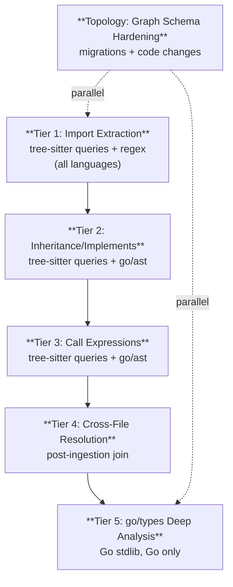

# MDEMG Agent Handoff Document

<!-- markdownlint-disable MD022 MD031 MD032 MD040 MD051 MD058 MD060 -->

**Date:** 2026-03-13
**Branch:** `mdemg-dev01`
**Repository:** `/Users/reh3376/mdemg`
**Purpose:** Complete context for continuing development of the MDEMG framework

<!--
=== AGENT RESUME CONTEXT (2026-03-10) ===

WHAT IS MDEMG? (Read VISION.md for full philosophy)
MDEMG (Multi-Dimensional Emergent Memory Graph) is a cognitive substrate for AI agents —
the ANN equivalent of a human's internal dialogue. It gives AI agents persistent, emergent
long-term memory where higher-level concepts and relationships arise automatically from
accumulated observations through Hebbian learning. It is NOT a tool — it IS the agent's
memory. When CMS is disconnected, memory is disconnected.

Core architecture: Neo4j graph with native vector indexes, 5-layer emergent hierarchy
(L0 observations → L5 emergent concepts), Hebbian learning edges, temporal decay,
LLM re-ranking, activation spreading, and a full RSIC self-improvement cycle.

Only stores domain-specific, organization-specific, task-specific knowledge —
NOT information LLMs already possess.

PROJECT STATUS: ALL DEVELOPMENT PHASES COMPLETE
- 105 core phases (1-105) — ALL COMPLETE
- 14 sidecar phases (S0-S14) — ALL COMPLETE
- 5 cognitive gap phases (101-105) — ALL GAPS CLOSED
  101: SME Synthesis, 102: Intent Translation, 103: Dynamic Emergence,
  104: Active Guardrails, 105: Global Meta-Learning
- Deployable package chain (93-100) — COMPLETE (10/10 criteria pass, v0.2.1 brew install verified)
- Quality hardening (gap analysis triage) — COMPLETE
  - 279 UATS contract test specs, all using canonical assertion format
  - 148 Go test files with comprehensive coverage
  - golangci-lint: 0 issues
  - Dead code removed (internal/observations/, internal/domain/)
- ANN Optimization Suite — COMPLETE (10 optimizations, 28 new config params)
- CI: ALL GREEN (push + pull_request) as of 2026-03-10

LAST SESSION (2026-03-14):
- Installer Repo Sync: Bringing homebrew-mdemg and mdemg-windows inline with MDEMG codebase
  - Phase 0A: Fixed LISTEN_ADDR default :8080 → :9999 (config.go:560)
  - Phase 0B: Fixed .env.example REQUIRED_SCHEMA_VERSION 17 → 19
  - Phase 0C: Added Windows .zip support for `mdemg upgrade` (extractZip, certutil checksum, .exe suffix)
  - Phase 1: Deleted stale Cask (homebrew-mdemg/Casks/mdemg.rb, frozen at v0.2.1)
  - Phase 2: CLI reference sync — 66 new env vars (12 sections), 5 value/name fixes, hook flags, language count fix
  - Phase 3: API reference sync — 4 new endpoints (jiminy/guide, negative-feedback, frontiers, orchestration/reset), 20 MCP tools section
  - Phase 4: Guide sync — Jiminy section in CMS/RSIC guide, language count + hook types in ingestion guide, Neo4j 5.11+ and Ollama dimension warnings in READMEs
  - Added repo URLs to CLAUDE.md (main + 2 sub-repos)
  - Updated AGENT_HANDOFF.md with session context

PREVIOUS SESSION (2026-03-13):
- Jiminy documentation update: Added Jiminy inner voice references to all 7 core docs
  - Created docs/features/jiminy-inner-voice.md (full feature doc — architecture, config, API, MCP, hooks)
  - Updated README.md (Key Features), VISION.md (Integration Mode #5), CLAUDE.md (3 edits)
  - Updated CONTRIBUTING.md (endpoint table), 01_Architecture.md (Integration Mode #6)
  - Updated 08_Config_and_Tuning.md (6 JIMINY_* config params + .env example)
  - CI: ALL GREEN (Test, Lint, Security Scan, Build all passed)
  - Commit: 7714856 on mdemg-dev01, pushed, auto-PR #131 updated

PREVIOUS SESSION (2026-03-12):
- ANN Optimization Suite: 10 neural learning improvements across 4 subsystems
  - Learning: tanh soft-cap, cautious decay, multi-rate eta, LR schedule
  - Retrieval: squared activation, local-first spreading, value residual bypass
  - Consolidation: L5 grounding (GROUNDED_BY edges)
  - API: negative feedback endpoint, frontier detection endpoint
  - 28 new config parameters, 17 files changed, 1272 insertions
- Linear module fix: 503 instead of 500/400 for unconfigured service (gRPC Unimplemented detection)
- RSIC orchestration reset: POST /v1/self-improve/orchestration/reset for test isolation
- All 12 "pre-existing" UATS failures fixed (Linear 503 + RSIC cooldown state)
- UATS: 279/279 specs passing (100%), 42 Go test packages passing, 0 lint issues
- 2 new UATS specs: frontier_detection, learning_negative_feedback

REPO STATE:
- Branch: mdemg-dev01 — pushed, auto-PR workflow creates/updates PR to main
- Binary: bin/mdemg (rebuild with: go build -o bin/mdemg ./cmd/mdemg)
- CMS: MDEMG server on localhost:9999, Neo4j via docker compose (volume: mdemg_neo4j_data, 34K+ nodes)
- CRITICAL: For the mdemg-dev CMS space, ALWAYS use `docker compose up -d neo4j` to preserve CMS data (volume: mdemg_neo4j_data). For fresh projects, `mdemg db start` is safe — it creates project-scoped containers (mdemg-neo4j-{project}) with their own volumes.
- Embedding dimensions: 3072 (text-embedding-3-large). Stub embedder matches at 3072.

MANDATORY WORKFLOW (from CLAUDE.md / MEMORY.md):
1. Never commit to main — all work on mdemg-dev01
2. Sequence: implement → lint (golangci-lint v2: go run github.com/golangci/golangci-lint/v2/cmd/golangci-lint@latest run ./...) → test → update docs → commit
3. Conventional commits (feat:, fix:, docs:)
4. Start CMS on session start: ./bin/mdemg start --auto-migrate
5. Resume memory: POST http://localhost:9999/v1/conversation/resume
6. NEVER bypass failed tests or bugs — at minimum document in this file's Known Issues section

WHAT REMAINS TO BE DONE:
1. RELEASE: ~~Create homebrew-mdemg repo, tag first release~~ DONE (v0.2.1 released, brew install verified)
2. DOCUMENTATION: ~~Overhaul homebrew-mdemg docs~~ DONE (4 wiki docs + simplified README)
3. DOCUMENTATION: ~~Installer repo sync (homebrew-mdemg + mdemg-windows)~~ DONE (66 env vars, 4 endpoints, 20 MCP tools, Jiminy guide, code fixes)
4. TESTING: Scraper/guardrail Neo4j-dependent methods (require mock infrastructure)
5. TESTING: ~5 endpoints still need UATS specs (spaces CRUD, jobs SSE)
6. CLEANUP: 7 stale legacy binaries in bin/ (extract-symbols, ingest-codebase, mcp-server,
   mdemg-ingest, mdemg-server, reset-db, server) — deletion blocked by pre-bash-check hook
7. VISION: VS Code extension, Cursor integration, real-time memory sidebar (Phase 4 partial)
8. BENCHMARKING: Run ANN optimization benchmark to measure retrieval quality improvement vs baseline (0.783 mean score)

KEY DOCUMENTS (read in order):
1. VISION.md — Core purpose, architecture philosophy, success metrics
2. CLAUDE.md — Commands, CMS connection, observation protocol, enforced hooks
3. This file — Phase registry, architecture, known issues
4. docs/development/COGNITIVE_INTELLIGENCE_GAP_ANALYSIS.md — 5 cognitive gaps (all closed)
5. .claude/projects/.../memory/cognitive-architecture.md — Why gaps 101-105 matter cognitively

HOMEBREW DOCUMENTATION (reh3376/homebrew-mdemg):
- README.md — Installation, quick start, command table, troubleshooting
- docs/cli-reference.md — Complete CLI reference (all flags, defaults, examples)
- docs/api-reference.md — Complete API reference (all endpoints, request/response shapes)
- docs/cms-rsic-guide.md — CMS & RSIC usage guide (workflows, practical examples)
- docs/ingestion-guide.md — All 8 ingestion methods with setup instructions
-->

---

## Table of Contents

1. [Project Overview](#1-project-overview)
2. [Architecture Summary](#2-architecture-summary)
3. [Environment Setup](#3-environment-setup)
4. [Phase Numbering Convention](#4-phase-numbering-convention)
5. [Phase Registry](#5-phase-registry)
6. [Completed Phases (31-33)](#6-completed-phases-31-33)
7. [Recently Completed Phases](#7-recently-completed-phases)
8. [Recently Completed DevSpace Phases (35-38)](#8-recently-completed-devspace-phases-35-38)
9. [Core Infrastructure Phases (41-52)](#9-core-infrastructure-phases-41-52)
10. [Governance & Testing Frameworks](#10-governance--testing-frameworks)
11. [File Inventory by Domain](#11-file-inventory-by-domain)
12. [Development Principles](#12-development-principles)
13. [Planned Phases](#13-planned-phases)
14. [Known Issues & Technical Debt](#14-known-issues--technical-debt)
15. [Quick Reference Commands](#15-quick-reference-commands)

---

## 1. Project Overview

**MDEMG** (Multi-Dimensional Emergent Memory Graph) is a long-term memory system for AI agents, built on Neo4j with native vector indexes. It implements a retrieval-augmented memory graph with spreading activation and Hebbian learning.

### Core Purpose

MDEMG provides AI agents with the **ANN equivalent of human internal dialog** — persistent cognitive context that survives across sessions. It stores:

- **Task History** — Decisions made, problems solved, work performed
- **SME Domain Knowledge** — Organization-specific procedures, institutional memory, tribal knowledge

It does **NOT** store general knowledge that LLMs already possess.

### Read First (in order)

| Document | Path | Purpose |
|----------|------|---------|
| Vision | `VISION.md` | Core purpose, architecture philosophy, emergent layer design |
| Architecture | `CLAUDE.md` | Commands, directory structure, environment variables, retrieval pipeline |
| Development Roadmap | `docs/development/DEVELOPMENT_ROADMAP.md` | Feature tracks, benchmarks, retrieval improvements (v4→v11) |
| API Reference | `docs/development/API_REFERENCE.md` | All HTTP endpoints (1,268 lines) |
| Collaboration Plan | `docs/specs/development-space-collaboration.md` | Master plan for DevSpace phases (the Space Transfer pipeline) |
| Homebrew CLI Reference | `reh3376/homebrew-mdemg:docs/cli-reference.md` | Complete CLI flags, defaults, env vars (2,038 lines) |
| Homebrew API Reference | `reh3376/homebrew-mdemg:docs/api-reference.md` | All REST endpoints with curl examples (2,931 lines) |
| CMS & RSIC Guide | `reh3376/homebrew-mdemg:docs/cms-rsic-guide.md` | CMS + RSIC workflows and practical examples (1,344 lines) |
| Ingestion Guide | `reh3376/homebrew-mdemg:docs/ingestion-guide.md` | All 8 ingestion methods with setup (1,040 lines) |
| Jiminy Inner Voice | `docs/features/jiminy-inner-voice.md` | Proactive guidance service — architecture, config, API, hooks |

### Technical Invariants (Do NOT Violate)

- **Vector index = recall** (fast candidate generation)
- **Graph = reasoning** (typed edges with evidence)
- **Runtime = activation physics** (spreading activation computed in-memory, NEVER persisted)
- **DB writes = learning deltas only** (bounded, no per-request activation writes)

---

## 2. Architecture Summary

### Technology Stack

| Component | Technology | Notes |
|-----------|-----------|-------|
| Graph DB | Neo4j 5.x | Docker: `docker compose up -d` |
| Backend | Go (latest stable) | Service at `cmd/server/main.go` |
| gRPC | Protocol Buffers | `api/proto/*.proto` |
| Embeddings | OpenAI `text-embedding-3-large` (3072d) / Ollama `qwen3-embedding:4b` (1536d) | Configurable; vector index at 3072d (V0018 migration) |
| Plugins | Binary sidecar via gRPC Unix sockets | `plugins/*/` |

### Directory Structure

```
api/
  proto/                    # Proto definitions
    mdemg-module.proto      # Plugin/module protocol
    space-transfer.proto    # Space transfer service
    devspace.proto          # DevSpace hub + messaging
  modulepb/                 # Generated Go (mdemg-module)
  transferpb/               # Generated Go (space-transfer)
  devspacepb/               # Generated Go (devspace)
cmd/
  server/                   # Main MDEMG server
  mcp-server/               # MCP tool server for IDEs
  ingest-codebase/          # Codebase ingestion CLI
  consolidate/              # Consolidation CLI
  decay/                    # Edge weight decay CLI
  space-transfer/           # Space transfer CLI (export/import/serve/pull)
  reset-db/                 # DB cleanup tool
internal/
  api/                      # HTTP handlers + middleware
  anomaly/                  # Anomaly detection on ingest
  ape/                      # Active Participant Engine scheduler
  backup/                   # Neo4j backup & restore (full dump, partial space, scheduler, retention)
  config/                   # Environment-based configuration
  consulting/               # Agent consulting service
  conversation/             # CMS (observe, recall, resume, correct)
  db/                       # Neo4j driver + schema validation
  devspace/                 # DevSpace hub (catalog, broker, server)
  domain/                   # Domain types
  embeddings/               # Embedding clients (OpenAI/Ollama)
  gaps/                     # Capability gap detection
  hidden/                   # Hidden layer abstraction/consolidation
  jobs/                     # Background job tracking
  learning/                 # Hebbian learning (CO_ACTIVATED_WITH)
  models/                   # Request/response types
  observations/             # Observation service
  plugins/                  # Plugin manager + scaffold
  retrieval/                # Core retrieval pipeline (vector + activation + scoring + cache)
  scraper/                  # Web scraper ingestion (types, service, store, parser, dedup)
  summarize/                # LLM summary service
  symbols/                  # Symbol extraction (tree-sitter)
  transfer/                 # Space Transfer (exporter, importer, format, validate, grpc_server)
  validation/               # Request validation
plugins/
  linear-module/            # Linear integration plugin
  reflection-module/        # APE reflection plugin
  keyword-booster/          # Sample reasoning plugin
  uxts-module/              # UxTS framework reasoning plugin (test coverage, compliance, drift)
migrations/                 # Neo4j Cypher migrations (V0001-V0018, 3072-dim vectors)
tests/
  integration/              # Integration tests (Neo4j required)
  udts/                     # UDTS contract tests (gRPC)
docs/
  specs/                    # Feature specifications (per-phase)
  architecture/             # Architecture docs (00-14 numbered)
  development/              # Dev guides, roadmap, API reference
  api/api-spec/             # UATS + UDTS specs, schemas, runners
  lang-parser/              # UPTS parser specs (27 languages)
  research/                 # Research papers (GAT, edge attention, etc.)
  benchmarks/               # Benchmark results and scripts
```

### Graph Schema (Core Labels)

| Label | Purpose |
|-------|---------|
| `:TapRoot` | Singleton per `space_id` |
| `:MemoryNode` | Main memory nodes with embeddings (3072-dim, V0018 migration) |
| `:Observation` | Append-only events linked to MemoryNodes |
| `:SymbolNode` | Extracted code symbols (constants, functions, classes) |
| `:SchemaMeta` | Schema version tracking |
| `:CapabilityGap` | Identified retrieval gaps |
| `:InterviewPrompt` | Gap interview prompts |

### Key Relationship Types

| Type | Category | Description |
|------|----------|-------------|
| `ASSOCIATED_WITH` | Associative | Semantic relationship |
| `CO_ACTIVATED_WITH` | Learned | Hebbian-strengthened co-activation |
| `CAUSES`, `ENABLES` | Causal | Causal chains |
| `TEMPORALLY_ADJACENT` | Temporal | Time proximity |
| `ABSTRACTS_TO`, `INSTANTIATES` | Hierarchy | Layer abstraction |
| `HAS_OBSERVATION` | Structural | Node → observation link |
| `DEFINED_IN` | Symbol | Symbol → file link |
| `IMPLEMENTS_CONCERN` | Cross-cutting | Node → concern node |
| `COMPARED_IN` | Comparison | Module → comparison node |
| `IMPLEMENTS_CONFIG` | Config | File → config summary |
| `GENERALIZES` | Hierarchy | Hidden layer generalization |

### Retrieval Pipeline (`internal/retrieval/service.go`)

1. **Vector recall** — Query `memNodeEmbedding` vector index for top-K candidates
2. **Symbol search** — Pattern-match query for symbol names (exact, prefix, fuzzy)
3. **Bounded expansion** — Iterative 1-hop fetch with caps (max depth=3, per-node limit)
4. **Spreading activation** — In-memory computation with decay
5. **Scoring + ranking** — Combine vector similarity (α=0.55), activation (β=0.30), recency (γ=0.10), confidence (δ=0.05), hub penalty (φ=0.08), redundancy (κ=0.12)
6. **Caching** — TTL-LRU cache (98.9% latency improvement on repeated queries)

---

## 3. Environment Setup

### Start Neo4j

```bash
docker compose up -d
# Browser: http://localhost:7474 (neo4j/testpassword)
```

### Apply Migrations

```bash
# Modern (preferred — uses embedded migration runner):
./bin/mdemg db migrate

# Legacy (manual cypher-shell):
for f in migrations/V*.cypher; do
  echo "Applying $f"
  docker exec -i mdemg-neo4j cypher-shell -u neo4j -p testpassword < "$f"
done
```

### Run the MDEMG Server

```bash
# Build the unified CLI binary
go build -o bin/mdemg ./cmd/mdemg

# Start server (daemon mode, with auto-migration)
./bin/mdemg start --auto-migrate

# Or run in foreground for development
./bin/mdemg serve

# Check status
./bin/mdemg status
```

### Run Tests

```bash
# Unit tests
go test ./internal/... -v

# Integration tests (Neo4j must be running)
go test -tags=integration ./tests/integration/... -v

# UATS contract tests (server must be running)
make test-api BASE_URL=http://localhost:9999

# Full build + lint check
go build ./... && go vet ./...
go run github.com/golangci/golangci-lint/v2/cmd/golangci-lint@latest run ./...
```

### Space Management

```bash
# List spaces
./bin/mdemg space list

# Export a space to file
./bin/mdemg space export --space-id demo --output demo.mdemg

# Import a space from file
./bin/mdemg space import --file demo.mdemg --conflict skip
```

### Environment Variables

Full list in `CLAUDE.md` — key ones:

| Variable | Default | Description |
|----------|---------|-------------|
| `NEO4J_URI` | required | Bolt connection |
| `NEO4J_USER` / `NEO4J_PASS` | required | Auth |
| `REQUIRED_SCHEMA_VERSION` | required | Must match latest migration |
| `VECTOR_INDEX_NAME` | `memNodeEmbedding` | Vector index name |
| `SCORING_ALPHA` | 0.55 | Vector similarity weight |
| `SCORING_BETA` | 0.30 | Activation weight |
| `QUERY_CACHE_ENABLED` | true | Result caching toggle |
| `QUERY_CACHE_TTL_SECONDS` | 300 | Cache TTL |

---

## 4. Phase Numbering Convention

Phases are organized into **numbered series** to group related work:

| Series | Range | Domain |
|--------|-------|--------|
| **30s** | 31-40 | **Space Transfer & DevSpace Collaboration** — The multi-agent collaboration pipeline |
| **40s** | 41-43 | **Core Engine** — Original infrastructure phases (cleanup, self-ingest, CMS) |
| **50s** | 44-52 | **Advanced Features** — Modular intelligence, symbols, incremental updates, caching, LLM SDK, public readiness |
| **70s** | 70-79 | **Operations & Reliability** — Backup, restore, disaster recovery, monitoring, operational tooling |
| **80s** | 80-89 | **Meta-Cognition & Self-Improvement** — ANN meta-cognition, self-assessment enforcement, adaptive learning |
| **90s** | 90-91 | **RSIC Hardening** — Conformance, CI gating, observability, operations |
| **92-100** | 92-100 | **Deployable Package** — Gap analysis, unified CLI, config, database, IDE, build, release, onboarding |

### Mapping from Old to New

| Old Phase # | New Phase # | Name | Status |
|-------------|-------------|------|--------|
| Phase 1 (Space Transfer) | **Phase 31** | Space Transfer | ✅ Complete |
| Phase 2 (DevSpace Hub) | **Phase 32** | DevSpace Hub + Out-of-Band Distribution | ✅ Complete |
| Phase 3 (Inter-Agent Comms) | **Phase 33** | Inter-Agent Communications | ✅ Complete |
| Phase 4 (Incremental Sync) | **Phase 34** | Incremental Sync (Delta Export) | ✅ Complete |
| Phase 5 (CRDT + Lineage) | **Phase 35** | CRDT for Learned Edges + Space Lineage | ✅ Complete |
| Phase 7 (Observation Forwarding) | **Phase 36** | Selective Observation Forwarding (CMS) | 📋 Planned |
| Phase 8 (Agent Health) | **Phase 37** | Agent Health / Heartbeat / Presence | ✅ Complete |
| — (UNTS) | **Phase 38** | Hash Verification (UNTS / Nash Verification) | ✅ Complete |
| Phase 1 (Cleanup) | **Phase 41** | Space Cleanup | ✅ Complete |
| Phase 2 (Self-Ingest) | **Phase 42** | Self-Ingest MDEMG Codebase | ✅ Complete |
| Phase 3A (CMS Enforcement) | **Phase 43A** | CMS Agent Enforcement | ✅ Complete |
| Phase 3B (CMS Quality) | **Phase 43B** | CMS Quality & Retrieval Improvements | ✅ Complete |
| Phase 3C (Multi-Agent CMS) | **Phase 43C** | Multi-Agent CMS Support | ✅ Complete |
| Phase 4 (Linear CRUD) | **Phase 44** | Linear Integration — Full CRUD + Workflows | ✅ Complete |
| Phase 6 (Modular Intelligence) | **Phase 45** | Modular Intelligence & Active Participation | 🔄 Partial |
| Phase 8 (Symbols) | **Phase 46** | Symbol-Level Indexing | ✅ Complete (8.5-8.6 archived) |
| Phase 9 (Incremental Updates) | **Phase 47** | Incremental Update & Re-Ingestion | 🔄 Partial |
| Phase 10 (Query Optimization) | **Phase 48** | Query Optimization & Caching | ✅ Complete (10.1-10.2) |
| Phase 11 (LLM SDK) | **Phase 49** | LLM Plugin SDK & Self-Improvement | ✅ Complete |
| Phase 7 (Public Readiness) | **Phase 50** | Public Readiness & Open Source Hardening | ⏳ Partial (7.1 ✅, 7.2 ✅) |
| — (Web Scraper) | **Phase 51** | Web Scraper Ingestion Module | ✅ Complete |
| — (CMS Advanced II) | **Phase 60** | CMS Advanced Functionality II | ✅ Complete |
| — (RSIC) | **Phase 60b** | Recursive Self-Improvement Cycle | ✅ Complete |
| — (Constraint Nodes) | **Phase 45.5** | Constraint Detection & Consolidation | ✅ Complete |
| — (Pipeline Registry) | **Phase 46-PR** | Dynamic Pipeline Registry | ✅ Complete |
| — (Skill Registry) | **Phase 48-SR** | CMS Skill Registry API | ✅ Complete |
| — (Neo4j Backup) | **Phase 70** | Neo4j Backup (Full & Partial) with Scheduler | ✅ Complete |
| — (Relationship Extraction) | **Phase 75** | Cross-File Relationship Extraction & Graph Topology Hardening | ✅ Complete |
| — (Neo4j Monitor) | **Phase 76** | Neo4j State Monitor & Space Overview | ✅ Complete |
| — (CMS Meta-Cognition) | **Phase 80** | CMS ANN Meta-Cognition & Self-Improvement Enforcement | ✅ Complete |
| — (Plugin Triggers) | **Phase 9.4** | Plugin-Specific Triggers (File Watcher + Events) | ✅ Complete |

---

## 5. Phase Registry

### Status Legend

| Icon | Meaning |
|------|---------|
| ✅ | Complete — implemented, tested, verified |
| 🔄 | In Progress — partially implemented |
| 📋 | Planned — spec exists, no implementation |
| 📦 | Archived — deferred or superseded |

### Quick Status Table

| Phase | Name | Status | Spec File |
|-------|------|--------|-----------|
| 31 | Space Transfer | ✅ | `docs/specs/space-transfer.md` |
| 32 | DevSpace Hub | ✅ | `docs/specs/phase-devspace-hub.md` |
| 33 | Inter-Agent Comms | ✅ | `docs/specs/phase3-inter-agent-comms.md` |
| 34 | Incremental Sync | ✅ | `docs/specs/phase4-incremental-sync.md` |
| 35 | CRDT + Lineage | ✅ | `docs/specs/development-space-collaboration.md` §Phase 5 |
| 36 | Observation Forwarding | 📋 | `docs/specs/development-space-collaboration.md` §Phase 7 |
| 37 | Agent Health / Presence | ✅ | `docs/specs/development-space-collaboration.md` §Phase 8 |
| 38 | UNTS Hash Verification | ✅ | `docs/specs/unts-hash-verification.md` (gRPC + REST API complete) |
| 41 | Space Cleanup | ✅ | `docs/specs/phase1-space-cleanup.md` |
| 42 | Self-Ingest | ✅ | `docs/specs/phase2-self-ingest.md` |
| 43A | CMS Enforcement | ✅ | `docs/specs/phase3a-cms-enforcement.md` |
| 43B | CMS Quality | ✅ | `docs/specs/phase3b-cms-quality.md` |
| 43C | Multi-Agent CMS | ✅ | `docs/specs/phase3c-multi-agent.md` |
| 44 | Linear CRUD | ✅ | `docs/specs/phase4-linear-crud.md` |
| 45 | Modular Intelligence | 🔄 | `docs/development/DEVELOPMENT_ROADMAP.md` §Phase 6 |
| 46 | Symbol Indexing | ✅ | `docs/development/DEVELOPMENT_ROADMAP.md` §Phase 8 |
| 47 | Incremental Updates | 🔄 | `docs/development/DEVELOPMENT_ROADMAP.md` §Phase 9 |
| 48 | Query Optimization | ✅ | `docs/development/DEVELOPMENT_ROADMAP.md` §Phase 10 |
| 49 | LLM Plugin SDK | ✅ | `docs/development/DEVELOPMENT_ROADMAP.md` §Phase 11 |
| 50 | Public Readiness | 📋 | `docs/development/repo-to-public-roadmap.md` |
| 51 | Web Scraper Ingestion | ✅ | `docs/specs/phase51-web-scraper-ingestion.md` |
| 60 | CMS Advanced II | ✅ | `docs/specs/phase60-cms-advanced-ii.md` |
| 60b | Recursive Self-Improvement Cycle (RSIC) | ✅ | `docs/development/RSIC_GAP_ANALYSIS.md`, phases 87-91 specs |
| 45.5 | Constraint Detection & Consolidation | ✅ | `internal/hidden/constraint_nodes.go`, `internal/conversation/constraint_detector.go` |
| 46-PR | Dynamic Pipeline Registry | ✅ | `docs/development/REGISTRY.md` |
| 70 | Neo4j Backup (Full & Partial) with Scheduler | ✅ | `docs/specs/phase70-neo4j-backup.md` |
| 75 | Cross-File Relationship Extraction & Graph Topology Hardening | ✅ | `docs/specs/phase75-relationship-extraction.md` |
| 75C | L5 Emergent Layer — Unblock Emergence | ✅ | `docs/features/l5-emergent-layer.md` |
| 76 | Neo4j State Monitor & Space Overview | ✅ | `docs/api/api-spec/uats/specs/neo4j_overview.uats.json` |
| 80 | CMS ANN Meta-Cognition & Self-Improvement Enforcement | ✅ | `docs/specs/phase80-cms-metacognition.md` |
| 87 | RSIC Orchestration Activation | ✅ | `docs/specs/phase87-rsic-orchestration-activation.md` |
| 88 | RSIC Safety & Policy Enforcement | ✅ | `docs/specs/phase88-rsic-safety-policy-enforcement.md` |
| 89 | RSIC Persistence & Multi-Space Correctness | ✅ | `docs/specs/phase89-rsic-persistence-multi-space.md` |
| 90 | RSIC Conformance & CI Gating | ✅ | `docs/specs/phase90-rsic-conformance-ci-gating.md` |
| 9.4 | Plugin-Specific Triggers (File Watcher + Events) | ✅ | `internal/api/handlers_filewatcher.go`, `internal/plugins/events.go` |
| 91 | RSIC Observability & Operations | ✅ | `docs/specs/phase91-rsic-observability-operations.md` |
| 92 | Gap Analysis — Deployable Package | ✅ | `docs/specs/phase92-gap-analysis.md` |
| 93 | Unified CLI Foundation | ✅ | `docs/specs/phase93-unified-cli-foundation.md` |
| 94 | Config Simplification + Project Init | ✅ | `docs/specs/phase94-config-project-init.md` |
| 95 | Database + Embedding + Migrations | ✅ | `docs/specs/phase95-database-embedding-migrations.md` |
| 96 | IDE + Repo Integration | ✅ | `docs/specs/phase96-ide-repo-integration.md` |
| 97 | Process Lifecycle + Security | ✅ | `docs/specs/phase97-process-lifecycle-security.md` |
| 98 | Cross-Platform Build + Release | ✅ | `.goreleaser.yaml`, `internal/cli/upgrade.go`, `.github/workflows/release.yml` |
| 99 | Onboarding + Polish | ✅ | `README.md`, `docs/quickstart.md`, `docs/FAQ.md`, `internal/cli/demo.go` |
| 100 | Deployable Package (Mac) | ✅ | All 10/10 criteria pass; `brew install mdemg` verified v0.2.1 (16/16 test phases) |
| 101 | SME Synthesis Engine | ✅ | `docs/specs/phase101-sme-synthesis.md` |
| 102 | Intent Translation | ✅ | `docs/specs/phase102-intent-translation.md` |
| 103 | Dynamic Emergence | ✅ | `docs/specs/phase103-dynamic-emergence.md` |
| 103b | Emergence Model Eval & MLX | ✅ | `docs/tests/uets/` |
| 104 | Active MCP Guardrails | ✅ | `docs/specs/phase104-active-mcp-guardrails.md` |
| 105 | Global Meta-Learning | ✅ | `docs/specs/phase105-global-meta-learning.md` |
| S8 | Distribution Pipeline | ✅ | `docs/sidecar/roadmap.md` §S8 |
| S9 | Personal Beta and Public Readiness | ✅ | `docs/sidecar/roadmap.md` §S9 |
| S10 | Dynamic Port Allocation | ✅ | `docs/sidecar/roadmap.md` §S10 |
| S11 | Sidecar LLM Integration | ✅ | `docs/sidecar/roadmap.md` §S11 |
| S12 | Sidecar Upgrade and Uninstall | ✅ | `docs/sidecar/roadmap.md` §S12 |
| S13 | Embedding Model Migration | ✅ | `docs/sidecar/roadmap.md` §S13 |
| S14 | Documentation Cleanup — Stub Resolution | ✅ | `docs/sidecar/roadmap.md` §S14 |

---

## Phase Artifact Index (Docs + JSON)

This index keeps phase plans formalized by linking each phase to the primary documentation and supporting JSON artifacts.

- **Phase 31**: `docs/specs/space-transfer.md` | JSON: `docs/api/api-spec/udts/specs/space_transfer_list_spaces.udts.json`, `docs/api/api-spec/udts/specs/space_transfer_space_info.udts.json`.
- **Phase 32**: `docs/specs/phase-devspace-hub.md` | JSON: `docs/api/api-spec/udts/specs/devspace_register_agent.udts.json`, `docs/api/api-spec/udts/specs/devspace_list_exports.udts.json`, `docs/api/api-spec/udts/specs/devspace_pull_export.udts.json`.
- **Phase 33**: `docs/specs/phase3-inter-agent-comms.md` | JSON: `docs/api/api-spec/udts/specs/devspace_connect.udts.json`.
- **Phase 34**: `docs/specs/phase4-incremental-sync.md` | JSON: `docs/api/api-spec/udts/specs/space_transfer_export_delta.udts.json`.
- **Phase 35-37**: `docs/specs/development-space-collaboration.md` | JSON: `docs/api/api-spec/udts/drafts/space_transfer_crdt.udts.json`, `docs/api/api-spec/udts/drafts/devspace_presence.udts.json`.
- **Phase 38**: `docs/specs/unts-hash-verification.md` | JSON: `docs/specs/unts-registry.json`, `docs/specs/manifest.sha256`, `docs/api/api-spec/udts/drafts/unts_hash_verification.udts.json` | UATS: 8 specs (`hash_verification_*.uats.json`).
- **Phase 41-42**: `docs/specs/phase1-space-cleanup.md`, `docs/specs/phase2-self-ingest.md` | JSON: `docs/api/api-spec/uats/specs/neo4j_overview.uats.json`, `docs/api/api-spec/uats/specs/ingest_codebase.uats.json`.
- **Phase 43A-43C**: `docs/specs/phase3a-cms-enforcement.md`, `docs/specs/phase3b-cms-quality.md`, `docs/specs/phase3c-multi-agent.md` | JSON: `docs/api/api-spec/uats/specs/conversation_resume.uats.json`, `docs/api/api-spec/uats/specs/conversation_observe.uats.json`, `docs/api/api-spec/uats/specs/conversation_volatile_stats.uats.json`.
- **Phase 44**: `docs/specs/phase4-linear-crud.md` | JSON: `docs/api/api-spec/uats/specs/webhooks_generic.uats.json`.
- **Phase 45-49**: `docs/development/DEVELOPMENT_ROADMAP.md` | JSON: `docs/api/api-spec/uats/specs/ape_status.uats.json`, `docs/api/api-spec/uats/specs/symbols.uats.json`, `docs/api/api-spec/uats/specs/ingest_trigger.uats.json`, `docs/api/api-spec/uats/specs/cache_stats.uats.json`, `docs/api/api-spec/uats/specs/plugin_create.uats.json`.
- **Phase 50**: `docs/development/repo-to-public-roadmap.md` | JSON: `docs/specs/manifest.sha256`.
- **Phase 51**: `docs/specs/phase51-web-scraper-ingestion.md` | JSON: `docs/api/api-spec/uats/specs/scraper_create_job.uats.json`, `docs/api/api-spec/uats/specs/scraper_get_status.uats.json`.
- **Phase 60**: `docs/specs/phase60-cms-advanced-ii.md` | JSON: `docs/api/api-spec/uats/specs/cms_templates_create.uats.json`, `docs/api/api-spec/uats/specs/cms_snapshot_create.uats.json`, `docs/api/api-spec/uats/specs/cms_org_decision.uats.json`.
- **Phase 60b**: `docs/development/RSIC_GAP_ANALYSIS.md` | JSON: `docs/api/api-spec/uats/specs/self_improve_assess.uats.json`, `docs/api/api-spec/uats/specs/self_improve_cycle.uats.json`, `docs/api/api-spec/uats/specs/self_improve_health.uats.json`.
- **Phase 70**: `docs/specs/phase70-neo4j-backup.md` | JSON: `docs/api/api-spec/uats/specs/backup_trigger.uats.json`, `docs/api/api-spec/uats/specs/backup_restore.uats.json`, `docs/api/api-spec/uats/specs/backup_status.uats.json`.
- **Phase 75 / 75C**: `docs/specs/phase75-relationship-extraction.md`, `docs/features/l5-emergent-layer.md` | JSON: `docs/api/api-spec/uats/specs/relationship_stats.uats.json`, `docs/api/api-spec/uats/specs/symbol_relationships.uats.json`, `docs/api/api-spec/uats/specs/consolidate.uats.json`.
- **Phase 76**: `docs/features/neo4j-state-monitor.md` | JSON: `docs/api/api-spec/uats/specs/neo4j_overview.uats.json`.
- **Phase 80**: `docs/specs/phase80-cms-metacognition.md` | JSON: `docs/api/api-spec/uats/specs/session_anomalies.uats.json`, `docs/api/api-spec/uats/specs/self_improve_signals.uats.json`.
- **Phase 81-86**: `docs/specs/FRAMEWORK_GOVERNANCE.md`, `docs/development/UXTS_FRAMEWORK_MATRIX.md` | JSON: `docs/tests/ubts/schema/ubts.schema.json`, `docs/tests/usts/schema/usts.schema.json`, `docs/tests/uams/schema/uams.schema.json`, `docs/tests/uvts/schema/uvts.schema.json`, `docs/api/api-spec/uots/schema/uots.schema.json`.
- **Phase 87**: `docs/specs/phase87-rsic-orchestration-activation.md` | JSON: `docs/api/api-spec/uats/specs/self_improve_cycle_trigger_metadata.phase87.uats.json`, `docs/api/api-spec/uats/specs/self_improve_health_orchestration.phase87.uats.json`, `docs/api/api-spec/uats/specs/self_improve_history_trigger_source_filter.phase87.uats.json`, `docs/api/api-spec/uats/specs/self_improve_cycle_idempotency.phase87.uats.json`. Go: `internal/ape/orchestration_policy.go`.
- **Phase 88**: `docs/specs/phase88-rsic-safety-policy-enforcement.md` | JSON: `docs/api/api-spec/uats/specs/self_improve_cycle_dry_run.phase88.uats.json`, `docs/api/api-spec/uats/specs/self_improve_health_safety.phase88.uats.json`, `docs/api/api-spec/uats/specs/self_improve_rollback_list.phase88.uats.json`. Go: `internal/ape/safety_validator.go`, `internal/ape/action_snapshot.go`.
- **Phase 89**: `docs/specs/phase89-rsic-persistence-multi-space.md` | Go: `internal/ape/rsic_store.go`. Config: `RSIC_PERSISTENCE_ENABLED`, `RSIC_WATCHDOG_SPACE_ID`.
- **Phase 90**: `docs/specs/phase90-rsic-conformance-ci-gating.md` | Go: `tests/integration/rsic_test.go` (6 core tests), `tests/integration/rsic_systems_test.go` (10 systems tests), `tests/integration/rsic_holistic_test.go` (6 holistic tests — full pipeline with Neo4j mutations). CI: `.github/workflows/ci.yml` (pipeline split). Make: `test-rsic*` targets. Runner: `--include-tag`/`--exclude-tag`/sequential mode.
- **Phase 91**: `docs/specs/phase91-rsic-observability-operations.md` | Go: `internal/metrics/collectors.go` (12 RSIC metrics), `internal/ape/cycle.go`, `internal/ape/orchestration_policy.go`, `internal/ape/safety_validator.go`, `internal/ape/watchdog.go`, `internal/ape/calibration.go`, `internal/ape/task_dispatch.go`. Dashboard: `deploy/docker/grafana/dashboards/mdemg-rsic.json`. Alerts: `deploy/docker/prometheus/alerts/rsic.yaml`. Runbook: `docs/architecture/14_Operations_Runbook.md` §11. JSON: `docs/api/api-spec/uats/specs/prometheus_rsic_metrics.phase91.uats.json`.
- **Phase 92**: `docs/specs/phase92-gap-analysis.md` — Full gap analysis with 15 categories, dependency graph, and Phase 93-100 roadmap.
- **Phase 93**: `docs/specs/phase93-unified-cli-foundation.md` | Go: `cmd/mdemg/main.go`, `internal/cli/root.go`, `internal/cli/version.go`, `internal/cli/serve.go`, `internal/cli/mcp.go`, `internal/cli/ingest.go`, `internal/cli/consolidate.go`, `internal/cli/decay.go`, `internal/cli/prune.go`, `internal/cli/extract_symbols.go`, `internal/cli/watch.go`, `internal/cli/db.go`, `internal/cli/space.go`, `internal/cli/plugin.go`, `internal/cli/neo4jutil/conversions.go`. Make: `build-cli` target. CI: unified build + `mdemg serve`.
- **Phase 94**: `docs/specs/phase94-config-project-init.md` | Go: `internal/config/yaml_config.go` (YAML loader, ignore patterns), `internal/cli/config_loader.go` (shared loadConfig), `internal/cli/init.go` (init wizard), `internal/cli/config_cmd.go` (config show/validate). Modified: `internal/cli/root.go`, `serve.go`, `db.go`, `ingest.go`, `consolidate.go`, `decay.go`, `prune.go`, `space.go` (YAML+godotenv wiring). Housekeeping: `.env.example` (schema 4→17), `scripts/mdemg-git-hook` (prefer mdemg ingest).
- **Phase 95 (Complete)**: Database + Embedding + Migrations — Go-native migration runner with embedded `*.cypher` files, `mdemg db migrate/start/stop/status/shell` commands, `mdemg embeddings check`, `--auto-migrate` on serve, `REQUIRED_SCHEMA_VERSION` auto-detection, CI simplified (no cypher-shell). Spec: `docs/specs/phase95-database-embedding-migrations.md`. Feature: `docs/features/database-embedding-migrations.md`.
- **Phase 96 (Complete)**: IDE + Repo Integration — `mdemg hooks install/uninstall/list`, `.claude/mcp.json` generation, `mdemg serve --mcp` subprocess. Spec: `docs/specs/phase96-ide-repo-integration.md`. Feature: `docs/features/ide-repo-integration.md`.
- **Phase 97 (Complete)**: Process Lifecycle + Secret Management — `mdemg start/stop/restart/status` daemon mode with PID/log management, `mdemg config set-secret/get-secret/list-secrets` keychain integration, auto-start Neo4j on `mdemg start`. Spec: `docs/specs/phase97-process-lifecycle-security.md`. Features: `docs/features/process-lifecycle.md`, `docs/features/secret-management.md`.
- **Phase 98 (Complete)**: Cross-Platform Build + Release — `.goreleaser.yaml` with 3 build targets (darwin/arm64, darwin/amd64, linux/amd64 via Zig CC), tar.gz archives, SHA256 checksums, homebrew_casks tap distribution. `.github/workflows/release.yml` tag-triggered CI on macos-latest with Zig for Linux cross-compile. `mdemg upgrade` self-update command with `--dry-run`/`--force` flags, GitHub Releases API, checksum verification, backup-and-replace strategy. Files: `.goreleaser.yaml`, `.github/workflows/release.yml`, `internal/cli/upgrade.go`, `internal/cli/root.go`.
- **Phase 99 (Complete)**: Onboarding + Polish — README rewritten for adopter 3-step flow (install → init → ingest), `docs/quickstart.md` 10-minute tutorial, `docs/FAQ.md`, `mdemg demo` command with sample data seeding and recall demonstration. Files: `README.md`, `docs/quickstart.md`, `docs/FAQ.md`, `internal/cli/demo.go`, `internal/cli/root.go`.
- **Phase 100 (Complete)**: Deployable Package (Mac) — All 10/10 acceptance criteria verified (v0.2.1). `brew install mdemg` tested with 16/16 test phases passing. Key v0.2.1 fixes: project-scoped Neo4j containers, dynamic port selection, API key prompt in init wizard, `.env` secret management, `UpdateNeo4jURI()` config helper.
- **Phase 101 (Complete)**: SME Synthesis Engine — Optional LLM synthesis for `/v1/memory/consult` via `llm_synthesis: true`. Produces coherent organizational SME narrative grounded exclusively in graph evidence with mandatory `(Node: <node_id>)` citations. Three fallback paths (flag off, synthesizer nil, LLM error). Circuit breaker protection. Spec: `docs/specs/phase101-sme-synthesis.md`. New file: `internal/consulting/synthesis.go`. Config: 5 `SYNTHESIS_*` env vars.
- **Phase 102 (Complete)**: Intent Translation — LLM-driven query rewriting before vector embedding for `/v1/memory/retrieve`, `/v1/memory/consult`, and `/v1/memory/suggest` via `translate_intent: true`. Rewrites conversational questions into keyword-dense search strings optimized for vector similarity against declarative graph text. Three fail-open paths (flag off, translator nil, LLM error). Temperature 0.0 for deterministic rewrites. Original question preserved for synthesis (Phase 101). Strict 2s P95 timeout. Circuit breaker protection. Spec: `docs/specs/phase102-intent-translation.md`. New file: `internal/retrieval/intent_translator.go`. Config: 5 `INTENT_*` env vars.
- **Phase 103 (Complete)**: Dynamic Emergence — LLM-driven concept naming for unclassified `CO_ACTIVATED_WITH` clusters during consolidation. Pipeline step at phase 22 (`internal/hidden/step_dynamic_emergence.go`). LLM namer (`internal/hidden/emergence_namer.go`) with OpenAI/Ollama support and circuit breaker protection. Creates `:MemoryNode:EmergentConcept` nodes with `role_type: 'dynamic_emergent'` and LLM-proposed labels. Union-find clustering, fail-open per cluster, idempotent. Config: 8 `EMERGENCE_*` env vars. Spec: `docs/specs/phase103-dynamic-emergence.md`. Feature: `docs/features/dynamic-emergence.md`. Closes Gap 3 from Cognitive Intelligence Gap Analysis.
- **Phase 103b (Complete)**: Emergence Model Evaluation & MLX Server Integration — `LLM_ENDPOINT` env var decouples LLM text-generation from embeddings (synthesis, intent, emergence, reranking use `EffectiveLLMEndpoint()`, embeddings stay on `OPENAI_ENDPOINT`). Ollama `format` JSON schema for grammar-constrained output (eliminates invalid JSON). UETS (Universal Emergence Test Specification) framework for model evaluation with 5 patterns (E1-E5), 8 model specs (7/7 passing), Python runner with `--endpoint` override for remote execution. Mac Studio specs (`llama3.2-3b-macstudio`, `llama3.2-3b-fp16-macstudio`, `llama3.3-70b-macstudio`), `num_ctx` config support in runner. Recommendation: `llama3.2:3b` Q4_K_M as default emergence model (fastest latency, top name quality). Config: `LLM_ENDPOINT`. UETS: `docs/tests/uets/`. Modified: `internal/config/config.go`, `internal/api/server.go`, `internal/hidden/emergence_namer.go`, `internal/hidden/step_dynamic_emergence.go`, `internal/retrieval/rerank.go`.
- **Phase 104 (Complete)**: Active MCP Guardrails — `POST /v1/memory/guardrail/validate` endpoint + MCP `validate_changes` tool. 4-step pipeline: diff parsing (regex symbol extraction) → constraint retrieval (vector similarity + keyword match) → LLM evaluation (OpenAI/Ollama, circuit breaker, Temperature 0.0) → response building (type-based Block/Warning/Pass mapping). Fail-open on any pipeline error. Re-validates LLM output against actual constraint types (prevents LLM from marking `should` as violation). Config: 6 `GUARDRAIL_*` env vars. New package: `internal/guardrail/` (6 files). Spec: `docs/specs/phase104-active-mcp-guardrails.md`. UATS: `docs/api/api-spec/uats/specs/guardrail_validate.uats.json`. Closes Gap 4 from Cognitive Intelligence Gap Analysis.
- **Phase 105 (Complete)**: Global Meta-Learning (Cross-Space Collective Learning) — `POST /v1/memory/meta-learn` endpoint promotes high-value L4/L5 concepts from local spaces to shared `mdemg-global` space via LLM generalization (strips repo-specific names/paths/credentials, preserves core architectural insights). `ORIGINATED_FROM` edges link global nodes back to source. Retrieval pipeline (`/v1/memory/retrieve`, `/consult`, `/suggest`) supports `include_global_space: true` for cross-space vector+BM25 search. Multi-space support: `vectorRecall`, `BM25Search`, `fetchOutgoingEdges` all accept `spaceIDs []string`. New package: `internal/metalearn/` (generalizer.go, service.go, service_test.go — 7 unit tests). Config: 8 `METALEARN_*` env vars. Spec: `docs/specs/phase105-global-meta-learning.md`. UATS: `meta_learn_promote.uats.json` (llm_required), `meta_learn_retrieve_global.uats.json` (embedding_required). Closes Gap 5 from Cognitive Intelligence Gap Analysis — all 5 cognitive gaps now addressed.
- **Phase S8 (Complete)**: Distribution Pipeline — goreleaser cross-compilation, Homebrew tap formula, curl installer with platform detection, signed checksums. Spec: `docs/sidecar/roadmap.md` §S8.
- **Phase S9 (Complete)**: Personal Beta and Public Readiness — acceptance testing, documentation validation pass, friction log burn-down. Spec: `docs/sidecar/roadmap.md` §S9. Tests: `scripts/sidecar-acceptance.sh`, `tests/integration/sidecar_lifecycle_test.go`.
- **Phase S10 (Complete)**: Dynamic Port Allocation and Multi-Project Isolation — OS-level free port detection, per-project isolation. Spec: `docs/sidecar/roadmap.md` §S10.
- **Phase S11 (Complete)**: Sidecar LLM Integration and Config Simplification — consolidated embedding model defaults (qwen3-embedding:4b), LLM config auto-detection. Spec: `docs/sidecar/roadmap.md` §S11.
- **Phase S12 (Complete)**: Sidecar Upgrade and Uninstall Commands — `mdemg sidecar upgrade` (version drift, down→install→up cycle), `mdemg sidecar uninstall` (7-phase cleanup, safety backup). Go: `internal/cli/sidecar_upgrade.go`, `internal/cli/sidecar_uninstall.go`. Tests: `internal/cli/sidecar_upgrade_test.go`, `internal/cli/sidecar_uninstall_test.go`. Spec: `docs/sidecar/roadmap.md` §S12.
- **Phase S14 (Complete)**: Documentation Cleanup — Stub Resolution — removed stale stub references from `maintenance.md`, `faq.md`, `sidecar-acceptance.sh`, `sidecar_lifecycle_test.go`. Added S10-S12, S14 to roadmap. 5 new integration tests + 3 state guard entries.
- **Phase D (Validation)**: 2nd codebase benchmark (`docs/archive/benchmarks/plc-gbt/BENCHMARK_SUMMARY.md`, 0.724 avg), scale test 28K nodes (`docs/architecture/benchmarks/SCALE_TEST_RESULTS.md`), 14 architecture docs in `docs/architecture/`.
- **Space Pruning Framework**: Go: `internal/api/handlers_admin.go` (~420 lines — 3 handlers + `runAutoSpacePrune` shared logic + batch deletion). Modified: `internal/retrieval/service.go` (TapRoot MERGE + `IsPrunableSpace`), `internal/transfer/importer.go`, `internal/models/models.go` (6 structs), `internal/api/server.go` (3 routes + `StartSpacePruneScheduler`/`StopSpacePruneScheduler`), `internal/config/config.go` (`SpacePruneIntervalHours`), `cmd/server/main.go` (scheduler startup). JSON: `docs/api/api-spec/uats/specs/admin_spaces_list.uats.json`, `admin_spaces_update.uats.json`, `admin_spaces_prune.uats.json`. Config: `SPACE_PRUNE_INTERVAL_HOURS` (default 24, 0=disabled). Endpoints: `GET /v1/admin/spaces`, `PATCH /v1/admin/spaces/{id}`, `POST /v1/admin/spaces/prune`. Auto-prune scheduler runs on configurable interval (ticker-based goroutine, follows `StartContextCoolerProcessing` pattern).

---

## 6. Completed Phases (31-33)

### Phase 31: Space Transfer ✅

**Spec:** `docs/specs/space-transfer.md`
**Master Plan:** `docs/specs/development-space-collaboration.md` §Phase 1

**Supporting artifacts (docs + JSON):** `docs/api/api-spec/udts/specs/space_transfer_list_spaces.udts.json`, `docs/api/api-spec/udts/specs/space_transfer_space_info.udts.json`

**What it does:** Enables sharing mature MDEMG space_id graphs between developer environments via gRPC streaming or file export/import.

**Key files:**

| File | Purpose |
|------|---------|
| `api/proto/space-transfer.proto` | gRPC service definition (Export, Import, ListSpaces, SpaceInfo) |
| `api/transferpb/*.pb.go` | Generated Go code |
| `internal/transfer/exporter.go` | Neo4j → chunks (with ProgressFunc, delta support) |
| `internal/transfer/importer.go` | Chunks → Neo4j (skip/overwrite/error conflict modes) |
| `internal/transfer/format.go` | File I/O (`.mdemg` JSON format) |
| `internal/transfer/validate.go` | Schema version validation |
| `internal/transfer/grpc_server.go` | gRPC SpaceTransfer server |
| `internal/transfer/format_test.go` | Unit tests (round-trip, embeddings, ExportFromRequest, Phase 34 delta) |
| `cmd/space-transfer/main.go` | CLI (export, import, list, info, serve, pull, profiles, git check) |
| `tests/integration/transfer_test.go` | Integration tests |
| `tests/udts/contract_test.go` | UDTS contract tests (ListSpaces, SpaceInfo, ExportDelta) |
| `docs/api/api-spec/udts/specs/space_transfer_*.udts.json` | UDTS specs |

**Capabilities:**
- File export/import with `.mdemg` format
- gRPC streaming (serve/pull)
- Export profiles: `full`, `codebase`, `cms`, `learned`, `metadata`
- Conflict modes: `skip`, `overwrite`, `error`
- Progress reporting, pre-export git check
- Schema version validation

---

### Phase 32: DevSpace Hub + Out-of-Band Distribution ✅

**Spec:** `docs/specs/phase-devspace-hub.md`
**Master Plan:** `docs/specs/development-space-collaboration.md` §Phase 2

**Supporting artifacts (docs + JSON):** `docs/api/api-spec/udts/specs/devspace_register_agent.udts.json`, `docs/api/api-spec/udts/specs/devspace_list_exports.udts.json`, `docs/api/api-spec/udts/specs/devspace_pull_export.udts.json`

**What it does:** Named collaboration groups ("DevSpaces") with registered agents. Agents publish exports to the hub; other members list and pull exports.

**Key files:**

| File | Purpose |
|------|---------|
| `api/proto/devspace.proto` | DevSpace service (RegisterAgent, ListExports, PullExport, Connect) |
| `api/devspacepb/*.pb.go` | Generated Go code |
| `internal/devspace/catalog.go` | In-memory catalog (agents, exports) |
| `internal/devspace/server.go` | gRPC DevSpace server |
| `internal/devspace/broker.go` | Message broker for inter-agent messaging (Phase 33) |
| `cmd/space-transfer/main.go` | `-enable-devspace` flag, `-devspace-data-dir` |
| `docs/api/api-spec/udts/specs/devspace_*.udts.json` | UDTS specs (register_agent, list_exports, pull_export) |

**RPCs:** `RegisterAgent`, `DeregisterAgent`, `ListExports`, `PublishExport`, `PullExport`

---

### Phase 33: Inter-Agent Communications ✅

**Spec:** `docs/specs/phase3-inter-agent-comms.md`
**Master Plan:** `docs/specs/development-space-collaboration.md` §Phase 3

**Supporting artifacts (docs + JSON):** `docs/api/api-spec/udts/specs/devspace_connect.udts.json`

**What it does:** Bidirectional gRPC streaming for agent-to-agent messaging within a DevSpace. Agents connect to the hub and exchange `AgentMessage` payloads (context, bugs, notifications).

**Key files:**

| File | Purpose |
|------|---------|
| `api/proto/devspace.proto` | `Connect(stream AgentMessage) returns (stream AgentMessage)` |
| `internal/devspace/broker.go` | In-memory message broker; routes by `dev_space_id` + optional `topic` |
| `internal/devspace/server.go` | `Connect` handler |
| `docs/api/api-spec/udts/specs/devspace_connect.udts.json` | UDTS spec |
| `tests/udts/contract_test.go` | `TestDevSpaceConnect` |

---

## 7. Recently Completed Phases

### Phase 34: Incremental Sync (Delta Export) ✅

**Completed:** 2026-02-06
**Spec:** `docs/specs/phase4-incremental-sync.md`
**Master Plan:** `docs/specs/development-space-collaboration.md` §Phase 4

**Supporting artifacts (docs + JSON):** `docs/api/api-spec/udts/specs/space_transfer_export_delta.udts.json`

**What it does:** Export/import only changes since a given timestamp or cursor, reducing payload for frequent syncs.

**All tasks complete:**
- [x] Proto: `ExportRequest` extended with `since_timestamp` (field 9) and `since_cursor` (field 10)
- [x] Proto: `TransferSummary` extended with `next_cursor` (field 8)
- [x] Exporter: All `fetch*Batch` functions filter by `updated_at`/`created_at`/`timestamp` when `since` is set
- [x] Exporter: `countEntities` filters by since for accurate delta counts
- [x] Exporter: Summary chunk sets `next_cursor = completedAt` for delta exports
- [x] CLI: `-since-timestamp` and `-since-cursor` flags; prints "Next cursor for delta" to stderr
- [x] Unit test: `TestExportFromRequest_Phase4Delta` (passes)
- [x] Integration test: `TestTransferDeltaExport` (passes)
- [x] UDTS spec: `space_transfer_export_delta.udts.json` (added)
- [x] UDTS test: `TestSpaceTransferExportDelta` (added)
- [x] Import idempotency verified: Uses MERGE for nodes/edges (no duplicates)
- [x] Run UDTS test against live server: 7/7 tests pass
- [x] User verification of delta export/import end-to-end

**Key files:**

| File | Purpose |
|------|---------|
| `internal/transfer/exporter.go` | Delta filtering in `countEntities`, `fetchNodeBatch`, `fetchEdgeBatch`, `fetchObservationBatch`, `fetchSymbolBatch`; `NextCursor` in summary |
| `internal/transfer/importer.go` | Idempotent MERGE for nodes (node_id) and edges (relationship keys) |
| `internal/transfer/format_test.go` | `TestExportFromRequest_Phase4Delta` |
| `tests/integration/transfer_test.go` | `TestTransferDeltaExport` |
| `tests/udts/contract_test.go` | `TestSpaceTransferExportDelta` |
| `docs/api/api-spec/udts/specs/space_transfer_export_delta.udts.json` | UDTS spec |
| `cmd/space-transfer/main.go` | `-since-timestamp`, `-since-cursor` flags |

---

### UOBS: Embedding Health Monitor ✅

**Added:** 2026-02-06

Extended the UOBS (Universal Observability Specification) framework to include embedding model health monitoring with active probe validation.

**Components:**

| Component | Path | Description |
|-----------|------|-------------|
| Schema | `docs/tests/uobs/schema/uobs.schema.json` | Added "dependency" test type |
| Spec | `docs/tests/uobs/specs/embedding_health.uobs.json` | Embedding health validation spec |
| Handler | `internal/api/handlers.go` | `handleEmbeddingHealth()` function |
| Runner | `docs/tests/uobs/runners/uobs_runner.py` | Added `run_dependency_test()` |

**API Endpoint: `GET /v1/embedding/health`**

Returns embedding provider health status with active probe validation.

```json
{
  "status": "healthy",
  "provider": "openai",
  "model": "text-embedding-3-small",
  "dimensions": 1536,
  "latency_ms": 923,
  "cache_enabled": true,
  "success_rate_24h": 100,
  "error_count_24h": 0,
  "circuit_breaker": "closed",
  "configured_env_var": true
}
```

**Health Checks (8 total):**
- `embedding_connectivity` — Endpoint reachable
- `embedding_status` — Status is healthy/degraded
- `embedding_active_probe` — Actually generates embedding
- `embedding_latency_threshold` — Latency <= 2000ms
- `embedding_success_rate` — Success rate >= 99%
- `embedding_error_rate` — Error rate <= 1%
- `embedding_configuration` — Env vars and dimensions valid
- `embedding_circuit_breaker` — Circuit breaker closed

---

## 8. Recently Completed DevSpace Phases (35-38)

### Phase 35: CRDT for Learned Edges + Space Lineage ✅

**Completed:** 2026-02-06
**Master Plan:** `docs/specs/development-space-collaboration.md` §Phase 5

**Supporting artifacts (docs + JSON):** `docs/api/api-spec/udts/drafts/space_transfer_crdt.udts.json`

**What it does:** CO_ACTIVATED_WITH edges merge with CRDT semantics (max weight, sum evidence_count) so concurrent updates from multiple agents don't lose data. Space lineage tracks origin, merges, and who shared what.

**Key Files:**

| Component | Location | Description |
|-----------|----------|-------------|
| CRDT conflict mode | `api/proto/space-transfer.proto` | `CONFLICT_CRDT = 3` enum value |
| Lineage messages | `api/proto/space-transfer.proto` | `Lineage`, `LineageEvent` messages |
| CRDT importer | `internal/transfer/importer.go` | Merge logic for edges |
| Exporter lineage | `internal/transfer/exporter.go` | Records origin in exports |
| Tests | `internal/transfer/crdt_test.go` | 7 test functions |
| UDTS spec | `docs/api/api-spec/udts/drafts/space_transfer_crdt.udts.json` | Contract tests |

**CRDT Merge Semantics:**
- `evidence_count`: Sum (additive)
- `weight`: Max (last-writer-wins for dimension weights)
- `dim_temporal`, `dim_semantic`, `dim_causal`: Preserved in EdgeData

---

### Phase 36: Selective Observation Forwarding (CMS) 📋

**Master Plan:** `docs/specs/development-space-collaboration.md` §Phase 7

**Supporting artifacts (docs + JSON):** `docs/api/api-spec/udts/specs/devspace_connect.udts.json`

**Goal:** Agents mark observations as "team-visible" or forward selected observations into a shared DevSpace feed.

**Deliverables:**
- Proto: `ForwardObservation` or extend CMS observe with `visibility: team` and DevSpace target
- Implementation: store/route observations to DevSpace feed; recall filters by visibility
- UDTS specs and tests

**Dependencies:** Phase 32 (DevSpace) and existing CMS (Phase 43A-C).

---

### Phase 37: Agent Health / Heartbeat / Presence ✅

**Completed:** 2026-02-06
**Master Plan:** `docs/specs/development-space-collaboration.md` §Phase 8

**Supporting artifacts (docs + JSON):** `docs/api/api-spec/udts/drafts/devspace_presence.udts.json`

**What it does:** Agents in a DevSpace have online/away/offline status via heartbeat. Bounded offline queue for disconnected agents.

**Key Files:**

| Component | Location | Description |
|-----------|----------|-------------|
| Proto definitions | `api/proto/devspace.proto` | `Heartbeat`, `GetPresence`, `SetQueueConfig`, `QueueMessage`, `DrainQueue` RPCs |
| Catalog storage | `internal/devspace/catalog.go` | `last_heartbeat` per agent |
| Server handlers | `internal/devspace/server.go` | Presence endpoint, queue management |
| Tests | `internal/devspace/presence_test.go` | 39 test functions (100% coverage) |
| UDTS spec | `docs/api/api-spec/udts/drafts/devspace_presence.udts.json` | Contract tests |

**Presence Thresholds:**
- Online: < 30 seconds since heartbeat
- Away: 30 seconds - 5 minutes
- Offline: > 5 minutes

**Offline Queue:** Configurable max size (disabled, limited, unlimited)

---

### Phase 38: UNTS Hash Verification (Nash Verification) ✅

**Completed:** 2026-02-06 (gRPC backend), 2026-02-23 (REST API layer)
**Spec:** `docs/specs/unts-hash-verification.md`

**Supporting artifacts (docs + JSON):** `docs/specs/unts-registry.json`, `docs/specs/manifest.sha256`, `docs/api/api-spec/udts/drafts/unts_hash_verification.udts.json`

**What it does:** Central registry + API for hash verification of all framework-protected files. Current + historical (last 3) hashes per file. Revert capability. Both gRPC and REST interfaces.

**Key Files:**

| Component | Location | Description |
|-----------|----------|-------------|
| Proto definitions | `api/proto/unts.proto` | 7 RPCs for hash verification |
| Generated code | `api/untspb/` | Generated Go code |
| Registry | `docs/specs/unts-registry.json` | JSON registry format |
| Scanners | `internal/unts/scanner.go` | Ingest from manifest.sha256 and UDTS specs |
| Core logic | `internal/unts/registry.go` | VerifyNow, UpdateHash, RevertToPreviousHash |
| gRPC server | `internal/unts/server.go` | Service implementation |
| REST handlers | `internal/api/handlers_unts.go` | 8 HTTP endpoints |
| Tests | `internal/unts/registry_test.go`, `server_test.go` | 55 test functions |
| UDTS spec | `docs/api/api-spec/udts/drafts/unts_hash_verification.udts.json` | gRPC contract tests |
| UATS specs | `docs/api/api-spec/uats/specs/hash_verification_*.uats.json` | 8 REST contract specs (19 variants) |

**REST Endpoints (Phase 38 REST layer):**
- `POST /v1/hash-verification/register` — Register a file for tracking
- `GET  /v1/hash-verification/files/{path}` — Get single file status
- `GET  /v1/hash-verification/files` — List all tracked files (optional `?framework=`/`?status=` filters)
- `POST /v1/hash-verification/verify` — Verify single file hash
- `POST /v1/hash-verification/verify-all` — Verify all tracked files
- `POST /v1/hash-verification/update` — Update expected hash
- `POST /v1/hash-verification/revert` — Revert to previous hash from history
- `POST /v1/hash-verification/scan` — Scan manifest + UDTS specs to register files

**Config:** `UNTS_ENABLED` (default: false), `UNTS_BASE_PATH` (default: ".")

**gRPC RPCs:**
- `ListVerifiedFiles` — List all tracked files
- `GetFileStatus` — Get current hash and status
- `GetHashHistory` — Get last 3 hashes
- `RevertToPreviousHash` — Roll back to previous hash
- `UpdateHash` — Update current hash
- `VerifyNow` — Trigger verification
- `RegisterTrackedFile` — Add new file to tracking

---

### Phase 60: CMS Advanced Functionality II ✅

**Completed:** 2026-02-07
**Spec:** `docs/specs/phase60-cms-advanced-ii.md`

**Supporting artifacts (docs + JSON):** `docs/api/api-spec/uats/specs/cms_templates_create.uats.json`, `docs/api/api-spec/uats/specs/cms_snapshot_create.uats.json`, `docs/api/api-spec/uats/specs/cms_org_decision.uats.json`

**What it does:** Enhanced CMS with structured observations, intelligent resume, and context window optimization for LLM coding agents.

**Key Files:**

| Component | Location | Description |
|-----------|----------|-------------|
| Templates Service | `internal/conversation/templates.go` | Template CRUD with JSON Schema validation |
| Snapshot Service | `internal/conversation/snapshot.go` | Task context snapshot capture |
| Relevance Scoring | `internal/conversation/relevance.go` | Recency, importance, task-relevance scoring |
| Smart Truncation | `internal/conversation/truncation.go` | Tiered resume with token budget |
| Org Review Service | `internal/conversation/org_review.go` | Flag/approve/reject workflow |
| API Handlers | `internal/api/server.go` | Route registration for all Phase 60 endpoints |
| UATS Specs | `docs/api/api-spec/uats/specs/cms_*.uats.json` | 15 API contract tests |

**Features Implemented (All P0):**

| Feature | Description |
|---------|-------------|
| **Observation Templates** | Predefined schemas stored in Neo4j sub-space with JSON Schema validation |
| **Task Context Snapshots** | Auto-capture task state before compaction/session end with manual trigger |
| **Resume Relevance Scoring** | Score by recency (0.3), importance (0.4), task-relevance (0.3) with configurable weights |
| **Smart Truncation** | Tiered resume (critical/important/background), token budget enforcement |
| **Org-Level Flagging** | Alert user for review before org-level ingestion with approve/reject workflow |

**API Endpoints (15 total):**

Templates:
- `GET/POST /v1/conversation/templates` — List/Create templates
- `GET/PUT/DELETE /v1/conversation/templates/{id}` — Get/Update/Delete template

Snapshots:
- `GET/POST /v1/conversation/snapshots` — List/Create snapshots
- `GET /v1/conversation/snapshots/{id}` — Get snapshot
- `GET /v1/conversation/snapshots/latest` — Get latest for session
- `DELETE /v1/conversation/snapshots/{id}` — Delete snapshot
- `POST /v1/conversation/snapshots/cleanup` — Clean up old snapshots

Org Reviews:
- `GET /v1/conversation/org-reviews` — List pending reviews
- `GET /v1/conversation/org-reviews/stats` — Review statistics
- `POST /v1/conversation/org-reviews/flag` — Flag for review
- `POST /v1/conversation/org-reviews/decision` — Approve/reject decision

**UATS Test Coverage:** 15/15 Phase 60 specs passing (100% conformance)

**Relevance Scoring Formula:**
```
score = (recency_weight × recency_score) +
        (importance_weight × importance_score) +
        (task_relevance_weight × task_relevance_score)
```

**Truncation Tiers:**
- Critical (40% budget): Corrections, errors, recent decisions
- Important (35% budget): Task context, active learnings
- Background (25% budget): Older observations, summarized

---

### Phase 60b: Recursive Self-Improvement Cycle (RSIC) ✅

**Completed:** 2026-02-07
**Priority:** Critical (Highest)
**Spec:** `docs/development/RSIC_GAP_ANALYSIS.md` (gap analysis), phases 87-91 specs (hardening)
**Dependencies:** Phase 60 (CMS Advanced II), Phase 43A (CMS Enforcement), Phase 45.5 (APE Scheduler)

**Supporting artifacts (docs + JSON):** `docs/development/RSIC_GAP_ANALYSIS.md`, `docs/api/api-spec/uats/specs/self_improve_assess.uats.json`, `docs/api/api-spec/uats/specs/self_improve_cycle.uats.json`, `docs/api/api-spec/uats/specs/self_improve_health.uats.json`

**What it does:** Forces LLM coding agents to run programmatically-defined recursive self-improvement cycles. The system assesses its own knowledge quality, reflects on gaps and degradation, plans remediation, delegates execution to background agents, and validates improvement — all autonomously within defined safety bounds. A decay watchdog enforces cycle compliance: if the agent fails to complete a cycle within the configured period, escalating pressure forces execution automatically.

**Design Philosophy:**
- **Layered approach**: Enforced discipline first (mandatory cycles), architected toward autonomous cognition as trust increases
- **MDEMG-first, portable later**: Deep integration with Neo4j/learning/hidden layer now; clean `SelfImprovementCycle` interface for future protocol abstraction
- **Full autonomy within safety bounds**: System prunes, merges, re-weights, and restructures without human approval, bounded by per-cycle limits and protected space rules

#### Core Loop: 5-Stage RSIC

```
ORCHESTRATOR (main agent)              BACKGROUND AGENTS
─────────────────────────              ─────────────────
  1. ASSESS   (inline)
  2. REFLECT  (inline)
  3. PLAN     (inline)
         │
         ├── dispatch ──────────→  Agent 1: prune_decayed_edges
         ├── dispatch ──────────→  Agent 2: trigger_consolidation
         ├── dispatch ──────────→  Agent 3: fill_knowledge_gap
         │
         │   ← progress report ──  Agent 1: 50% complete
         │   (user interaction continues)
         │   ← final report ─────  Agent 2: COMPLETE
         │   ← final report ─────  Agent 1: COMPLETE
         │   ← final report ─────  Agent 3: COMPLETE
         │
  4. VALIDATE (reviews reports + checks metrics)
  5. RECORD   (persists cycle outcome as CMS observation)
         │
         └── reset watchdog decay timer
```

Stages 1-3 and 5 run **inline** on the orchestrator. Stage 4 (Execute) is **delegated** to background agents via standardized task specs. The orchestrator monitors progress via periodic summary reports while remaining available for user interaction.

#### Three Cycle Tiers

| Tier | Period | Trigger | Scope |
|------|--------|---------|-------|
| **Micro** | Per-session (start + end) | `session_start`, `session_end` | Quick health pulse: distribution stats, volatile counts, correction rate since last session |
| **Meso** | Every N sessions or T hours (default: 6hr / 5 sessions) | APE cron + session counter | Full self-assessment: retrieval quality, knowledge gaps, edge health, calibration update |
| **Macro** | Daily (default: `0 3 * * *`) | APE cron | Comprehensive: memory structure review, hidden layer re-consolidation, topology optimization, long-term trend analysis |

#### Stage 1: ASSESS (`internal/ape/self_assess.go`)

Gathers quantitative metrics from all subsystems into a `SelfAssessmentReport`:

**Retrieval Quality Metrics:**
- Relevance score distribution (P25/P50/P75/P95) from recent queries
- Knowledge gap count and trend (from `/v1/system/capability-gaps`)
- Cache hit ratio trend
- Recall coverage (% of queries returning >= threshold results)

**Task Performance Metrics:**
- Correction rate: `corrections / total_observations` (rolling window)
- Re-work rate: observations that correct previous observations
- Decision reversal rate: decisions that contradict earlier decisions
- User satisfaction signal: implicit from correction frequency decay

**Memory Health Metrics:**
- Learning phase and edge count (from distribution stats)
- Orphan node ratio (unconnected / total)
- Volatile observation backlog (pending graduation)
- Consolidation freshness (time since last hidden layer rebuild)
- Embedding coverage (% nodes with valid embeddings)
- Edge weight entropy (healthy = distributed, unhealthy = clustered at extremes)

**Self-Reported Confidence:**
- Per-observation confidence scores (predicted utility)
- Validated against: was the observation recalled? Was it corrected?
- Calibration score: correlation between predicted and actual utility

#### Stage 2: REFLECT (`internal/ape/self_reflect.go`)

Analyzes the assessment report to identify actionable patterns:

- **Degradation detection**: Metrics trending downward across cycles
- **Blind spot identification**: Topics with high gap counts but low observation coverage
- **Saturation detection**: Learning phase approaching/at saturation
- **Stale knowledge detection**: High-confidence nodes not accessed or validated recently
- **Structural imbalance**: Hub nodes with excessive edges, orphan clusters
- **Calibration drift**: Self-reported confidence diverging from actual outcomes

Uses the existing `/v1/memory/reflect` endpoint internally for topic-specific introspection. Produces `ReflectionInsights` — a prioritized list of findings with severity and recommended action category.

#### Stage 3: PLAN (`internal/ape/improvement_plan.go`)

Generates concrete `ImprovementAction` items and builds standardized `RSICTaskSpec` for each:

| Action Type | Trigger Condition |
|------------|-------------------|
| `prune_decayed_edges` | Edge count > saturation threshold or low-weight accumulation |
| `prune_excess_edges` | Hub nodes exceeding per-node edge cap |
| `graduate_volatile` | Stable volatile observations past threshold |
| `tombstone_stale` | Observations not accessed in N days with low importance |
| `trigger_consolidation` | Orphan ratio > threshold or consolidation stale |
| `re_weight_scoring` | Calibration drift detected |
| `fill_knowledge_gap` | High-priority gap identified |
| `merge_redundant_concepts` | Hidden layer concepts with high cosine similarity |
| `refresh_stale_edges` | Stale co-activation edges need recalculation |
| `adjust_cycle_period` | Meso/macro frequency tuning based on change velocity |

**Safety Bounds (hardcoded):**
- Max nodes pruned per cycle: 5% of total
- Max edges pruned per cycle: 10% of total
- Protected spaces (`mdemg-dev`) never modified destructively
- All actions logged with before/after snapshots
- Rollback window: last 3 cycles retained

#### Standardized Task Specification (RSICTaskSpec)

Every background agent receives a fully self-contained task spec:

```go
type RSICTaskSpec struct {
    // Identity
    TaskID             string              // "rsic-meso-20260207-prune-01"
    CycleID            string              // parent cycle ID
    ActionType         string              // "prune_decayed_edges"

    // Purpose
    Purpose            string              // human-readable rationale
    TriggerInsight     string              // reflection insight that caused this
    AssessmentContext   *AssessmentSummary  // relevant metrics snapshot

    // Scope
    TargetSpaceID      string
    Scope              TaskScope           // nodes, edges, or graph region

    // Tools (explicit allowlist)
    AllowedEndpoints   []EndpointSpec      // method, path, purpose, allowed params

    // Safety
    SafetyBounds       SafetyBounds        // max affected, protected spaces, dry_run_first, require_snapshot

    // Deliverables
    Deliverables       []Deliverable       // name, description, format (json/markdown/metric), required
    SuccessCriteria    []Criterion         // metric, operator, threshold

    // Reporting
    ReportingSchedule  ReportSchedule      // interval_type (time/progress/milestone), interval, milestones

    // Constraints
    Timeout            time.Duration
    Priority           string              // "low" | "medium" | "high"
    RollbackPlan       string              // instructions if things go wrong
    BaselineMetrics    map[string]float64  // before-state for validation
}
```

**Agent Progress Reports** (periodic, at intervals defined in task spec):

```go
type RSICProgressReport struct {
    TaskID           string
    CycleID          string
    Timestamp        time.Time
    Status           string              // "in_progress" | "completed" | "failed" | "blocked"
    ProgressPct      int                 // 0-100
    Milestone        string              // current milestone
    ActionsCompleted int
    ActionsRemaining int
    Summary          string              // human-readable narrative
    MetricsDelta     map[string]float64  // running comparison vs baseline
    Warnings         []string
    Errors           []string
    Deliverables     map[string]any      // final reports only
    RollbackNeeded   bool
}
```

The orchestrator reads these reports while remaining available for user interaction. It can cancel, redirect, or escalate agents based on report content.

#### Stage 4: VALIDATE (`internal/ape/calibration.go`)

After all background agents complete, the orchestrator:

- **Immediate validation**: Collects final reports, checks `SuccessCriteria` for each task
- **Metric comparison**: Compares `BaselineMetrics` → current metrics across all actions
- **Deferred validation**: Next cycle checks if improvements held (no regression)
- **Calibration update**: Adjusts confidence in each action type based on historical success rate
- **Meta-learning**: Tracks which action types consistently produce improvement — future planning prioritizes proven actions

#### Decay Watchdog (`internal/ape/watchdog.go`)

A background goroutine enforces cycle compliance. If the agent doesn't complete a self-improvement cycle within the configured period, escalating pressure forces execution.

**Decay Function:**
```
decay_score = (time_since_last_cycle / cycle_period) * decay_rate
```
Ranges from 0.0 (just completed) to 1.0 (fully overdue). Persisted on TapRoot node (`rsic_last_cycle` property) so it survives server restarts.

**Escalation Levels:**

| Level | Decay Range | Behavior |
|-------|------------|----------|
| **0 — Nominal** | 0.0–0.3 | No action. System healthy. |
| **1 — Nudge** | 0.3–0.6 | Injects `rsic_overdue: true` into `/v1/conversation/resume` response. Agent sees "Self-improvement cycle due" in restored context. |
| **2 — Warn** | 0.6–0.9 | Session health score penalized. `X-MDEMG-Warning: rsic-overdue` header on all API responses. APE fires `rsic_overdue` event. |
| **3 — Force** | ≥ 0.9 | Watchdog auto-dispatches full RSIC cycle via APE scheduler. No agent cooperation required. Forced execution logged as `error` observation. |

Completing any cycle tier resets the watchdog to Level 0.

#### API Endpoints (7 new)

| Method | Path | Purpose |
|--------|------|---------|
| `POST` | `/v1/self-improve/assess` | Trigger on-demand assessment (specify tier) |
| `GET` | `/v1/self-improve/report` | Latest assessment report |
| `GET` | `/v1/self-improve/report/{cycle_id}` | Specific cycle report |
| `POST` | `/v1/self-improve/cycle` | Trigger full RSIC cycle (assess→validate) |
| `GET` | `/v1/self-improve/history` | Cycle history with outcomes |
| `GET` | `/v1/self-improve/calibration` | Calibration metrics and confidence scores |
| `GET` | `/v1/self-improve/health` | Aggregate self-improvement health score + watchdog status |

#### Portability Interface

The cycle is defined as a clean Go interface for future protocol abstraction:

```go
type SelfImprovementCycle interface {
    Assess(ctx context.Context, tier CycleTier) (*AssessmentReport, error)
    Reflect(ctx context.Context, report *AssessmentReport) (*ReflectionInsights, error)
    Plan(ctx context.Context, insights *ReflectionInsights) ([]ImprovementAction, error)
    Dispatch(ctx context.Context, actions []ImprovementAction) ([]TaskHandle, error)
    Monitor(ctx context.Context, handles []TaskHandle) (<-chan ProgressReport, error)
    Validate(ctx context.Context, results []ExecutionResult) (*CycleOutcome, error)
}
```

MDEMG implements this natively. Future portable spec (USIC — Universal Self-Improvement Cycle) would define the interface at the protocol level for adoption by any LLM coding agent.

#### Key Files

| File | Purpose |
|------|---------|
| `internal/ape/self_assess.go` | Assessment engine — gathers metrics from all subsystems |
| `internal/ape/self_reflect.go` | Reflection engine — pattern detection, gap analysis |
| `internal/ape/improvement_plan.go` | Planning engine — generates task specs from insights |
| `internal/ape/task_spec.go` | RSIC Task Specification types and builder |
| `internal/ape/task_dispatch.go` | Dispatches task specs to background agents, tracks active tasks |
| `internal/ape/task_monitor.go` | Reads progress reports, aggregates status, alerts on failures |
| `internal/ape/calibration.go` | Validation engine — calibration, meta-learning |
| `internal/ape/watchdog.go` | Decay watchdog — timer, escalation, forced trigger |
| `internal/ape/cycle.go` | Cycle orchestrator — runs inline stages, dispatches execute, monitors |
| `internal/ape/types_rsic.go` | All RSIC types (report, insights, actions, task spec, progress) |
| `internal/api/handlers_self_improve.go` | HTTP handlers for 7 new endpoints |
| `docs/development/RSIC_GAP_ANALYSIS.md` | Gap analysis and hardening roadmap (phases 87-91) |
| `docs/api/api-spec/uats/specs/self_improve_*.uats.json` | UATS specs for all endpoints |

#### Configuration

```bash
# Cycle Periods
RSIC_MICRO_ENABLED=true
RSIC_MESO_PERIOD_HOURS=6              # or RSIC_MESO_PERIOD_SESSIONS=5
RSIC_MACRO_CRON="0 3 * * *"           # daily at 3am

# Safety Bounds
RSIC_MAX_NODE_PRUNE_PCT=5             # max 5% nodes per cycle
RSIC_MAX_EDGE_PRUNE_PCT=10            # max 10% edges per cycle
RSIC_ROLLBACK_WINDOW=3                # retain last 3 cycles for rollback

# Watchdog
RSIC_WATCHDOG_ENABLED=true
RSIC_WATCHDOG_CHECK_INTERVAL_SEC=60   # how often watchdog ticks
RSIC_WATCHDOG_DECAY_RATE=1.0          # 1.0=linear, >1.0=aggressive, <1.0=lenient
RSIC_WATCHDOG_NUDGE_THRESHOLD=0.3     # Level 1
RSIC_WATCHDOG_WARN_THRESHOLD=0.6      # Level 2
RSIC_WATCHDOG_FORCE_THRESHOLD=0.9     # Level 3

# Calibration
RSIC_CALIBRATION_WINDOW_DAYS=7        # rolling window for calibration scoring
RSIC_MIN_CONFIDENCE_THRESHOLD=0.3     # below this, action type is deprioritized
```

---

### Phase 45.5: Constraint Detection & Consolidation ✅

**Completed:** 2026-02-07

**What it does:** Detects constraint-tagged observations (`constraint:*` tags) and promotes them to first-class constraint nodes (`role_type='constraint'`) during consolidation. Linked via `IMPLEMENTS_CONSTRAINT` edges. Constraint detection runs automatically during `POST /v1/conversation/observe` and during consolidation.

**Key Files:**

| File | Purpose |
|------|---------|
| `internal/hidden/constraint_nodes.go` | `CreateConstraintNodes()` — promotes tagged observations to constraint nodes |
| `internal/conversation/constraint_detector.go` | Auto-detects constraints in observation content |
| `internal/conversation/constraint_detector_test.go` | Unit tests for constraint detection |
| `docs/api/api-spec/uats/specs/constraints_list.uats.json` | UATS spec for constraint list endpoint |
| `docs/api/api-spec/uats/specs/constraints_stats.uats.json` | UATS spec for constraint stats endpoint |

**Context Cooler (Volatile Observation Graduation):**

Manages the lifecycle of volatile observations — reinforcement, stability decay, graduation to permanent memory, and tombstoning of stale observations.

| File | Purpose |
|------|---------|
| `internal/conversation/cooler.go` | Core: reinforcement, graduation, decay, tombstoning (439 lines) |
| `internal/conversation/cooler_test.go` | Unit tests (213 lines) |
| `plugins/context-cooler/main.go` | APE plugin (gRPC, scheduled execution) (341 lines) |
| `internal/api/handlers_conversation.go` | API handlers for volatile stats and graduation |

**Endpoints:**
- `GET /v1/conversation/volatile/stats` — Volatile observation statistics
- `POST /v1/conversation/graduate` — Trigger graduation processing (decay + graduate + tombstone)

**Configuration:**
- `COOLER_REINFORCEMENT_WINDOW_HOURS` (default: 2)
- `COOLER_STABILITY_INCREASE_PER_REINFORCEMENT` (default: 0.15)
- `COOLER_STABILITY_DECAY_RATE` (default: 0.1/day)
- `COOLER_TOMBSTONE_THRESHOLD` (default: 0.05)
- `COOLER_GRADUATION_THRESHOLD` (default: 0.8)

**UATS:** 79 specs, 133 variants, 133 passing (100%).

---

### Phase 46-PR: Dynamic Pipeline Registry ✅

**Completed:** 2026-02-07
**Spec:** `docs/development/REGISTRY.md`

**What it does:** Replaces duplicated consolidation node-creation logic (4-file shotgun surgery per new node type) with a self-registering `NodeCreator` pipeline. Adding a new node type is now a 2-file operation: create the step adapter file and register it in `buildPipeline()`.

**Key Files:**

| File | Purpose |
|------|---------|
| `internal/hidden/pipeline.go` | `NodeCreator` interface, `Pipeline` struct, `StepResult`, `PipelineResult` |
| `internal/hidden/pipeline_test.go` | 8 unit tests (phase ordering, aggregation, error handling, skip map) |
| `internal/hidden/step_*.go` | 7 step adapters (hidden, concern, config, comparison, temporal, ui, constraint) |
| `internal/hidden/service.go` | `buildPipeline()`, `RunNodeCreationPipeline()`, rewired `RunConsolidation()` |
| `internal/api/handlers.go` | Single pipeline call replaces 7 individual step calls |
| `internal/models/models.go` | `StepResultAPI` + `Steps` map on `ConsolidateResponse` |

**API Change:** `POST /v1/memory/consolidate` response now includes `"steps"` map (dynamic, auto-expands). All flat fields preserved for backward compatibility.

**UATS:** 79 specs, 133 variants, 133 passing (100%).

---

### Phase 48-SR: CMS Skill Registry API ✅

**Status:** Complete
**Priority:** High (structural dependency for all CMS-backed skills)

**What it does:** Standardizes skill creation/recall as a first-class API surface. Skills are CMS pinned observations with `skill:<name>` tags. Thin skill files in `.claude/skills/` are pointers that recall from CMS. Without CMS, skills cannot function.

**Key Files:**
| File | Description |
|------|-------------|
| `internal/api/handlers_skills.go` | List, recall, and register handlers |

**Endpoints:**
| Method | Path | Description |
|--------|------|-------------|
| `GET` | `/v1/skills?space_id=X` | List registered skills (from pinned observations) |
| `POST` | `/v1/skills/{name}/recall` | Recall skill content by tag (direct Cypher) |
| `POST` | `/v1/skills/{name}/register` | Register skill sections as pinned observations |

**Design decisions:**
- Recall uses direct Cypher query (not vector search) for reliable tag-based retrieval
- Register auto-sets `Pinned: true` on all skill observations (permanent, non-decaying)
- Neo4j label is `MemoryNode` with `role_type='conversation_observation'`, NOT `ConversationObservation`
- Migrated mdemg-api.md (519→23 lines) and create-plugin.md (931→23 lines) to CMS

**UATS:** 79 specs, 133 variants, 133 passing (100%). 3 new specs: skills_list, skills_recall, skills_register.

---

### Phase 51: Web Scraper Ingestion Module ✅

**Completed:** 2026-02-07
**Spec:** `docs/specs/phase51-web-scraper-ingestion.md`
**Guide:** `docs/development/SCRAPER.md`

**Supporting artifacts (docs + JSON):** `docs/api/api-spec/uats/specs/scraper_create_job.uats.json`, `docs/api/api-spec/uats/specs/scraper_get_status.uats.json`

**What it does:** Asynchronous web scraping module for discovering and ingesting web content. Plugin-based architecture with gRPC binary, section chunking for large pages, and user review workflow.

**Key files:**

| File | Purpose |
|------|---------|
| `plugins/docs-scraper/` | Standalone gRPC plugin (fetcher, extractor, quality, tagger) |
| `internal/scraper/` | Core service (types, service, store, orchestrator, dedup, reviewer, summarizer, parser) |
| `internal/api/handlers_scraper.go` | 6 REST endpoints under `/v1/scraper/` |
| `internal/api/scraper_adapters.go` | conversation.Service adapter |
| `internal/scraper/parser.go` | UPTS-validated MarkdownParser (15 unit tests) |

**Config:** 8 `SCRAPER_*` env vars (default: `SCRAPER_ENABLED=false`). 6 UATS specs, 11 plugin unit tests.

---

### Phase 70: Neo4j Backup & Restore ✅

**Completed:** 2026-02-07
**Spec:** [`docs/specs/phase70-neo4j-backup.md`](docs/specs/phase70-neo4j-backup.md)
**Guide:** [`docs/development/NEO4J_BACKUP.md`](docs/development/NEO4J_BACKUP.md)

**Supporting artifacts (docs + JSON):** `docs/api/api-spec/uats/specs/backup_trigger.uats.json`, `docs/api/api-spec/uats/specs/backup_restore.uats.json`, `docs/api/api-spec/uats/specs/backup_status.uats.json`

**What it does:** Automated and on-demand backup of the Neo4j database, supporting full database dumps (via Docker exec) and partial space-level exports (via existing `.mdemg` format). Simple ticker scheduler for recurring backups, retention engine for cleanup, restore from full dump.

**All tasks complete:**
- [x] Backup service core with manifest I/O and job tracking
- [x] Full database dump via `docker exec neo4j-admin database dump`
- [x] Partial space backup via `transfer.Exporter` → `.mdemg` file
- [x] Ticker-based scheduler (full weekly, partial daily — configurable)
- [x] Retention engine: count + age + storage-based cleanup; `keep_forever` exempt
- [x] Restore from full dump via `neo4j-admin database load`
- [x] 7 API endpoints (return 503 when disabled; backup is now permanently enabled)
- [x] Migration: V0013 BackupMeta constraint + index
- [x] 7 UATS specs, all passing
- [x] E2E verified: 101MB partial backup of mdemg-dev (21,033 nodes, 232,434 edges)

**Key files:**

| File | Purpose |
|------|---------|
| `internal/backup/types.go` | Config, BackupRecord, BackupManifest, request/response types |
| `internal/backup/service.go` | Core orchestrator: Trigger, Get, List, Delete, manifest I/O |
| `internal/backup/full.go` | Full database dump + restore via Docker exec |
| `internal/backup/partial.go` | Space-level backup via transfer.Exporter |
| `internal/backup/retention.go` | Count/age/storage-based cleanup engine |
| `internal/backup/scheduler.go` | Ticker-based automatic backup scheduler |
| `internal/api/handlers_backup.go` | 7 HTTP handlers for backup endpoints |
| `migrations/V0013__backup_metadata.cypher` | BackupMeta constraint + index |

**API Endpoints (7 for P0):**

| Method | Path | Description |
|--------|------|-------------|
| `POST` | `/v1/backup/trigger` | Trigger backup (type: full or partial_space) |
| `GET` | `/v1/backup/status/{id}` | Backup job progress |
| `GET` | `/v1/backup/list` | List available backups |
| `GET` | `/v1/backup/manifest/{id}` | Backup manifest details |
| `DELETE` | `/v1/backup/{id}` | Delete backup |
| `POST` | `/v1/backup/restore` | Trigger restore (full dump only) |
| `GET` | `/v1/backup/restore/status/{id}` | Restore job progress |

**Configuration:** 11 `BACKUP_*` env vars. **Backup is permanently enabled** (`BACKUP_ENABLED=true` in `.env`). See `.env.example` and `docs/development/NEO4J_BACKUP.md`.

**Backup/Restore Guide:** `docs/development/BACKUP_RESTORE.md` — comprehensive step-by-step guide for dev teams covering space export, full backup, restore, importing shared `.mdemg` files, retention policies, and API reference.

---

### Phase 75: Cross-File Relationship Extraction & Graph Topology Hardening ✅

**Completed:** 2026-02-08
**Spec:** [`docs/specs/phase75-relationship-extraction.md`](docs/specs/phase75-relationship-extraction.md)
**Guide:** [`docs/development/RELATIONSHIP_EXTRACTION.md`](docs/development/RELATIONSHIP_EXTRACTION.md)
**Research:** [`docs/research/lsp-vs-upts-analysis.md`](docs/research/lsp-vs-upts-analysis.md)
**Dependencies:** Phase 46 (Symbol Indexing), Phase 42 (Self-Ingest), Phase 47 (Incremental Updates)

**Supporting artifacts (docs + JSON):** `docs/api/api-spec/uats/specs/relationship_stats.uats.json`, `docs/api/api-spec/uats/specs/symbol_relationships.uats.json`

**What it does:** Two parallel tracks:

**A. Relationship Extraction** — Extends existing UPTS parsers (tree-sitter queries + regex + `go/ast`) to extract **relationships** between symbols — not just declarations. Currently, parsers identify "what exists" (`func Retrieve()` in `service.go`) but not "how things connect" (`Retrieve()` calls `ComputeActivation()` in `activation.go`). Adds `IMPORTS`, `EXTENDS`, `IMPLEMENTS`, and `CALLS` edges between `:SymbolNode` entities using a tiered approach — zero new external dependencies.

**B. Graph Topology Hardening** — A codebase audit revealed six structural issues:

| # | Issue | Fix |
|---|-------|-----|
| 1 | `:MemoryNode` overloaded (18+ role_types on one label) | Add secondary Neo4j labels (`:HiddenPattern`, `:Concept`, etc.) |
| 2 | `GENERALIZES` semantically overloaded (code + conversation) | Split: keep `GENERALIZES` for code, add `THEME_OF` for conversation |
| 3 | `:SymbolNode` disconnected from activation | Bring into `CO_ACTIVATED_WITH` loop via Hebbian learning |
| 4 | Tree-sitter underutilized (manual `walkTree` + `switch`) | Tree-sitter query patterns (`.scm` files) via existing `sitter.NewQuery()` API |
| 5 | Edge properties inconsistent across types | Common `BaseEdgeProperties()` builder for all new/audited edges |
| 6 | Upper-layer dynamic edges (L4+) defined in Go but not indexed | Either implement fully (migration + config) or remove unused constants |

**Why not LSP:** Research showed existing parsers already encounter relationship data during AST walks but drop it. AST-native extraction covers 9+ languages at <1ms/file vs LSP's 3 languages at 50-100ms/file with Docker overhead. See [research analysis](docs/research/lsp-vs-upts-analysis.md).

**Design Goals (10):**
1. Zero new dependencies — uses existing `go/ast`, tree-sitter, and regex
2. Incremental — each tier is independently valuable and shippable
3. Backward compatible — `Relationship` is an additive field on `CodeElement`
4. UPTS-aligned — uses the `Relationship` type already defined in `upts.schema.json`
5. Performance neutral — <5ms per file overhead
6. Idempotent — MERGE operations, safe to re-run
7. Configurable — each relationship type can be enabled/disabled
8. Query-driven — tree-sitter queries (`.scm` files) replace hard-coded switch patterns
9. Property-consistent — all new edges use a common property builder
10. Topology-correct — secondary labels and split edges fix structural issues

**Architecture — 5 Tiers + Topology Track:**



**All tasks complete:**

- [x] **75.1** — Tree-sitter query engine (`internal/symbols/query_engine.go`) — loads 20 `.scm` files via `//go:embed`
- [x] **75.2** — `Relationship` type + constants added to `internal/symbols/types.go`
- [x] **75.3** — Import `.scm` queries for Go, Python, TypeScript, Rust, Java, C, C++
- [x] **75.4** — Integrated into `ParseContent()` — relationships extracted alongside symbols

- [x] **75.5** — Inheritance `.scm` queries for Python, TypeScript, Java, Rust, C++
- [x] **75.6** — Call expression `.scm` queries for all 7 languages (capped at 50/file)
- [x] **75.7** — `BaseEdgeProperties()` in `internal/models/edge_properties.go` + DEFINES_SYMBOL fix
- [x] **75.8** — Relationship Neo4j writer (`internal/symbols/relationships.go`) — batched MERGE, idempotent
- [x] **75.9** — Cross-file resolver (`internal/symbols/resolver.go`) — same-file > same-package > global
- [x] **75.10** — go/types stub (`internal/symbols/go_types.go`) — deferred until `golang.org/x/tools` added
- [x] **75.11** — Secondary labels migration (V0015) — 10 labels + btree indexes
- [x] **75.12** — THEME_OF edge split (V0016) + 8 Cypher updates in hidden/conversation services
- [x] **75.13** — SymbolNode activation (`ApplySymbolCoactivation` in learning/service.go)
- [x] **75.14** — Relationship edge indexes (V0014) + dynamic edge indexes (V0017)
- [x] **75.15** — EdgeAttentionWeights extended with 11 new edge types in activation.go
- [x] **75.16** — 2 API endpoints: relationship stats + symbol relationships
- [x] **75.17** — Dynamic edges fully implemented: proper Neo4j types, MERGE, degree cap, confidence threshold
- [x] **75.18** — 31 unit tests (symbols), 14 (hidden), all passing; 94 UATS specs, 151/151 passing (100%)
- [x] **75.19** — Documentation: `docs/development/RELATIONSHIP_EXTRACTION.md`, CONTRIBUTING.md, AGENT_HANDOFF.md

### Phase 75C: L5 Emergent Layer — Unblock Emergence ✅

**Completed:** 2026-02-08
**Dependencies:** Phase 75B (L5 infrastructure), Phase 46 (Pipeline Registry)

**Supporting artifacts (docs + JSON):** `docs/features/l5-emergent-layer.md`, `docs/api/api-spec/uats/specs/consolidate.uats.json`

**What it does:** Fixed 6 bottlenecks preventing L5 emergent node creation:

| # | Fix | Impact |
|---|-----|--------|
| 75C.1 | Added BRIDGES to InferEdgeType | L5 query can now find qualifying edges |
| 75C.2 | L5BridgeEvidenceMin default 3→1 | L5 triggers on first consolidation |
| 75C.3 | Expanded L5 edges: +COMPOSES_WITH | 3 edge types qualify (was 2) |
| 75C.4 | Source layer L4→L3+ (L5SourceMinLayer) | L3 concepts feed L5 clusters |
| 75C.5 | Fixed co-activation param (0.0) | Edge inference uses honest inputs |
| 75C.6 | Dynamic edges via pipeline post-clustering | Edges exist before L5 step runs |

**Architecture:**
- Pipeline split execution: `RunPhaseRange(10,20)` pre-clustering, `RunPhaseRange(25,30)` post-clustering
- New step: `step_dynamic_edges.go` (phase 25) between enrichment and L5
- New pipeline method: `RunPhaseRange()` for selective phase execution

**Results:** 50 dynamic edges + 4 L5 nodes on mdemg-dev consolidation. UATS: 150/151 (99.3%).

**Key Files:**

| File | Change |
|------|--------|
| `internal/hidden/step_dynamic_edges.go` | NEW — Pipeline step for dynamic edge creation |
| `internal/hidden/pipeline.go` | Added `RunPhaseRange()` method |
| `internal/hidden/service.go` | BRIDGES in InferEdgeType, L3+ layer filter, split pipeline, co-activation fix |
| `internal/config/config.go` | `L5SourceMinLayer` field, evidence default 3→1 |
| `internal/models/models.go` | `DynamicEdgesCreated`, `L5NodesCreated` flat fields |
| `internal/api/handlers.go` | Post-clustering pipeline call + flat field population |

**Planned Key Files:**

| File | Purpose |
|------|---------|
| `internal/symbols/query_engine.go` | Tree-sitter query engine (loads `.scm` files) |
| `internal/symbols/queries/*/imports.scm` | Import extraction queries per language |
| `internal/symbols/queries/*/inheritance.scm` | Inheritance/implementation queries per language |
| `internal/symbols/queries/*/calls.scm` | Call expression queries per language |
| `internal/symbols/relationships.go` | Relationship Neo4j writer (batch MERGE) |
| `internal/symbols/resolver.go` | Cross-file name resolution (Tier 4) |
| `internal/symbols/go_types.go` | go/types interface resolution (Tier 5) |
| `internal/models/edge_properties.go` | Common edge property builder |
| `migrations/V0013__relationship_edges.cypher` | Indexes for relationship edges |
| `migrations/V0014__secondary_labels.cypher` | Secondary labels + THEME_OF migration |
| `docs/specs/phase75-relationship-extraction.md` | Phase specification |

**New Graph Edge Types:**

| Type | From → To | Description |
|------|-----------|-------------|
| `IMPORTS` | `:SymbolNode` → `:SymbolNode` | File/module A imports module B |
| `EXTENDS` | `:SymbolNode` → `:SymbolNode` | Class A extends class B |
| `IMPLEMENTS` | `:SymbolNode` → `:SymbolNode` | Type A implements interface B |
| `CALLS` | `:SymbolNode` → `:SymbolNode` | Function A calls function B |
| `THEME_OF` | `:ConversationObs` → `:ConversationTheme` | Observation clusters into theme (replaces conversation `GENERALIZES`) |

**Planned API Endpoints (2):**

| Method | Path | Description |
|--------|------|-------------|
| `GET` | `/v1/symbols/relationships` | Relationship edge counts by type |
| `GET` | `/v1/symbols/{id}/relationships` | Edges for a specific symbol |

**Planned Configuration:**

```bash
# Relationship extraction toggles
REL_EXTRACT_IMPORTS=true         # Tier 1 (default: on)
REL_EXTRACT_INHERITANCE=true     # Tier 2 (default: on)
REL_EXTRACT_CALLS=true           # Tier 3 (default: on)
REL_CROSS_FILE_RESOLVE=true      # Tier 4 (default: on)
GO_TYPES_ANALYSIS_ENABLED=false  # Tier 5 (default: off)

# Query engine
REL_QUERIES_DIR=internal/symbols/queries  # Path to .scm query files

# Limits
REL_MAX_CALLS_PER_FUNCTION=50   # Cap outgoing CALLS per function
REL_BATCH_SIZE=500              # Edges per Neo4j transaction
REL_RESOLUTION_TIMEOUT_SEC=60   # Max time for cross-file resolution

# Topology hardening
SECONDARY_LABELS_ENABLED=true    # Apply secondary labels to MemoryNodes (default: on)
SYMBOL_ACTIVATION_ENABLED=true   # Include SymbolNodes in Hebbian learning (default: on)
THEME_OF_EDGE_ENABLED=true       # Use THEME_OF instead of GENERALIZES for conversation (default: on)
```

---

## 9. Core Infrastructure Phases (41-52)

### Phase 41: Space Cleanup ✅

**Spec:** `docs/specs/phase1-space-cleanup.md`

**Supporting artifacts (docs + JSON):** `docs/api/api-spec/uats/specs/neo4j_overview.uats.json`

Cleared 570,436 non-protected nodes from Neo4j, preserving only `mdemg-dev` (2,789 nodes). Used `go run ./cmd/reset-db --all --yes`.

---

### Phase 42: Self-Ingest MDEMG Codebase ✅

**Spec:** `docs/specs/phase2-self-ingest.md`

**Supporting artifacts (docs + JSON):** `docs/api/api-spec/uats/specs/ingest_codebase.uats.json`

Ingested MDEMG codebase into `mdemg-codebase` space (1,561 elements, 0 errors, 100% embedding coverage). Added optional `space_id` parameter to all MCP tools in `cmd/mcp-server/main.go`.

---

### Phase 43A: CMS Agent Enforcement ✅

**Spec:** `docs/specs/phase3a-cms-enforcement.md`

**Supporting artifacts (docs + JSON):** `docs/api/api-spec/uats/specs/conversation_resume.uats.json`, `docs/api/api-spec/uats/specs/conversation_recall.uats.json`

**What it does:** Tracks per-session CMS usage, exposes session health scores, warns when agents skip resume.

**Key files:**
- `internal/conversation/session_tracker.go` — SessionState, SessionTracker (sync.Map, TTL cleanup)
- `internal/conversation/session_tracker_test.go` — 6 test functions
- `internal/api/middleware.go` — SessionResumeWarningMiddleware

**Endpoint:** `GET /v1/conversation/session/health?session_id=X`
**Warning header:** `X-MDEMG-Warning: session-not-resumed`

---

### Phase 43B: CMS Quality & Retrieval Improvements ✅

**Spec:** `docs/specs/phase3b-cms-quality.md`

**Supporting artifacts (docs + JSON):** `docs/api/api-spec/uats/specs/conversation_observe.uats.json`, `docs/api/api-spec/uats/specs/conversation_correct.uats.json`

**What it does:** Multi-factor observation quality scoring, relevance-weighted resume ranking, near-duplicate detection (cosine similarity > 0.95).

**Key files:**
- `internal/conversation/quality.go` — Specificity, actionability, context-richness scoring
- `internal/conversation/dedup.go` — Cosine similarity dedup
- `internal/conversation/bench_test.go` — 8 benchmark tests
- `internal/conversation/service.go` — Relevance-weighted resume query

**Resume ranking formula:**
```
relevanceScore = 0.40 * recencyScore + 0.25 * surpriseScore + 0.20 * typePriority + 0.15 * coactivationScore
```

---

### Phase 43C: Multi-Agent CMS Support ✅

**Spec:** `docs/specs/phase3c-multi-agent.md`

**Supporting artifacts (docs + JSON):** `docs/api/api-spec/uats/specs/conversation_volatile_stats.uats.json`

**What it does:** Persistent `agent_id` on all CMS operations (survives across sessions). Agent isolation (private obs), team visibility, cross-session resume.

**Key files:**
- `migrations/V0011__agent_identity.cypher` — Neo4j indexes for agent_id
- `internal/conversation/multi_agent_test.go` — 11 test functions
- `internal/conversation/types.go` — AgentID on Observation
- `internal/conversation/service.go` — Agent filtering, cross-session resume

---

### Phase 44: Linear Integration — Full CRUD + Workflows ✅

**Completed:** 2026-02-04
**Spec:** `docs/specs/phase4-linear-crud.md`

**Supporting artifacts (docs + JSON):** `docs/api/api-spec/uats/specs/webhooks_generic.uats.json`

**What it does:** Full CRUD operations for Linear (create/read/update/delete issues, projects, comments). Config-driven workflow engine. Generic CRUDModule protobuf service.

**Key Files:**

| Component | Location | Description |
|-----------|----------|-------------|
| CRUDModule proto | `api/proto/mdemg-module.proto` | Generic CRUD service (lines 246-329) |
| CRUD implementation | `plugins/linear-module/main.go` | Create, Read, Update, Delete, List methods |
| Mutation builders | `plugins/linear-module/mutations.go` | GraphQL mutation query builders |
| Workflow engine | `plugins/linear-module/workflow.go` | Config-driven trigger/action engine |
| Default workflows | `plugins/linear-module/workflows.yaml` | Sample workflow configuration |
| REST handlers | `internal/api/handlers_linear.go` | HTTP handlers for `/v1/linear/*` |
| Webhook handler | `internal/api/handle_webhooks.go` | Linear webhook receiver with debounce |
| MCP tools | `cmd/mcp-server/main.go` | 6 Linear tools (create, list, read, update, comment, search) |

**REST Endpoints:**
- `POST/GET /v1/linear/issues` — Create/List issues
- `GET/PUT/DELETE /v1/linear/issues/{id}` — Read/Update/Delete issue
- `POST/GET /v1/linear/projects` — Create/List projects
- `GET/PUT /v1/linear/projects/{id}` — Read/Update project
- `POST /v1/linear/comments` — Create comment
- `POST /v1/webhooks/linear` — Linear webhook receiver

**MCP Tools:**
- `linear_create_issue` — Create new Linear issue
- `linear_list_issues` — List issues with filters
- `linear_read_issue` — Read single issue by ID
- `linear_update_issue` — Update issue fields
- `linear_add_comment` — Add comment to issue
- `linear_search` — Search issues

**Test Coverage:** 36 tests (20 plugin + 16 API handlers)

---

### Phase 45: Modular Intelligence & Active Participation 🔄

**Roadmap:** `docs/development/DEVELOPMENT_ROADMAP.md` §Phase 6

**Supporting artifacts (docs + JSON):** `docs/api/api-spec/uats/specs/ape_status.uats.json`, `docs/api/api-spec/uats/specs/ape_trigger.uats.json`

**What it does:** Plugin architecture, Jiminy explainable retrieval, APE scheduler.

| Deliverable | Status | Key Files |
|-------------|--------|-----------|
| 45.1 Jiminy (Explainable Retrieval) | ✅ | `internal/retrieval/service.go` |
| 45.2 Binary Sidecar Host (Plugin Manager) | ✅ | `internal/plugins/manager.go`, `docs/development/SDK_PLUGIN_GUIDE.md` |
| 45.3 Code Parser Module Migration | 📋 | Extract parsers to RPC module |
| 45.4 Non-Code Integrations (Linear, Obsidian) | 🔄 | Linear complete (ingestion + CRUD); Obsidian pending |
| 45.5 APE (Active Participant Engine) | ✅ | `internal/ape/scheduler.go`, `plugins/reflection-module/` — Constraint Module ✅ complete; Context Cooler ✅ complete |

---

### Phase 46: Symbol-Level Indexing ✅

**Roadmap:** `docs/development/DEVELOPMENT_ROADMAP.md` §Phase 8

**Supporting artifacts (docs + JSON):** `docs/api/api-spec/uats/specs/symbols.uats.json`, `docs/api/api-spec/uats/specs/symbol_relationships.uats.json`

**What it does:** Tree-sitter symbol extraction (TS/JS/Go/Python), SymbolNode storage, symbol-aware retrieval.

| Deliverable | Status | Key Files |
|-------------|--------|-----------|
| 46.1 Parser Infrastructure | ✅ | `internal/symbols/parser.go`, `internal/symbols/types.go`, `internal/symbols/parser_test.go` |
| 46.2 Storage Schema | ✅ | `migrations/V0007__symbol_nodes.cypher`, `internal/symbols/store.go` |
| 46.3 Ingestion Integration | ✅ | `cmd/ingest-codebase/main.go` (`--extract-symbols`), `internal/api/handlers.go` |
| 46.4 Symbol-Aware Retrieval | ✅ | `internal/retrieval/service.go` (hybrid scoring with ε=0.25 symbol match) |
| 46.5 Symbol Search Endpoint | 📦 Archived | Deferred; use retrieve with `include_symbols: true` |
| 46.6 Testing & Validation | 📦 Archived | Core parser tests (12) done; VS Code benchmark deferred |

---

### Phase 47: Incremental Update & Re-Ingestion 🔄

**Roadmap:** `docs/development/DEVELOPMENT_ROADMAP.md` §Phase 9

**Supporting artifacts (docs + JSON):** `docs/api/api-spec/uats/specs/ingest_trigger.uats.json`, `docs/api/api-spec/uats/specs/ingest_status.uats.json`, `docs/api/api-spec/uats/specs/ingest_jobs.uats.json`

| Deliverable | Status | Key Files |
|-------------|--------|-----------|
| 47.1 Git Commit Hooks | ✅ | `cmd/ingest-codebase/main.go` (`--incremental`, `--since`, `--archive-deleted`) |
| 47.2 Time-Based Scheduled Sync | 🔄 | Freshness tracking done (TapRoot properties, `GET /v1/memory/spaces/{space_id}/freshness`); APE INGEST action pending |
| 47.3 User-Triggered Updates | ✅ | `POST /v1/memory/ingest/trigger`, `/status/{job_id}`, `/cancel/{job_id}`, `/jobs`; file-level re-ingest at `POST /v1/memory/ingest/files` |
| 47.4 Plugin-Specific Triggers | ✅ | Linear webhook ✅, file watcher REST API ✅ (Phase 9.4), event-driven module updates ✅ (Phase 9.4) |
| 47.5 Conflict Resolution | ✅ | Optimistic locking with retry, edge consistency cascade |

**47.5 Optimistic Lock Retry + Edge Consistency (Completed 2026-02-06):**

| Component | Location | Description |
|-----------|----------|-------------|
| Retry package | `internal/optimistic/lock.go` | Exponential backoff with jitter, `WithRetry()`, error types |
| Versioned updates | `internal/retrieval/versioned_update.go` | `UpdateNodeWithVersion()`, `UpdateEdgeWithVersion()` |
| Edge consistency | `internal/retrieval/edge_consistency.go` | `PropagateEdgeStaleness()`, `RefreshStaleCoactivationEdges()` |
| Retry helpers | `internal/retrieval/ingest_retry.go` | `IngestWithRetry()`, `PropagateEdgeStalenessAfterIngest()` |
| Learning retry | `internal/learning/edge_retry.go` | `UpdateEdgeWithRetry()` for CO_ACTIVATED_WITH edges |
| API handlers | `internal/api/handlers_edge_consistency.go` | Stale edge stats and refresh endpoints |

**New API Endpoints:**
- `GET /v1/memory/edges/stale/stats?space_id=xxx` — Stale edge statistics
- `POST /v1/memory/edges/stale/refresh` — Trigger stale edge refresh

**Configuration (`.env.example`):**
```bash
OPTIMISTIC_RETRY_ENABLED=true           # default: true
OPTIMISTIC_RETRY_MAX_ATTEMPTS=5         # default: 5
OPTIMISTIC_RETRY_BASE_DELAY_MS=10       # default: 10
OPTIMISTIC_RETRY_MAX_DELAY_MS=1000      # default: 1000
OPTIMISTIC_RETRY_MULTIPLIER=2.0         # default: 2.0
EDGE_STALENESS_CASCADE_ENABLED=true     # default: true
EDGE_STALENESS_REFRESH_BATCH_SIZE=100   # default: 100
EDGE_STALENESS_RECLUSTER_THRESHOLD=0.3  # default: 0.3
```

---

### Phase 48: Query Optimization & Caching ✅

**Roadmap:** `docs/development/DEVELOPMENT_ROADMAP.md` §Phase 10

**Supporting artifacts (docs + JSON):** `docs/api/api-spec/uats/specs/cache_stats.uats.json`, `docs/api/api-spec/uats/specs/query_metrics.uats.json`

| Deliverable | Status | Key Files |
|-------------|--------|-----------|
| 48.1 Query Profiling + Indexes | ✅ | `internal/retrieval/profiling.go`, `/v1/memory/query/metrics` |
| 48.2 Result Caching | ✅ | `internal/retrieval/cache.go`, `internal/retrieval/cache_test.go`, `/v1/memory/cache/stats` |
| 48.3 Data Transmission | ✅ | `internal/api/sse.go`, `internal/models/models.go` (pagination) |
| 48.4 Connection Pooling & Resilience | ✅ | `internal/backpressure/`, `internal/embeddings/ratelimit.go` |
| 48.5 Benchmarking & Monitoring | ✅ | See below |

**48.5 Observability Stack (Completed 2026-02-06):**

| Component | Location | Description |
|-----------|----------|-------------|
| Prometheus config | `deploy/docker/prometheus.yml` | Scrape jobs for MDEMG, service health, TCP probes |
| Grafana provisioning | `deploy/docker/grafana/` | Auto-import datasources and dashboards |
| Blackbox exporter | `deploy/docker/blackbox/` | HTTP/TCP health monitoring |
| Alert rules | `deploy/docker/prometheus/alerts/latency_slo.yaml` | 7 SLO alerts |
| Dev compose | `deploy/docker/docker-compose.observability.yml` | Local testing stack |
| Dashboard | `deploy/docker/grafana/dashboards/mdemg-overview.json` | 10-panel overview |

**Dashboard Panels:** Request Rate, P95 Latency, Error Rate, Circuit Breakers, Request Latency Distribution, Requests by Status, Cache Hit Ratios, Retrieval Latency, Rate Limit Rejections, Embedding Latency.

**Neo4j Graph Dashboard (Added 2026-02-16):**

| Component | Path | Description |
|-----------|------|-------------|
| Dashboard | `deploy/docker/grafana/dashboards/neo4j-graph-health.json` | 12-panel Neo4j graph health dashboard |
| Alert rules | `deploy/docker/prometheus/alerts/mdemg_neo4j_graph.yaml` | 7 graph health alert rules |
| Prometheus config | `deploy/docker/prometheus.yml` | Updated scrape targets |

**Neo4j Dashboard Panels:** Total Nodes, Total Edges, Orphan Ratio, Learning Edges, Edge Density, Nodes by Layer, L5 Emergent Nodes, Node Growth Rate, Edge Growth Rate, Space Health Scores, Consolidation Age, Learning Phase Gauge.

**Alert Rules (7):** OrphanRatioHigh (>10%), EdgeDensityLow (<2.0), ConsolidationStale (>7d), LearningEdgeSaturated (>50k), L5EmergentMissing, SpaceHealthDegraded (<0.5), NodeGrowthStalled (0 for 24h).

**Metrics Fixes:**
- Fixed histogram bucket initialization (`server.go` - use `DefaultConfig()`)
- Fixed histogram Observe() double-counting (`prometheus.go`)
- Added retrieval latency instrumentation (`retrieval/service.go`)
- Added embedding latency instrumentation (`openai.go`, `ollama.go`)

**Results:** 92.5% uncached improvement (387ms→29ms); 98.9% cached improvement (387ms→4ms).

**48.3-48.4 Data Transmission & Connection Pooling (Completed 2026-02-06):**

| Component | Location | Description |
|-----------|----------|-------------|
| Memory pressure | `internal/backpressure/memory.go` | Backpressure middleware, returns 503 when heap > threshold |
| Embedding rate limiting | `internal/embeddings/ratelimit.go` | Token bucket rate limiter wrapper for embedders |
| Ollama circuit breaker | `internal/embeddings/ollama.go` | Circuit breaker support (matches OpenAI pattern) |
| Neo4j pool metrics | `internal/metrics/collectors.go` | 7 new gauges for connection pool monitoring |
| SSE streaming | `internal/api/sse.go` | `GET /v1/jobs/{job_id}/stream` for job progress |
| Pagination fields | `internal/models/models.go` | Cursor/limit fields on RetrieveRequest/Response |

**New API Endpoints:**
- `GET /v1/jobs/{job_id}/stream` — SSE streaming for job progress

**Configuration (`.env.example`):**
```bash
# Embedding Rate Limiting
EMBEDDING_RATE_LIMIT_ENABLED=false      # default: false
EMBEDDING_OPENAI_RPS=500                # default: 500
EMBEDDING_OPENAI_BURST=1000             # default: 1000
EMBEDDING_OLLAMA_RPS=100                # default: 100
EMBEDDING_OLLAMA_BURST=200              # default: 200

# Memory Pressure
MEMORY_PRESSURE_ENABLED=false           # default: false
MEMORY_PRESSURE_THRESHOLD_MB=4096       # default: 4096
```

**Test Coverage:** All new code has 100% test coverage (44 tests total).

---

### Phase 49: LLM Plugin SDK & Self-Improvement ✅

**Roadmap:** `docs/development/DEVELOPMENT_ROADMAP.md` §Phase 11

**Supporting artifacts (docs + JSON):** `docs/api/api-spec/uats/specs/plugin_create.uats.json`, `docs/api/api-spec/uats/specs/capability_gaps.uats.json`, `docs/api/api-spec/uats/specs/gap_interviews.uats.json`

| Deliverable | Status | Key Files |
|-------------|--------|-----------|
| 49.1 Plugin SDK Documentation | ✅ | `docs/development/SDK_PLUGIN_GUIDE.md` (1,582 lines) |
| 49.2 LLM Semantic Summary Service | ✅ | `internal/summarize/service.go`, `internal/summarize/service_test.go` |
| 49.3 Claude Plugin Creation Skill | ✅ | `.claude/skills/create-plugin.md` |
| 49.4 Plugin Scaffolding Generator | ✅ | `cmd/plugin-scaffold/main.go`, `internal/plugins/scaffold/scaffold.go` |
| 49.5 Plugin Validation & Testing | ✅ | `internal/plugins/validator.go`, `cmd/plugin-validate/main.go` |
| 49.6 Plugin Creation API | ✅ | `internal/api/plugin_handlers.go` (POST /v1/plugins/create, GET /v1/plugins/{id}, POST /v1/plugins/{id}/validate) |
| 49.7 Capability Gap Detection | ✅ | `internal/gaps/` (detector, store, interview), `internal/api/gaps_handlers.go` |

**UATS:** `plugin_create.uats.json` (6 variants), `plugins.uats.json`, `capability_gaps.uats.json`, `capability_gaps_full.uats.json` (4 variants), `gap_interviews.uats.json`.

---

### Phase 50: Public Readiness & Open Source Hardening ⏳

**Spec:** `docs/development/repo-to-public-roadmap.md`

**Supporting artifacts (docs + JSON):** `docs/specs/manifest.sha256`

| Area | Status | Tasks |
|------|--------|-------|
| Governance & Collaboration | ✅ | PR/Issue templates, CONTRIBUTING.md, CODE_OF_CONDUCT.md, CODEOWNERS, SECURITY.md |
| Security Hardening | ✅ | Gitleaks CI, gosec enabled, error sanitization (20 handlers fixed), path normalization (0 in Go source) |
| Repository Restructuring | 📋 | Standard Go layout, docs consolidation |
| CI/CD Guards | ✅ | GitHub Actions (build, test, lint, security), golangci-lint (6 linters), UATS contract tests |
| Public Onboarding | 📋 | README overhaul, SemVer releases, MIT License |

**Security hardening details (Deliverable 7.2):**
- **Gitleaks**: Added to `.github/workflows/ci.yml` security job
- **Gosec**: Enabled in `.golangci.yml` with documented exclusions for false-positive categories
- **Error sanitization**: 20 raw `err.Error()` leaks fixed across 7 handler files; `readJSON` utility sanitized
- **Files modified**: `handlers.go`, `handlers_backup.go`, `handlers_edge_consistency.go`, `handlers_relationships.go`, `handlers_filewatcher.go`, `handlers_ingest_codebase.go`, `handlers_self_improve.go`, `server.go`

---

## 10. Governance & Testing Frameworks

### Framework Inventory

**Spec:** `docs/specs/FRAMEWORK_GOVERNANCE.md`
**Operational Matrix:** `docs/development/UXTS_FRAMEWORK_MATRIX.md`

**Developer Guide:** [`docs/guides/UXTS_DEVELOPER_GUIDE.md`](docs/guides/UXTS_DEVELOPER_GUIDE.md) — authoritative reference for UxTS methodology, architecture, spec writing, CI integration, anti-patterns, and all 11 frameworks.

Current framework reality is broader than the original governance table. These are the active or partially-active UxTS tracks in repo now:

- **UNTS** (hash verification): `docs/specs/unts-hash-verification.md`, `docs/specs/unts-registry.json`, `internal/unts/`, `api/proto/unts.proto`
- **UDTS** (gRPC contract): `docs/api/api-spec/udts/`, `tests/udts/contract_test.go`
- **UATS** (HTTP contract): `docs/api/api-spec/uats/` + runner + CI wiring
- **UPTS** (parser contract): `docs/lang-parser/lang-parse-spec/upts/` + runner + CI wiring
- **UBTS** (benchmark): `docs/tests/ubts/` (schema/specs/profiles/runner present)
- **USTS** (security): `docs/tests/usts/` (schema/specs/payloads/runner present)
- **UAMS** (auth method contracts): `docs/tests/uams/` + `internal/auth/uams_test.go`
- **UOBS** (observability validation): `docs/tests/uobs/` (schema/specs/runner/alerts/dashboard)
- **UOTS** (observability contract track): `docs/api/api-spec/uots/` (schema/specs/runner present)
- **UVTS** (semantic validation): `docs/tests/uvts/` (schema + canonical specs + runner; legacy drafts split to `drafts/`)

### UxTS Gap Analysis (Codebase vs Intended Governance)

Main issue sets identified after reviewing specs, runners, CI, and implementation:

1. **Governance drift:** `FRAMEWORK_GOVERNANCE.md` and this handoff section no longer match repo reality (e.g., UBTS/USTS/UAMS/UOBS now exist; UNTS is implemented, not spec-only).
2. **Observability split-brain (partially remediated):** `UOBS` and `UOTS` now both have runnable paths and documented boundary, but convergence/deprecation governance is still pending.
3. **Execution gap in automation:** CI and Make targets strongly cover UATS/UPTS, and UDTS/UVTS now have canonical-dialect CI guards; however UBTS/USTS/UOBS/UOTS/UAMS/UNTS runtime execution is still not consistently CI-gated.
4. **UNTS scope incomplete:** scanner currently ingests manifest + UDTS only; governance/spec intent covers UATS/UPTS/UBTS/USTS/UOTS/UAMS artifacts too.
5. **UDTS format drift risk:** README describes one compact UDTS shape, while some UDTS specs (e.g., UNTS contract spec) use a different test-case structure; governance needs explicit versioned format policy.
6. **UAMS artifact integrity gaps:** UAMS specs reference fixture files that are not present under `docs/tests/uams/fixtures/`; this weakens conformance confidence.
7. **UVTS CI gap remains:** canonical UVTS specs/runner now exist, but framework is not yet CI-gated.

### Development Plan: UxTS Hardening Phases

The following named phases address each issue set directly.

#### Phase 81: UxTS Governance Reconciliation

- Update `docs/specs/FRAMEWORK_GOVERNANCE.md` and `AGENT_HANDOFF.md` to reflect actual framework inventory and status.
- Define lifecycle state per framework: `active`, `pilot`, `spec-only`, `deprecated`.
- Add single ownership map for each framework (spec path, runner path, CI job, maintainer).
- Publish a canonical "framework matrix" doc linking schema -> specs -> runner -> CI target.

**Supporting documentation for review:**
- `docs/specs/FRAMEWORK_GOVERNANCE.md`
- `docs/development/UXTS_FRAMEWORK_MATRIX.md`
- `AGENT_HANDOFF.md` (this section)

#### Phase 82: Observability Framework Convergence (UOBS/UOTS)

- Choose one canonical observability framework name and schema (`UOBS` or `UOTS`), and formally deprecate the other.
- Provide migration adapters for existing specs so no coverage is lost.
- Implement/standardize one runner path and one CLI contract.
- Align alert/dashboard/metrics checks under the unified schema.

**Supporting artifacts (docs + JSON):**

- `docs/tests/uobs/schema/uobs.schema.json`
- `docs/tests/uobs/specs/health_endpoints.uobs.json`
- `docs/tests/uobs/specs/prometheus_metrics.uobs.json`
- `docs/tests/uobs/dashboards/overview.json`
- `docs/api/api-spec/uots/schema/uots.schema.json`
- `docs/api/api-spec/uots/specs/grafana_neo4j_dashboard.uots.json`
- `docs/api/api-spec/uots/specs/alert_rules_neo4j.uots.json`

#### Phase 83: UxTS Orchestration and CI Gate Expansion

- Add Make targets for `test-udts`, `test-ubts`, `test-usts`, `test-uobs-or-uots`, `test-uams`, `test-unts`.
- Add CI jobs (or one matrix job) for all active frameworks with clear pass/fail semantics.
- Introduce tiered pipelines: `smoke` (fast), `contract` (merge gate), `extended` (nightly).
- Ensure artifacts/reports are uploaded consistently for all framework runs.

**Supporting artifacts (docs + JSON):**

- `.github/workflows/ci.yml`
- `.github/workflows/parser-tests.yml`
- `Makefile`
- `docs/tests/ubts/profiles/smoke.profile.json`
- `docs/tests/ubts/profiles/load.profile.json`
- `docs/tests/ubts/profiles/stress.profile.json`

#### Phase 84: UNTS Full-Framework Coverage

- Extend `internal/unts/scanner.go` to ingest hash-tracked artifacts across UATS/UPTS/UBTS/USTS/UAMS/UOBS(or UOTS).
- Define per-framework hash source conventions and verify-now behavior.
- Add regression tests proving registry/history/revert behavior for each framework family.
- Add operational docs for registry bootstrap, backup, and incident response.

**Supporting artifacts (docs + JSON):**

- `docs/specs/unts-hash-verification.md`
- `docs/specs/unts-registry.json`
- `docs/specs/manifest.sha256`
- `docs/api/api-spec/uats/schema/uats.schema.json`
- `docs/lang-parser/lang-parse-spec/upts/schema/upts.schema.json`
- `docs/tests/ubts/schema/ubts.schema.json`
- `docs/tests/usts/schema/usts.schema.json`
- `docs/tests/uams/schema/uams.schema.json`

#### Phase 85: Auth/Security/Performance Conformance Stabilization

- Add missing UAMS fixtures and enforce fixture existence checks in tests.
- Wire USTS/UBTS/UAMS runners into repeatable local and CI execution.
- Define minimum spec coverage targets (critical endpoints/auth flows/perf paths).
- Add baseline thresholds and failure policy (blocker vs warning) per framework.

**Supporting artifacts (docs + JSON):**

- `docs/tests/uams/schema/uams.schema.json`
- `docs/tests/uams/specs/apikey.uams.json`
- `docs/tests/uams/specs/jwt.uams.json`
- `docs/tests/uams/specs/saml.uams.json`
- `docs/tests/usts/schema/usts.schema.json`
- `docs/tests/usts/specs/auth_required.usts.json`
- `docs/tests/ubts/schema/ubts.schema.json`
- `docs/tests/ubts/specs/retrieve_latency.ubts.json`

#### Phase 86: UVTS Activation (Semantic Validation)

- Define UVTS v1 runner and canonical spec examples from existing benchmark assets.
- Connect UVTS to MDEMG retrieval evaluation workflows and scoring baselines.
- Add nightly UVTS validation profile with historical trend reporting.
- Gate major retrieval/scoring changes on non-regression UVTS thresholds.

**Supporting artifacts (docs + JSON):**

- `docs/tests/uvts/schema/uvts.schema.json`
- `docs/tests/uvts/specs/lnl_demo_validation.uvts.json`
- `docs/tests/uvts/runners/uvts_runner.py`

### RSIC Critical Infrastructure Gap Analysis (Addendum)

Given RSIC is a critical control loop, it now has a dedicated gap-analysis track:

- `docs/development/RSIC_GAP_ANALYSIS.md`

Main RSIC gap sets identified:
1. **Inactive scheduling knobs:** `RSIC_MESO_PERIOD_SESSIONS` and `RSIC_MACRO_CRON` are configured but not driving cycle scheduling.
2. **Weak guardrail enforcement:** task safety bounds are defined but not consistently enforced before mutation paths.
3. **Volatile learning state:** calibration and signal-effectiveness state are in-memory only and reset on process restart.
4. **Hard-coded identity assumptions:** watchdog/signal paths rely on fixed session/space defaults, reducing multi-session correctness.
5. **Adapter signal-quality risk:** consolidation-age adapter has type-handling risk that can suppress watchdog signal quality.
6. **Lifecycle retention drift:** task state retention in dispatcher lacks explicit cleanup policy for long-running processes.
7. **Spec/docs drift:** RSIC spec path references are inconsistent and API docs only partially describe the implemented RSIC surface.
8. **Conformance depth gap:** UATS validates contracts but not full guardrail/behavior quality, and CI remains permissive for API specs.

### Development Plan: RSIC Hardening Phases

#### Phase 87: RSIC Orchestration Activation

- **Status:** In Review (design package drafted, implementation not started)
- **Spec:** `docs/specs/phase87-rsic-orchestration-activation.md`
- **Draft UATS:** `docs/api/api-spec/uats/drafts/self_improve_*phase87*.uats.json`

- Activate session-driven meso triggers and macro cron scheduling from existing config knobs.
- Implement explicit micro-cycle auto-trigger policy behind `RSIC_MICRO_ENABLED` with backoff and auditability.
- Expose trigger-source visibility (manual, watchdog, session, macro) in RSIC health/reporting outputs.

#### Phase 88: RSIC Safety and Policy Enforcement

- Enforce `SafetyBounds` (`max_nodes`, `max_edges`, `protected_spaces`) across all action executors.
- Add deterministic dry-run mode with explicit mutation deltas before execution.
- Connect rollback window policy to concrete snapshot/revert behavior for RSIC-initiated changes.

**Supporting artifacts (docs + JSON):**

- `docs/development/RSIC_GAP_ANALYSIS.md`
- `docs/specs/phase87-rsic-orchestration-activation.md`
- `docs/api/api-spec/uats/specs/self_improve_cycle.uats.json`
- `docs/api/api-spec/uats/drafts/self_improve_cycle_idempotency.phase87.uats.json`

#### Phase 89: RSIC Persistence and Multi-Space Correctness

- Persist calibrator and signal learner state to durable storage.
- Remove hard-coded session assumptions and pass session/space identity end-to-end.
- Harden Neo4j datetime handling in watchdog adapter signal collection.

**Supporting artifacts (docs + JSON):**

- `docs/development/RSIC_GAP_ANALYSIS.md`
- `docs/specs/phase87-rsic-orchestration-activation.md`
- `docs/api/api-spec/uats/specs/self_improve_history.uats.json`
- `docs/api/api-spec/uats/drafts/self_improve_history_trigger_source_filter.phase87.uats.json`

#### Phase 90: RSIC Conformance and CI Gating (Complete)

- ✅ 6 core integration tests in `tests/integration/rsic_test.go` (CycleCreatesHistory, DryRunNoDelta, SafetyBlocksProtected, MultiSpaceIsolation, PersistenceFlush, HealthShape).
- ✅ 10 systems-level integration tests in `tests/integration/rsic_systems_test.go` (CooldownRejectsRapidRetrigger, SourceTierMismatchRejected, IdempotencyDeduplication, CalibrationAccumulatesHistory, HistoryFiltersBySpaceAndTier, DryRunStructureAndSafetyMetadata, RollbackListAndInvalidAttempt, WatchdogStateInHealth, FullHealthCompositeValidation, PrometheusMetricsAfterCycle).
- ✅ 6 holistic integration tests in `tests/integration/rsic_holistic_test.go` (ConfidenceGatePassAndReflect, TombstoneStaleEndToEnd, DryRunPreservesState, RollbackReversesTombstone, HistoryAndCalibrationReflectExecution, MultiActionDispatchAndMetrics). These are the first tests to pass the confidence gate and verify the full reflect→plan→dispatch→execute pipeline with real Neo4j mutations.
- ✅ 10 test helpers in `tests/integration/helpers_test.go` — RSIC API helpers (TriggerRSICCycleRaw, GetRSICCalibration, GetRSICHistoryFiltered, GetRSICRollbackList, PostRSICRollback, GetRSICSignals) + holistic helpers (SeedHiddenNode, SeedObservationNodes, CountNodesByProperty, RefreshDistributionCache).
- ✅ CI pipeline split: core specs merge-gating, embedding specs best-effort.
- ✅ UATS runner: `--include-tag`/`--exclude-tag` CLI args, sequential mode.
- ✅ Makefile: `test-rsic`, `test-rsic-unit`, `test-rsic-integration`, `test-rsic-uats` targets.

**Supporting artifacts (docs + JSON):**

- `.github/workflows/ci.yml`
- `Makefile`
- `docs/api/api-spec/uats/specs/self_improve_assess.uats.json`
- `docs/api/api-spec/uats/specs/self_improve_cycle.uats.json`
- `docs/api/api-spec/uats/specs/self_improve_health.uats.json`
- `docs/api/api-spec/uats/specs/self_improve_history.uats.json`
- `docs/api/api-spec/uats/drafts/self_improve_cycle_trigger_metadata.phase87.uats.json`
- `docs/api/api-spec/uats/drafts/self_improve_health_orchestration.phase87.uats.json`

#### Phase 91: RSIC Observability and Operations (Complete)

- ✅ Added 12 Prometheus metrics (`mdemg_rsic_*`) across cycle, trigger, action, safety, watchdog, and calibration domains.
- ✅ Added Grafana dashboard with 16 panels across 4 rows (Overview, Cycles, Actions, Watchdog).
- ✅ Added 8 Prometheus alert rules for RSIC degradation detection.
- ✅ Added Operations Runbook §11 with failure mode playbooks, safe mode instructions, and SLO targets.
- ✅ Added UATS spec for Prometheus RSIC metric validation.

**Supporting artifacts (docs + JSON):**

- `docs/specs/phase91-rsic-observability-operations.md`
- `docs/architecture/14_Operations_Runbook.md` (§11)
- `deploy/docker/grafana/dashboards/mdemg-rsic.json`
- `deploy/docker/prometheus/alerts/rsic.yaml`
- `docs/api/api-spec/uats/specs/prometheus_rsic_metrics.phase91.uats.json`
- `docs/development/RSIC_GAP_ANALYSIS.md`

### Deployable Package Phases (92-100)

#### Phase 92: Gap Analysis — Deployable MDEMG Package (Complete)

- ✅ Comprehensive gap analysis document: `docs/specs/phase92-gap-analysis.md`
- ✅ 15 gap categories analyzed against Phase 100 requirements
- ✅ Phase dependency graph and summary table
- ✅ Phase 100 acceptance criteria defined
- ✅ AGENT_HANDOFF.md updated with Phases 92-100

**Supporting artifacts (docs + JSON):**
- `docs/specs/phase92-gap-analysis.md`

#### Phase 93: Unified CLI Foundation (Planned)

- Merge 12 separate binaries (`cmd/server`, `cmd/mcp-server`, `cmd/ingest-codebase`, `cmd/consolidate`, `cmd/decay`, `cmd/prune`, `cmd/extract-symbols`, `cmd/watch`, `cmd/space-transfer`, `cmd/plugin-scaffold`, `cmd/plugin-validate`, `cmd/reset-db`) into single `mdemg` binary with Cobra subcommands.
- Subcommands: `serve`, `init`, `ingest`, `mcp`, `consolidate`, `decay`, `prune`, `status`, `version`, `config`, `db`, `plugin`, `space`.
- Shared flag groups, shell completion, global --verbose/--quiet/--config/--format flags.
- **Effort**: XL | **Depends on**: Nothing — this is the foundation for all subsequent phases.

#### Phase 94: Config Simplification + Project Init (Planned)

- `mdemg.yaml` as primary config format with grouped sections (server, neo4j, embedding, learning, rsic, plugins).
- Layered config resolution: defaults < config file < .env < env vars < CLI flags.
- Profiles: `dev` (minimal) vs `production` (full config).
- `mdemg config wizard/show/validate` commands.
- `mdemg init` creates `.mdemg/config.yaml`, `.mdemgignore`, detects environment.
- **Effort**: L | **Depends on**: Phase 93.

#### Phase 95: Database + Embedding + Migrations (Complete)

- `mdemg db migrate` — Go-native migration runner with embedded `*.cypher` files (`//go:embed`). Statement splitting handles `CALL {} IN TRANSACTIONS` blocks. Idempotent re-application. Flags: `--status`, `--dry-run`, `--migrations-dir`.
- `mdemg db start/stop/status/shell` — Docker container management. Lightweight dev profile (1GB heap, 512MB page cache). Container: `mdemg-neo4j-dev`, volume: `mdemg-neo4j-data`.
- `mdemg embeddings check` — actual test embedding (not just probe). Reports dimensions, provider status.
- `mdemg serve --auto-migrate` — applies pending migrations before starting.
- `REQUIRED_SCHEMA_VERSION` auto-detects from `migrations.MaxVersion()` if unset.
- CI simplified: replaced cypher-shell download + loop with `./bin/mdemg db migrate`.
- 10 unit tests in `internal/db/migrate_test.go`.
- **Spec**: `docs/specs/phase95-database-embedding-migrations.md`
- **Feature**: `docs/features/database-embedding-migrations.md`
- **Effort**: L | **Depends on**: Phase 93.

#### Phase 96: IDE + Repo Integration (Complete)

- `mdemg hooks install/uninstall/list` — standalone git hook management with `--force`, `--space-id`, `--type` flags. Shared `InstallGitHook()` used by both `mdemg init` and `mdemg hooks install`.
- `.claude/mcp.json` generation — `mdemg init` now detects Claude Code (`.claude/` dir) and writes MCP config alongside Cursor and VS Code configs.
- `mdemg serve --mcp` — launches MCP server as a subprocess with correct `MDEMG_ENDPOINT`. Graceful shutdown of both HTTP and MCP processes.
- Pre-existing lint fixes: 3 `errcheck` violations resolved (`conn.Close()`, `os.Setenv()`).
- **Spec**: `docs/specs/phase96-ide-repo-integration.md`
- **Feature**: `docs/features/ide-repo-integration.md`
- **Effort**: M | **Depends on**: Phase 94.

#### Phase 97: Process Lifecycle + Secret Management (Complete)

- `mdemg start` — background daemon via detached child process (`SysProcAttr{Setsid: true}`). PID file at `.mdemg/mdemg.pid`, logs at `.mdemg/logs/mdemg.log`. Auto-starts Neo4j container if stopped (`--no-db` to skip). Flags: `--port`, `--db-uri`, `--auto-migrate`, `--mcp`, `--no-db`.
- `mdemg stop` — SIGTERM with 30s graceful shutdown, SIGKILL fallback. Stops server only, prints Neo4j reminder.
- `mdemg restart` — stop then start, forwarding all start flags.
- `mdemg status` — shows PID, port, uptime, log path, Neo4j container status, and `/healthz` health check.
- `mdemg config set-secret <key> [value]` — stores secrets in system keychain (macOS Keychain, Linux secret-tool, Windows Credential Manager) via `go-keyring`. Hidden input prompt when value omitted.
- `mdemg config get-secret <key>` — retrieves secret (exit 1 if not found).
- `mdemg config list-secrets` — shows known secret keys with keychain status (never prints values).
- `secrets.ResolveSecrets()` in config loading — opportunistic keychain resolution between YAML and `.env`.
- Config priority: defaults → yaml → keychain → .env → env vars → flags.
- `.mdemgignore` default patterns now include `.env` and `.env.*`.
- **Spec**: `docs/specs/phase97-process-lifecycle-security.md`
- **Features**: `docs/features/process-lifecycle.md`, `docs/features/secret-management.md`
- **Effort**: M | **Depends on**: Phase 95.

#### Phase 98: Cross-Platform Build + Release (Complete)

- `.goreleaser.yaml` — 3 build targets (darwin/arm64, darwin/amd64, linux/amd64 via Zig CC), tar.gz archives, SHA256 checksums, homebrew_casks for tap distribution.
- `.github/workflows/release.yml` — tag-triggered CI workflow on macos-latest, installs Zig for Linux cross-compile, runs goreleaser.
- `mdemg upgrade` — self-update command with `--dry-run` and `--force` flags, GitHub Releases API for version checking, SHA256 checksum verification, backup-and-replace binary update strategy.
- **Files**: `.goreleaser.yaml`, `.github/workflows/release.yml`, `internal/cli/upgrade.go`, `internal/cli/root.go`
- **Effort**: L | **Depends on**: Phase 97.

#### Phase 99: Onboarding + Polish (Complete)

- README rewritten for developer adopters with 3-step quickstart (install → init → ingest).
- `docs/quickstart.md` — 10-minute tutorial covering install, init, ingest, query, consolidation.
- `docs/FAQ.md` — common questions, troubleshooting, configuration reference.
- `mdemg demo` command — seeds sample observations into `mdemg-demo` space, demonstrates semantic recall.
- **Files**: `README.md`, `docs/quickstart.md`, `docs/FAQ.md`, `internal/cli/demo.go`, `internal/cli/root.go`
- **Effort**: M | **Depends on**: Phase 98.

#### Phase 100: Deployable Package — Mac (Complete)

- All 10/10 acceptance criteria verified (v0.2.1).
- `mdemg init --defaults` creates `.mdemg/` in fresh git repo — PASS
- `mdemg db status` reports schema v17, up to date — PASS
- `mdemg status` shows running daemon — PASS
- CMS observe/resume endpoints — PASS
- RSIC health endpoint — PASS
- `mdemg upgrade --dry-run` — PASS
- `brew install mdemg` — PASS (v0.2.1, all 16 homebrew install test phases passed)
- **Homebrew install test plan**: `docs/tests/homebrew-install-test-plan.md`
- **Effort**: S | **Depends on**: Phase 99.

#### Phase 101-105: Cognitive Intelligence (Planned)

- **Gap Analysis**: `docs/development/COGNITIVE_INTELLIGENCE_GAP_ANALYSIS.md`
- **Phase 101**: SME Synthesis Engine (LLM-based multi-hop synthesis for `/v1/memory/consult`). Spec: `docs/specs/phase101-sme-synthesis.md`. Draft UATS: `docs/api/api-spec/uats/drafts/consult_synthesis.phase101.uats.json`. Features: `docs/features/skill-registry.md`, `docs/features/meta-cognition-enforcement.md`.
- **Phase 102**: Intent Translation (Query rewriting before vector embedding). Spec: `docs/specs/phase102-intent-translation.md`. Draft UATS: `docs/api/api-spec/uats/drafts/retrieve_intent_translation.phase102.uats.json`, `consult_intent_translation.phase102.uats.json`. Features: `docs/features/intent-translation.md`.
- **Phase 103 (Complete)**: Dynamic Emergence (LLM-driven concept naming for unclassified clusters). Spec: `docs/specs/phase103-dynamic-emergence.md`. Feature: `docs/features/dynamic-emergence.md`. New files: `internal/hidden/emergence_namer.go`, `internal/hidden/step_dynamic_emergence.go`, `internal/hidden/emergence_namer_test.go`, `internal/hidden/step_dynamic_emergence_test.go`. Draft UATS: `docs/api/api-spec/uats/drafts/consolidate_dynamic_emergence.phase103.uats.json`. Draft UVTS: `docs/tests/uvts/drafts/dynamic_emergence_quality.phase103.uvts.json`.
- **Phase 103b (Complete)**: Emergence Model Evaluation & MLX Server Integration. `LLM_ENDPOINT` config separation + Ollama JSON schema + UETS framework. UETS: `docs/tests/uets/` (schema, 8 specs, runner, fixtures, README). New specs: `llama3.2-3b-macstudio.uets.json`, `llama3.2-3b-fp16-macstudio.uets.json`, `llama3.3-70b-macstudio.uets.json`, `llama3.3-70b-ollama.uets.json`. Modified: `internal/config/config.go` (`LLMEndpoint` + `EffectiveLLMEndpoint()`), `internal/api/server.go`, `internal/hidden/emergence_namer.go` (Ollama `format` schema), `internal/hidden/step_dynamic_emergence.go`, `internal/retrieval/rerank.go`, `.env.example`. Runner: `--endpoint` override, `num_ctx` config support. Governance: `docs/specs/FRAMEWORK_GOVERNANCE.md`, `docs/development/UXTS_FRAMEWORK_MATRIX.md`.
- **Phase 104**: Active MCP Guardrails (Complete). Spec: `docs/specs/phase104-active-mcp-guardrails.md`. UATS: `docs/api/api-spec/uats/specs/guardrail_validate.uats.json`. Package: `internal/guardrail/` (guardrail.go, diff_parser.go, constraint_retrieval.go, llm_evaluator.go, prompt.go, response_builder.go). Handler: `internal/api/handlers_guardrail.go`. MCP: `internal/cli/mcp.go` (validate_changes tool). Features: `docs/features/constraint-nodes.md`.
- **Phase 105**: Global Meta-Learning (Cross-space promotion of Layer 4/5 concepts). Spec: `docs/specs/phase105-global-meta-learning.md`. Draft UATS: `docs/api/api-spec/uats/drafts/meta_learn_promotion.phase105.uats.json`, `retrieve_global_space.phase105.uats.json`. Draft UDTS: `docs/api/api-spec/udts/drafts/global_space_topology.phase105.udts.json`. Features: `docs/features/l5-emergent-layer.md`.
- **Phase Jiminy (Complete)**: Jiminy Inner Voice — Active Guidance for Coding Agents. Proactive guidance service orchestrating constraints, corrections, contradictions, patterns, and frontier suggestions from MDEMG's knowledge graph. Parallel fan-out with 6s timeout. Spec: `docs/specs/phase-jiminy-guidance.md`. Package: `internal/jiminy/` (service.go, types.go, corrections.go, contradictions.go, frontiers.go, formatter.go, service_test.go). Handler: `internal/api/handlers_jiminy.go`. MCP: `internal/cli/mcp.go` (jiminy_guide tool). Hook: `.claude/hooks/prompt-context.sh` (JIMINY_ENABLED guard). UATS: `docs/api/api-spec/uats/specs/jiminy_guide.uats.json`, `jiminy_guide_validation.uats.json`. Config: 6 `JIMINY_*` env vars. Also fixed `LearningEdgeBoost` dead code in `internal/retrieval/scoring.go`.
  - **J6b (Complete)**: Hook Distribution — Embedded hook templates in binary via `//go:embed`. New package: `internal/cli/hook_templates/` (embed.go, prompt-context.sh, session-start.sh). `mdemg hooks install --type claude` installs parameterized hook scripts and registers them in `.claude/settings.local.json`. `mdemg hooks uninstall --type claude` removes them. Templates use `{{SPACE_ID}}` and `{{MDEMG_URL}}` placeholders substituted at install time.
  - **J6c (Complete)**: Init Wizard Integration — `mdemg init` wizard auto-installs Claude Code hooks when `.claude/` directory is detected. Auto-installs in `--defaults`/`--quick` mode.
  - **J6d (Complete)**: Windows PowerShell Hooks — PowerShell equivalents (`prompt-context.ps1`, `session-start.ps1`) using native `Invoke-RestMethod`/`ConvertFrom-Json`. Platform detection selects `.ps1` on Windows, `.sh` on Unix. PowerShell scripts invoked via `powershell.exe -ExecutionPolicy Bypass` in settings.
  - **J6e (Complete)**: Settings Merge — `mergeClaudeSettings()` preserves existing user settings when registering hooks. Detects existing MDEMG hooks by command path, updates in-place rather than duplicating.
- **Effort**: Variable | **Depends on**: Phase 100 (or independent track)

---

### UDTS (Active)

| File | Tests |
|------|-------|
| `docs/api/api-spec/udts/schema/udts.schema.json` | JSON schema for UDTS specs |
| `docs/api/api-spec/udts/specs/space_transfer_list_spaces.udts.json` | ListSpaces contract |
| `docs/api/api-spec/udts/specs/space_transfer_space_info.udts.json` | SpaceInfo contract |
| `docs/api/api-spec/udts/specs/space_transfer_export_delta.udts.json` | Export delta (Phase 34) |
| `docs/api/api-spec/udts/specs/devspace_register_agent.udts.json` | RegisterAgent |
| `docs/api/api-spec/udts/specs/devspace_list_exports.udts.json` | ListExports |
| `docs/api/api-spec/udts/specs/devspace_pull_export.udts.json` | PullExport |
| `docs/api/api-spec/udts/specs/devspace_connect.udts.json` | Connect (bidi stream) |
| `tests/udts/contract_test.go` | Go test runner (all UDTS tests) |

### UATS (Active)

Located at `docs/api/api-spec/uats/specs/` — 102 specs covering all HTTP endpoints. Runner: `docs/api/api-spec/uats/runners/uats_runner.py`.

**Current Status:** 102 specs, 172 variants, 172 passing (100%).

**Hash Integrity:** All specs include SHA256 hashes (`config.sha256`). The runner verifies hashes on load (use `--skip-hash` to bypass during development).

**Key Commands:**
```bash
# Run all UATS tests
make test-api

# Add/regenerate hashes after editing specs
python3 docs/api/api-spec/uats/runners/uats_runner.py add-hashes --spec-dir docs/api/api-spec/uats/specs/

# Verify hashes without running tests
python3 docs/api/api-spec/uats/runners/uats_runner.py verify-hashes --spec-dir docs/api/api-spec/uats/specs/
```

**Spec Format Requirements:**
- Must have top-level `request` and `expected` fields (not `tests[]`, `test_cases[]`, or `endpoints[]`)
- Additional test cases go in `variants[]` array
- Body assertions use inline operators: `"equals"`, `"contains"`, `"type"`, `"exists"` (not `"operator": "equals", "value": ...`)
- Query parameters use `"query"` key (not `"query_params"`)
- Spec-level variables use `{{var}}` syntax (resolved from `variables` section)
- Environment variables use `${ENV_VAR}` syntax (resolved from OS environment)

### UPTS (Active)

Located at `docs/lang-parser/lang-parse-spec/upts/` — 27 language parser specs with fixtures and Python runner.

### Manifest

`docs/specs/manifest.sha256` — SHA256 hashes for all spec docs. Verified by `scripts/verify-manifest.sh`.

### Test Coverage Baseline

`docs/specs/test-coverage-baseline.md` — Coverage percentages per `internal/` package. New code gate: 80% minimum.

---

## 11. File Inventory by Domain

### Proto Files

| File | Service | Generated Output |
|------|---------|-----------------|
| `api/proto/mdemg-module.proto` | Plugin lifecycle, CRUDModule, SymbolInfo | `api/modulepb/` |
| `api/proto/space-transfer.proto` | Export, Import, ListSpaces, SpaceInfo | `api/transferpb/` |
| `api/proto/devspace.proto` | RegisterAgent, ListExports, PullExport, Connect | `api/devspacepb/` |

**Current space-transfer.proto SHA256:** `50c838e8cf291ac9c6b89341255c64aadaeb7cae3916c9f93a342bec75d9b85e`

### Migrations

| File | Content |
|------|---------|
| `migrations/V0001__base_schema.cypher` | Base MemoryNode, TapRoot, Observation, SchemaMeta |
| `migrations/V0002__edge_types.cypher` | Relationship types and constraints |
| `migrations/V0003__vector_indexes.cypher` | Vector index `memNodeEmbedding` (1536d) |
| `migrations/V0004__learning_edges.cypher` | CO_ACTIVATED_WITH edge support |
| `migrations/V0005__hidden_layer_support.cypher` | Hidden layer nodes and GENERALIZES edges |
| `migrations/V0006__improvement_tracks.cypher` | ConcernNode, ComparisonNode, ConfigurationNode |
| `migrations/V0007__symbol_nodes.cypher` | SymbolNode label, indexes, constraints, vector index |
| `migrations/V0008-V0010` | (Various incremental improvements) |
| `migrations/V0011__agent_identity.cypher` | Agent_id indexes for multi-agent CMS |
| `migrations/V0013__backup_metadata.cypher` | BackupMeta unique constraint + started_at index |

### Integration Tests

| File | Tests |
|------|-------|
| `tests/integration/transfer_test.go` | Export/import round-trip, delta export, profiles |
| `tests/integration/retrieval_test.go` | Ingest+retrieve, graph expansion, scoring determinism |
| `tests/integration/scoring_golden_test.go` | Golden file scoring (pre-existing failure) |
| `tests/integration/hidden_test.go` | Hidden layer consolidation |
| `tests/integration/ingest_test.go` | Ingest creates node, generates embedding, idempotent |
| `tests/integration/reflection_test.go` | Reflect endpoint flow |
| `tests/integration/stats_test.go` | Stats endpoint, embedding coverage |
| `tests/integration/rsic_test.go` | RSIC core: cycle→history, dry-run no delta, safety blocks protected space, multi-space isolation, persistence flush, health shape (6 tests) |
| `tests/integration/rsic_systems_test.go` | RSIC systems: cooldown rejection, source-tier mismatch, idempotency dedupe, calibration accumulation, history filtering, dry-run structure+safety, rollback API, watchdog state, full health composite, Prometheus metrics (10 tests) |
| `tests/integration/rsic_holistic_test.go` | RSIC holistic: confidence gate passage, tombstone end-to-end with Neo4j mutation, dry-run preserves state, rollback reverses tombstone, history/calibration reflect execution, multi-action dispatch + Prometheus (6 tests) |

### Documentation Map

| Path | Contents |
|------|----------|
| `docs/architecture/` | 24 files: Architecture (01), Graph Schema (02), Embeddings (03), Activation (04), Ingestion (05), Retrieval (06), Consolidation (07), Config (08), Testing (09), Ops (10), Migrations (11), Scoring Examples (12), Go Framework (13), Runbook (14), plus Hidden Layer, Hybrid Rerank, Interceptor, Learning Edges, Modular Intelligence, Recursive Consolidation, Temporal Decay specs |
| `docs/development/` | API Reference, Backup & Restore Guide, CI/CD, Dev Roadmap, Linear Guide, Module Dev Guide, Neo4j Backup Guide, Pipeline Registry, Public Roadmap, Relationship Extraction, Research Roadmap, Scraper Guide, SDK Plugin Guide |
| `docs/specs/` | Phase specs (31-50 mapping), Framework Governance, UNTS spec, manifest, template |
| `docs/research/` | Edge Type Attention, GAT, Hybrid Edge Strategy, Enhancement Research, Query-Aware Expansion, Temporal Decay Results |
| `docs/benchmarks/` | Benchmark results, scripts, analysis (43 files) |
| `docs/lang-parser/` | UPTS specs for 27 languages, fixtures, parser roadmap, C++ analysis |

---

## 12. Development Principles

### Methodical and Modular (from Master Plan)

1. **One phase at a time.** No phase starts until the previous phase is complete (spec, impl, UDTS coverage, manifest hash).
2. **New code in new packages.** Prefer `internal/devspace/`, `api/proto/devspace.proto`, `cmd/devspace-hub/`; avoid touching core files unless required.
3. **Spec before impl.** Write/update the phase spec, then implement, then add UDTS/UATS specs and tests.

### Phase Completion Checklist

Before marking any phase **complete**:

- [ ] Phase spec updated and accurate
- [ ] All new/changed RPCs have at least one UDTS spec
- [ ] UDTS runner/tests pass for that phase's specs
- [ ] Proto (and spec doc if new) added to `docs/specs/manifest.sha256`
- [ ] `go build ./...` and `go test ./...` pass
- [ ] User interactive testing verifies functionality (NEVER mark complete without user verification)

### Spec Template

Use `docs/specs/TEMPLATE.md` for new phase specs. Required sections: Overview, Requirements (FR/NFR), API Contract, Data Model, Test Plan, Acceptance Criteria, Dependencies, Files Changed.

### Git Workflow

- **Branch:** `mdemg-dev01` (current)
- **Commit style:** Conventional Commits (`feat:`, `fix:`, `docs:`)
- **Main branch:** `main`

---

## 13. Planned Phases

### Phase 38: UNTS Hash Verification — Registry, Monitoring & Configuration ✅

**Status:** Complete (gRPC backend: 2026-02-06, REST API layer: 2026-02-23)
**Spec Date:** 2026-01-22
**Dependencies:** None

**What it does:** Maintains a current and historical record of hash verification for all MDEMG files protected by hash verification across frameworks (UPTS, UATS, UBTS, USTS, UOTS, UAMS, UDTS). Both gRPC and REST interfaces are implemented.

**Design Decisions Resolved:**
1. REST + gRPC: Both implemented. REST handlers call Registry/Scanner directly (not through gRPC).
2. File-based storage: `unts-registry.json` — simple, no Neo4j dependency.
3. Config: `UNTS_ENABLED` (default: false), `UNTS_BASE_PATH` (default: ".").
4. 8 UATS specs (19 variants, 100% pass rate) defined and validated.

**Key Files:**
- `docs/specs/unts-hash-verification.md` — Primary spec
- `internal/unts/registry.go`, `scanner.go`, `server.go` — Core logic + gRPC
- `internal/api/handlers_unts.go` — REST handlers (8 endpoints)
- `docs/api/api-spec/uats/specs/hash_verification_*.uats.json` — 8 UATS specs
- `Makefile` targets: `test-unts`, `test-unts-uats`

---

### Phase 76: Neo4j State Monitor & Space Overview ✅

**Status:** Complete (2026-02-09)
**Dependencies:** Phase 70 (Backup), Phase 75C (L5 Emergent Layer)
**Commit:** `9eb72ce`

**Supporting artifacts (docs + JSON):** `docs/features/neo4j-state-monitor.md`, `docs/api/api-spec/uats/specs/neo4j_overview.uats.json`

**What it does:** Single `GET /v1/neo4j/overview` endpoint that aggregates database health, per-space summaries, and backup status. Replaces calling 4+ endpoints to understand system state.

**Endpoint:** `GET /v1/neo4j/overview`

**Response sections:**
- **database**: status (healthy/degraded), version, schema_version, total_nodes, total_edges, total_spaces
- **spaces[]**: per-space node_count, edge_count, nodes_by_layer, observation_count, health_score, staleness, orphan_count, learning_edges, last_consolidation, last_ingest timestamps
- **backups**: last_full, last_partial (BackupSummary), total_count
- **computed_at**: ISO8601 timestamp

**Key Implementation Details:**
- 6 batched Cypher queries (not N*4 per-space) for efficiency
- Health score per space: orphan ratio (60%) + edge density (40%)
- Staleness detection: >10 observations + no consolidation in 7 days
- Graceful degradation: failed queries set status to "degraded" but response still returns
- Backup section populated from `backup.Service.ListBackups()` when enabled

**Files Changed:**

| File | Change |
|------|--------|
| `internal/models/models.go` | +5 types (Neo4jOverviewResponse, DatabaseOverview, SpaceOverview, BackupOverview, BackupSummary) |
| `internal/api/handlers.go` | +handleNeo4jOverview (~250 lines) |
| `internal/api/server.go` | +1 route registration |
| `docs/api/api-spec/uats/specs/neo4j_overview.uats.json` | 1 UATS spec with 7 body assertions |

---

### Phase 80: CMS ANN Meta-Cognition & Self-Improvement Enforcement ✅

**Status:** Complete (2026-02-08)
**Dependencies:** Phase 60b (RSIC), Phase 43A (CMS Enforcement)
**Commit:** `85617e8`

**Supporting artifacts (docs + JSON):** `docs/specs/phase80-cms-metacognition.md`, `docs/api/api-spec/uats/specs/session_anomalies.uats.json`, `docs/api/api-spec/uats/specs/self_improve_signals.uats.json`

**What it does:** Transforms MDEMG from passive memory retrieval to active anomaly detection and enforcement. Server-side anomaly signals detect empty-resume, empty-recall, and no-themes conditions. Hook circuit breakers emit CRITICAL warnings and auto-trigger RSIC assessments. Multi-dimensional watchdog monitoring extends beyond temporal decay. Hebbian signal learner tracks which signals agents respond to.

**4 Sub-Phases Implemented:**

| Sub-Phase | Focus | Key Changes |
|-----------|-------|-------------|
| 80.1 | Server-Side Anomaly Detection | `AnomalySignal` type, `anomalies`/`memory_state` in resume/recall responses, `X-MDEMG-Memory-State` headers, Jiminy nil-fix, session anomalies endpoint |
| 80.2 | Hook Circuit Breakers | session-start.sh 0-obs CRITICAL warning + auto RSIC assess + health display, prompt-context.sh empty-recall warning + health ribbon, post-tool-observe.py degraded state detection, pre-compact.sh health snapshot |
| 80.3 | Watchdog Multi-Dimensional Monitoring | `WatchdogSignalProvider` interface (session health, obs rate, consolidation age), extended `check()`, `rsicWatchdogSignalAdapter` |
| 80.4 | Behavioral Learning Loop | `SignalLearner` (Hebbian in-memory tracker), session tracker extensions (RSICCallCount, ObserveCallCount, SignalsEmitted), signal effectiveness endpoint |

**New Endpoints:**
- `GET /v1/conversation/session/anomalies?session_id=X&space_id=Y` — aggregated session health
- `GET /v1/self-improve/signals` — signal emission/response effectiveness stats

**Config (4 vars):**
- `METACOG_ENABLED=true` — master toggle
- `METACOG_EMPTY_RESUME_CHECK=true` — empty resume anomaly check
- `METACOG_SIGNAL_DECAY_RATE=0.05` — Hebbian decay per ignored emission
- `METACOG_SIGNAL_BOOST_RATE=0.1` — Hebbian boost per response

**Key Files:**

| File | Change |
|------|--------|
| `internal/models/models.go` | +AnomalySignal, extended ResumeResponse/RecallResponse |
| `internal/api/handlers_conversation.go` | Anomaly detection in handleResume/handleRecall, handleSessionAnomalies, countSpaceNodes |
| `internal/conversation/service.go` | Jiminy warning rationale on empty state |
| `internal/ape/signal_learner.go` | NEW — Hebbian signal effectiveness tracker |
| `internal/ape/watchdog.go` | Multi-dimensional monitoring via WatchdogSignalProvider |
| `internal/ape/types_rsic.go` | WatchdogSignalProvider interface, extended WatchdogState |
| `internal/api/handlers_self_improve.go` | Signal tracking + signals endpoint |
| `internal/api/rsic_adapters.go` | rsicWatchdogSignalAdapter |
| `internal/api/server.go` | Wire signal learner, register routes |
| `internal/config/config.go` | 4 METACOG_* config vars |
| `internal/conversation/session_tracker.go` | Signal tracking fields and methods |
| `.claude/hooks/session-start.sh` | 0-obs detection, auto-assess, RSIC health display |
| `.claude/hooks/prompt-context.sh` | Empty-recall warning, session health ribbon |
| `.claude/hooks/post-tool-observe.py` | CMS anomaly detection in API responses |
| `.claude/hooks/pre-compact.sh` | Health snapshot before compaction |

**Tests:** 3 new test files (signal_learner_test.go, watchdog_test.go, session_tracker_test.go additions). 3 new UATS specs (conversation_resume_anomaly, session_anomalies, self_improve_signals). All 154/154 UATS passing.

**Key implementation detail:** `countSpaceNodes()` filters by `role_type='conversation_observation'` to avoid false positives from codebase nodes in the same space.

---

### Phase 9.4: Plugin-Specific Triggers ✅

**Completed:** 2026-02-10
**Dependencies:** Phase 47 (Incremental Updates), Phase 45.5 (APE Scheduler)

**What it does:** Three sub-phases completing the plugin-specific trigger pipeline (Phase 47.4):

| Sub-Phase | Focus | Status |
|-----------|-------|--------|
| 9.4.1 | Linear Webhook Handler | ✅ Already complete (HMAC-SHA256, debounce, gRPC dispatch) |
| 9.4.2 | File Watcher REST API | ✅ 3 endpoints (start/status/stop) |
| 9.4.3 | Event-Driven Module Updates | ✅ EventDispatcher with wildcard subscriptions |

**9.4.2 File Watcher REST API:**
- `POST /v1/filewatcher/start` — Start watching a directory
- `GET /v1/filewatcher/status` — Get watcher status
- `POST /v1/filewatcher/stop` — Stop watching
- Reuses existing `filewatcher.Manager` + `handleFileWatcherChange`

**9.4.3 Event-Driven Module Updates:**
- `EventDispatcher` in `internal/plugins/events.go`
- `EventSubscriptions []string` added to plugin `Capabilities` in `types.go`
- `TriggerAPEEventWithContext` now dispatches to both APE scheduler + EventDispatcher
- INGESTION modules: Parse called with event metadata; CRUD: logged only
- Wildcard `*` subscription support

**Key Files:**

| File | Purpose |
|------|---------|
| `internal/api/handlers_filewatcher.go` | File watcher REST endpoints (start/status/stop) |
| `internal/plugins/events.go` | EventDispatcher — routes events to subscribed plugins |
| `internal/plugins/types.go` | EventSubscriptions field on Capabilities |
| `internal/api/handle_webhooks.go` | Linear webhook handler (9.4.1, pre-existing) |

**UATS:** 3 specs (filewatcher_start, filewatcher_status, filewatcher_stop), 7 variants total.

**Gotcha:** UATS deep merge: variant body merges with base — must explicitly set fields to `""` to override base values.

---

### Neo4j Space Cleanup (2026-02-16)

Cleaned up Neo4j from 140 spaces (~37K nodes) to **2 spaces (20,041 nodes)**:
- `whk-wms` — 7,649 nodes (primary domain knowledge space)
- `mdemg-dev` — 12,392 nodes (protected CMS + codebase space)

**Deleted:** 121 `uats-ingest-*` test fixtures, `lnl-demo-whk` (duplicate of whk-wms), `mdemg` and `mdemg-codebase` (superseded by mdemg-dev), `e2e-test`, `whk-wms-test`, `demo` (one-shot protobuf ingestion).

**Backups created before cleanup:**
- `backups/whk-wms+mdemg-dev-20260216.mdemg` (629 MB) — both spaces
- `backups/mdemg-dev-only-20260216.mdemg` (438 MB) — CMS only

---

## 14. Known Issues & Technical Debt

| Issue | Severity | Location | Notes |
|-------|----------|----------|-------|
| ~~`TestScoringGolden`~~ | ✅ Fixed | `tests/integration/scoring_golden_test.go` | Updated target similarities to be above retrieval threshold |
| ~~UOBS Prometheus metrics~~ | ✅ Fixed | `docs/tests/uobs/specs/prometheus_metrics.uobs.json` | All 10/10 metrics now passing |
| ~~UATS specs not all verified~~ | ✅ Fixed | `docs/api/api-spec/uats/specs/` | 102 specs, 172 variants, 172 passing (100%). |
| ~~Phase 60b RSIC not started~~ | ✅ Complete | `internal/ape/` | Implemented: 10 new files (types, assess, reflect, plan, spec, dispatch, monitor, calibration, watchdog, cycle), 7 API endpoints, 6 UATS specs. |
| ~~Phase 45.5 Constraint Nodes~~ | ✅ Complete | `internal/hidden/constraint_nodes.go` | Constraint detection + promotion during consolidation. 2 new UATS specs. |
| ~~Phase 46-PR Pipeline Registry~~ | ✅ Complete | `internal/hidden/pipeline.go` | Dynamic pipeline replaces 4-file shotgun surgery. 8 unit tests. See `docs/development/REGISTRY.md`. |
| ~~Phase 48-SR Skill Registry~~ | ✅ Complete | `internal/api/handlers_skills.go` | 3 endpoints (list/recall/register), 3 UATS specs. Migrated 2 skill files (1,450→46 lines). |
| ~~Distribution Stats UATS failure~~ | ✅ Fixed | `docs/api/api-spec/uats/specs/` | Previously nested response path issue — now passing |
| ~~Stub embedder dimension mismatch~~ | ✅ Fixed | `internal/embeddings/stub.go` | Stub produced 1536-dim vectors vs 3072-dim vector index (V0018). Fixed stub to 3072. CI now green. |
| ~~UATS runner "unknown" spec names~~ | ✅ Fixed | `docs/api/api-spec/uats/runners/uats_runner.py` | Skipped specs showed "unknown" name. Now extracts real name from loaded JSON before tag filtering. |
| Obsidian module not started | Low | Phase 44/45 | Listed in roadmap but no implementation |
| ~~Context Cooler (APE) not started~~ | ✅ Complete | Phase 45.5 | `internal/conversation/cooler.go` (439 lines), plugin, 2 API endpoints, unit tests |
| ~~`internal/ape/` low coverage~~ | ✅ Fixed | `internal/ape/scheduler_test.go` | 1,477-line test file |
| ~~`internal/consulting/` low coverage~~ | ✅ Fixed | `internal/consulting/service_test.go` | 3,788-line test file |
| ~~CRDT merge semantics~~ | ✅ Fixed | Phase 35 | Implemented: max for weights, sum for evidence_count |
| ~~Grafana dashboard not loading~~ | ✅ Fixed | `deploy/docker/` | Named volume `grafana-data` at `/var/lib/grafana` shadowed dashboard bind mount. Moved dashboards to `/etc/grafana/dashboards`. Also fixed alert rule job name `mdemg` → `mdemg-api`. |
| ~~Stale space_id accumulation in Neo4j/Grafana~~ | ✅ Fixed | `internal/api/handlers_admin.go` | Integration tests and UATS create `test-`/`uats-` spaces that were never cleaned up. Phase 90 gauge purge only masked metrics temporarily. **Solution:** Space Pruning Framework — `prunable` bool on TapRoot nodes, auto-detected from `test-`/`uats-` prefix on creation. 3 admin API endpoints: `GET /v1/admin/spaces`, `PATCH /v1/admin/spaces/{id}`, `POST /v1/admin/spaces/prune` with dry-run, batch deletion, protected-space guards, and cache invalidation. 3 UATS specs (6 variants). Auto-prune scheduler (`SPACE_PRUNE_INTERVAL_HOURS`, default 24h) runs background cleanup — fully hands-off. |

---

## 15. Quick Reference Commands

```bash
# === Build & Verify ===
go build -o bin/mdemg ./cmd/mdemg              # Build unified CLI binary
go build ./...                                  # Compile all packages
go vet ./...                                    # Static analysis
go run github.com/golangci/golangci-lint/v2/cmd/golangci-lint@latest run ./...  # Lint (must use v2)

# === Testing ===
go test ./internal/... -v                       # Unit tests (30 packages)
go test -tags=integration ./tests/integration/... -v  # Integration tests (Neo4j required)
make test-api BASE_URL=http://localhost:9999    # Run all 274 UATS contract specs
make test-rsic                                  # RSIC tests (unit + integration + UATS)

# === UATS Management ===
python3 docs/api/api-spec/uats/runners/uats_runner.py add-hashes --spec-dir docs/api/api-spec/uats/specs/
python3 docs/api/api-spec/uats/runners/uats_runner.py verify-hashes --spec-dir docs/api/api-spec/uats/specs/
# CI uses: --exclude-tag unts,llm_required (stub embedder handles embedding_required specs)

# === Server ===
./bin/mdemg start --auto-migrate               # Start server daemon with migrations
./bin/mdemg stop                                # Stop server
./bin/mdemg status                              # Show server + db + embedding status
./bin/mdemg serve                               # Run server in foreground (development)

# === Database ===
docker compose up -d neo4j                      # Start Neo4j (preserves mdemg_neo4j_data volume)
./bin/mdemg db migrate                          # Apply pending migrations
./bin/mdemg db status                           # Show container and schema status
./bin/mdemg db shell                            # Open interactive cypher-shell

# === Ingestion ===
./bin/mdemg ingest --path . --space-id my-project --extract-symbols  # Full ingest
./bin/mdemg ingest --path . --incremental --since HEAD~5             # Incremental
./bin/mdemg consolidate --space-id my-project                        # Hidden layer clustering
./bin/mdemg watch --space-id my-project --path .                     # File watcher

# === Space Management ===
./bin/mdemg space list                          # List all spaces
./bin/mdemg space export --space-id demo --output demo.mdemg
./bin/mdemg space import --file demo.mdemg --conflict skip

# === Health Endpoints ===
curl http://localhost:9999/healthz              # Liveness probe
curl http://localhost:9999/readyz               # Readiness probe
curl http://localhost:9999/v1/embedding/health  # Embedding model health

# === CMS Memory ===
curl -s -X POST http://localhost:9999/v1/conversation/resume \
  -H "Content-Type: application/json" \
  -d '{"space_id":"mdemg-dev","session_id":"claude-core","max_observations":10}'

# === Proto Regeneration (if modifying gRPC) ===
protoc --go_out=. --go-grpc_out=. api/proto/space-transfer.proto
protoc --go_out=. --go-grpc_out=. api/proto/devspace.proto
protoc --go_out=. --go-grpc_out=. api/proto/mdemg-module.proto
```

---

## Known Issues & Technical Debt (2026-03-12)

Issues discovered during gap analysis. **Never bypass — fix or document before committing.**

### Summary

| Category | Status | Details |
|----------|--------|---------|
| Untested packages (4 critical) | RESOLVED | 79 tests added (backup 22, filewatcher 25, jobs 27, secrets 5) |
| Dead code | RESOLVED | `internal/observations/` and `internal/domain/` removed |
| Lint warnings (8 gosec G118) | RESOLVED | All annotated with `//nolint:gosec`, 0 lint issues |
| UATS assertion format | RESOLVED | All specs use canonical `{path, op, expected}` format |
| UATS spec coverage | NEARLY COMPLETE | 279 specs; only SSE endpoint not testable via UATS |
| Partially tested packages | IMPROVED | Pure functions + constructors tested; remaining gaps need Neo4j/HTTP mocks |
| Release infrastructure | RESOLVED | Homebrew tap repo created, v0.2.1 released and tested |
| Stale legacy binaries | BLOCKED | 7 old binaries in `bin/`; deletion blocked by pre-bash-check hook |

### OPEN: Remaining UATS Coverage Gaps

Only 1 endpoint cannot be tested via standard UATS:
- `/v1/jobs/{job_id}/stream` (GET, SSE) — Server-Sent Events streaming; requires SSE client, not standard REST

All other previously uncovered endpoints now have specs (17 new specs added 2026-03-10):
embedding_health, module_sync, linear_issues, linear_projects, linear_comments,
capability_gap_get, capability_gap_dismiss, capability_gap_address, capability_gap_analyze,
capability_gap_metrics, gap_interview_run, gap_interview_answer, gap_interview_skip,
gap_interview_stats, node_archive, node_unarchive, node_delete

### OPEN: Partially Tested Packages

| Package | Tests | Remaining Gap |
|---------|-------|---------------|
| `internal/scraper/` | 54 tests (parser + scraper + store) | Neo4j-dependent methods (CRUD, session ops) need mock infra |
| `internal/guardrail/` | 60+ tests (guardrail + diff_parser) | LLM evaluator, constraint retrieval need Neo4j/HTTP mocks |
| `internal/metrics/` | 22 tests, all source files covered | Effectively complete |

Tests added 2026-03-10 for pure functions and constructors:
- `scraper/store_test.go`: `getStr` (4), `getInt` (5), `getFloat` (5) — type conversion helpers
- `scraper/scraper_test.go`: `NewDedupChecker` (3), `NewOrchestrator` (1), `NewReviewer` (1), `NewService` (1), `Service` getters (5) — constructors and wiring
- `guardrail/guardrail_test.go`: `NewGuardrailService` (2), `buildDiffSummary` (8) — constructor and summary builder

### OPEN: DBSCAN GPU Acceleration Investigation

DBSCAN clustering (`internal/hidden/clustering.go`) currently runs on CPU with goroutine parallelism. For 8,360+ nodes with 3,072-dimensional embeddings, the O(n²) distance matrix computation takes 10+ minutes even with all CPU cores. The M4 Max has 40 GPU cores (Metal 4) that are completely idle during this workload.

**Investigation needed:**
1. **Go-compatible GPU module** — look for Go bindings to Metal compute shaders or OpenCL. Libraries like `gorgonia/cu` (CUDA) won't work on Apple Silicon; need Metal-specific bindings.
2. **Python subprocess approach** — use `cuml.DBSCAN` (RAPIDS) or `sklearn` with GPU-accelerated distance computation via PyTorch/Metal. Call from Go via subprocess with JSON/binary embedding handoff.
3. **Apple Accelerate / AMX** — `gonum/blas` links to Apple's Accelerate framework which uses the AMX coprocessor (not GPU, but hardware-accelerated matrix math). This could speed up distance matrix computation without GPU.
4. **Precomputed distance matrix via Metal** — write a minimal Metal compute shader for pairwise cosine distance, call via CGo + Objective-C bridge. Highest performance ceiling but most implementation effort.

**Current state:** Parallel goroutine DBSCAN with precomputed float32 distance matrix. Uses all CPU cores (100% utilization). Memory: ~280MB for 8360² float32 matrix. Performance: ~10-15 minutes for full L0 clustering.

### OPEN: Stale Legacy Binaries in `bin/`

7 pre-unified-CLI binaries remain: `extract-symbols`, `ingest-codebase`, `mcp-server`, `mdemg-ingest`, `mdemg-server`, `reset-db`, `server`. All functionality is now in the unified `bin/mdemg` binary. Deletion requires user confirmation due to pre-bash-check hook matching `reset-db`.

### RESOLVED: v0.2.1 Release Fixes (Homebrew Install Testing)

Discovered and fixed during homebrew install test (all 16 test phases passed):

- **Project-scoped Neo4j containers** (`internal/cli/db.go`): `mdemg db start` now creates containers named `mdemg-neo4j-{project}` with project-specific volumes, preventing conflicts between multiple projects and the dev CMS volume.
- **Dynamic port selection** (`internal/cli/db.go`): `FindFreePort()` scans 7687-7787 for an available bolt port when default 7687 is busy; auto-selects next free port.
- **Auto-update config after db start** (`internal/config/yaml_config.go`): `UpdateNeo4jURI()` writes the actual bolt URI (including dynamic port) back to `.mdemg/config.yaml` so subsequent commands use the correct connection.
- **API key prompt in init wizard** (`internal/cli/init.go`): When OpenAI is selected as embedding provider, `mdemg init` now prompts for the API key and writes it to `.env` (not config.yaml).
- **`.env` file creation with secrets** (`internal/cli/init.go`): Init wizard creates `.env` with `NEO4J_PASS` and `OPENAI_API_KEY` entries, following the principle that secrets never go in config.yaml.
- **Project-scoped containers in daemon** (`internal/cli/daemon.go`): `mdemg start` and `mdemg status` use project-scoped container names (matching `mdemg db start` behavior) instead of hardcoded `mdemg-neo4j`.
- **README.md install instructions**: Updated with comprehensive Homebrew install flow (`brew tap reh3376/mdemg && brew install mdemg`).
- **Homebrew formula v0.2.1**: `reh3376/homebrew-mdemg` tap repo created with updated formula and SHA256 checksums.

### RESOLVED: Release Infrastructure

- `reh3376/homebrew-mdemg` GitHub repo created with Homebrew formula
- v0.2.1 tagged and released via goreleaser
- Phase 100 acceptance now 10/10 (last criterion — brew install — verified)

### RESOLVED Items (for reference)

- **Untested packages** (commit b38c205): backup 22, filewatcher 25, jobs 27, secrets 5 tests
- **Dead code** (commit 3dcfe10): `internal/observations/` and `internal/domain/` removed
- **Lint warnings** (commit 983de15): 8 gosec G118 annotated, 0 lint issues
- **UATS format** (commits 1b04d5c, 71ab52a): All `operator/value` → `op/expected`, all `eq` → `equals`
- **Stale docs** (commit 1b04d5c): `/v1/memory/recall` → `/v1/memory/retrieve`, Go badge 1.26→1.24

---

*Last updated: 2026-03-12 — All 105 phases + S0-S14 complete + ANN Optimization Suite (10 optimizations). v0.2.1 released and Homebrew install verified. 279 UATS specs (100% pass rate). 148 Go test files. golangci-lint: 0 issues. Phase 100: 10/10 criteria pass. Remaining: stale binary cleanup, SSE endpoint (not UATS-testable), scraper/guardrail Neo4j mock tests, ANN benchmark comparison.*
