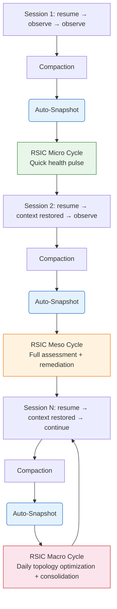
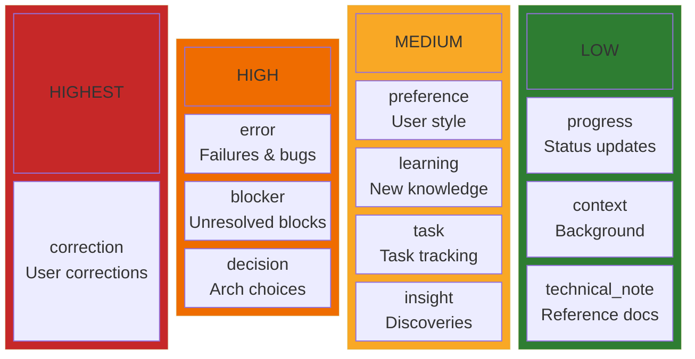
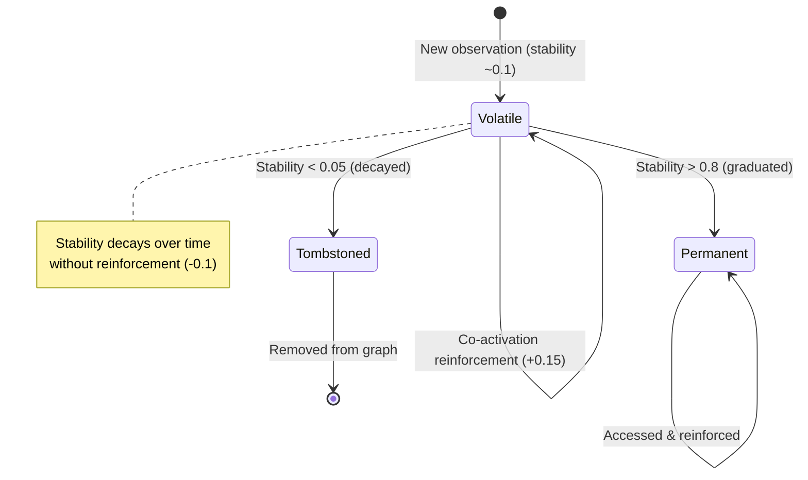
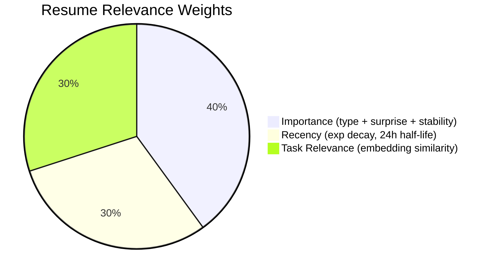
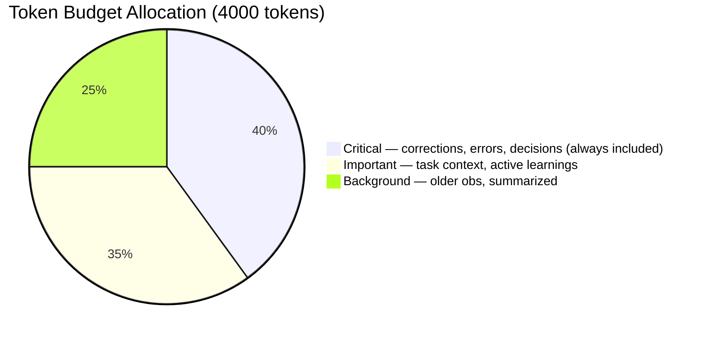
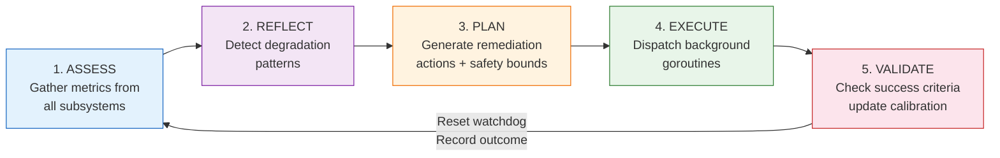
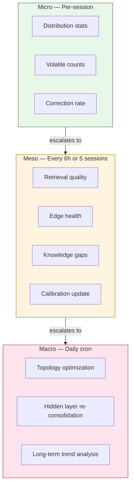
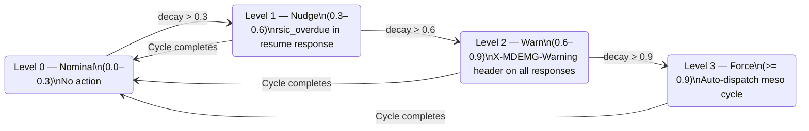
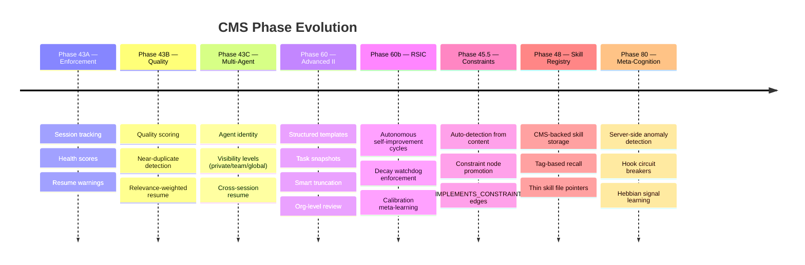

# CMS — Conversation Memory System

## Goal

The Conversation Memory System (CMS) provides **persistent memory for LLM coding agents** across context window boundaries. When an LLM's context window fills and compacts, all non-persistent state is lost. CMS solves this by capturing significant conversational events as structured observations stored in Neo4j, then restoring the most relevant context when a new session begins.

**Core problems solved:**

- Context loss on compaction (every 20-30 minutes of active work)
- Poor context selection (what matters most to restore?)
- Signal vs. noise (not all observations are equally valuable)
- Multi-agent isolation (private vs. shared knowledge)
- Cross-session continuity (work spans days/weeks, not just one session)
- Memory degradation over time (edge decay, stale knowledge, orphan accumulation)

CMS is not just passive storage — it actively maintains its own health. The **Recursive Self-Improvement Cycle (RSIC)** continuously monitors memory quality across retrieval, learning, conversation, and graph subsystems, then autonomously remediates detected issues (pruning decayed edges, triggering consolidation, graduating volatile observations, refreshing stale connections). A decay watchdog enforces cycle compliance: if self-improvement doesn't run within the configured period, escalating pressure culminates in automatic forced execution.

## How It Works

### The Memory Lifecycle



1. **Observe** — During a session, significant events are captured: decisions, corrections, learnings, errors, preferences, progress updates
2. **Store** — Each observation gets a semantic embedding, surprise score, and quality assessment, then persists in Neo4j
3. **Resume** — On session start, the system retrieves the most relevant observations (ranked by recency, importance, and task relevance), related themes, and emergent concepts
4. **Reinforce** — Observations accessed together strengthen co-activation edges (Hebbian learning), increasing their future retrieval priority
5. **Self-Improve** — Between sessions, RSIC assesses memory health, reflects on degradation patterns, plans remediation, executes repairs (edge pruning, consolidation, graduation), and validates that improvements hold

### Observation Types



### Surprise Detection

Novel observations persist longer. The system detects surprise through:

- **Correction patterns** — User says "No...", "Actually...", "That's wrong"
- **Term novelty** — Domain-specific terms not seen before
- **Embedding distance** — Semantically far from existing observations
- **Contradiction** — Conflicts with previously stored knowledge

### Volatile vs. Permanent Memory

New observations start as **volatile** (stability score ~0.1). Through co-activation reinforcement, stability increases. When stability exceeds 0.8, the observation **graduates** to permanent. If stability drops below 0.05, the observation is **tombstoned** (removed). This mimics biological memory consolidation.



### Resume Relevance Scoring

When restoring context, observations are ranked by:



- **Recency**: Exponential decay (half-life 24h)
- **Importance**: Based on type priority + surprise score + stability
- **Task relevance**: Embedding similarity to current task context

### Smart Truncation

Resume responses respect a token budget (default 4000 tokens). Observations are tiered:



## Key Features

### Multi-Agent Support (Phase 43C)

- Persistent `agent_id` on all operations
- **Private** observations: only visible to the owning agent
- **Team** observations: visible to all agents in the same space
- **Global** observations: organization-wide visibility
- Cross-session resume filtered by agent identity

### Structured Observation Templates (Phase 60)

JSON Schema-validated templates for common patterns:

- `task_handoff` — Current task, status, goals, blockers, next steps
- `decision` — Decision, rationale, alternatives, reversibility
- `error` — Error type, description, resolution, prevention
- `learning` — Topic, insight, confidence, applicability

### Task Context Snapshots (Phase 60)

Auto-capture full session state before compaction events. Includes active files, blockers, and next steps. Manually triggered or automatic on session end.

### Org-Level Review (Phase 60)

Valuable observations can be promoted from private to team/global visibility through a review workflow (flag → approve/reject).

### Session Health Monitoring (Phase 43A)

Tracks whether agents call `/resume` on session start and how actively they observe. Warning headers (`X-MDEMG-Warning: session-not-resumed`) alert when CMS is being underutilized.

### Quality Controls (Phase 43B)

- Near-duplicate detection (cosine similarity > 0.95 → merge)
- Multi-factor quality scoring (specificity + actionability + context-richness)
- Relevance-weighted resume ranking

### Recursive Self-Improvement Cycle — RSIC (Phase 60b)

CMS memory degrades over time: edges decay, observations go stale, knowledge gaps widen, and consolidation falls behind. RSIC is an autonomous 5-stage cycle that continuously monitors and repairs memory health without human intervention.

**The 5-Stage Cycle:**



**Three Cycle Tiers:**



**Automated Remediation Actions:**

- `prune_decayed_edges` — Remove low-weight learning edges approaching saturation
- `prune_excess_edges` — Trim hub nodes exceeding per-node edge cap
- `trigger_consolidation` — Run hidden layer consolidation when orphan ratio is high or consolidation is stale
- `graduate_volatile` — Promote stable volatile observations to permanent
- `tombstone_stale` — Remove observations not accessed in N days with low importance
- `refresh_stale_edges` — Recalculate stale co-activation edges

**Decay Watchdog:**

A background goroutine enforces cycle compliance. If the agent fails to run a self-improvement cycle within the configured period, escalating pressure forces execution:



**Calibration & Meta-Learning:**

RSIC tracks the historical success rate of each action type. Actions that consistently improve metrics gain higher confidence and are prioritized in future planning. Actions that fail are deprioritized below the minimum confidence threshold (default 0.3).

**Safety Bounds:**

- Max 5% of nodes pruned per cycle
- Max 10% of edges pruned per cycle
- Protected spaces (`mdemg-dev`) never modified destructively
- All actions bounded by configurable timeout per tier
- Dry-run mode: full pipeline runs with zero mutations, returning structured deltas
- Pre-mutation snapshots enable rollback for reversible actions (tombstone, graduate)

**Test Coverage (22 integration tests):**

RSIC is verified at three levels of integration testing:

- **6 core tests** (`rsic_test.go`): Cycle→history, dry-run no delta, safety blocks protected space, multi-space isolation, persistence flush, health shape
- **10 systems tests** (`rsic_systems_test.go`): Cooldown rejection, source-tier mismatch, idempotency dedupe, calibration accumulation, history filtering, dry-run structure, rollback API, watchdog state, health composite, Prometheus metrics
- **6 holistic tests** (`rsic_holistic_test.go`): Full pipeline verification — confidence gate passage, tombstone_stale end-to-end with Neo4j mutation verification, dry-run preserves state, rollback reverses tombstone, history/calibration reflect real execution, multi-action dispatch with Prometheus metrics

The holistic tests seed data via direct Cypher to pass the confidence gate (2/4 data points = 0.50 > 0.30 threshold), enabling the first end-to-end verification of the reflect → plan → dispatch → execute → calibrate pipeline with real Neo4j mutations.

### Meta-Cognition & Self-Improvement Enforcement (Phase 80)

Phase 80 transforms CMS from passive memory retrieval to active anomaly detection. When memory state is degraded, the system emits signals through API responses, HTTP headers, and hooks to force investigation.

**Server-Side Anomaly Detection:**

Resume and recall handlers check for anomalous states after computing results:

- **Empty Resume** (CRITICAL): Space has conversation_observation nodes but resume returned 0 observations
- **No Themes** (MEDIUM): Observations returned but 0 themes
- **Empty Recall** (HIGH): Query >20 chars but 0 results

Anomalies are embedded in both response body (`anomalies` array, `memory_state` field) and HTTP headers (`X-MDEMG-Memory-State`, `X-MDEMG-Anomaly`). A false-positive guard ensures genuinely empty spaces are not flagged.

**Hook Circuit Breakers:**

Hooks mechanically enforce investigation when degradation is detected:

- **session-start.sh**: Detects 0-observation resume, emits CRITICAL warning, auto-fires RSIC micro assessment, displays health summary
- **prompt-context.sh**: Detects empty recall for non-trivial queries, appends session health ribbon
- **post-tool-observe.py**: Detects `X-MDEMG-Memory-State: degraded` in curl output, records error observations
- **pre-compact.sh**: Queries session health before compaction, includes in context snapshot

**Behavioral Learning Loop:**

`SignalLearner` tracks signal effectiveness using Hebbian learning:

- `RecordEmission(code)`: Signal emitted, strength decays (agent hasn't responded yet)
- `RecordResponse(code)`: Agent acted on signal, strength boosts
- Strength range: 0.1 (floor) to 1.0 (ceiling)
- Configurable decay/boost rates via `METACOG_SIGNAL_DECAY_RATE` / `METACOG_SIGNAL_BOOST_RATE`

See `docs/features/meta-cognition-enforcement.md` for full details.

## API Endpoints

### Core Operations

| Method | Path | Description |
|--------|------|-------------|
| POST | `/v1/conversation/observe` | Store an observation |
| POST | `/v1/conversation/correct` | Store an explicit correction |
| POST | `/v1/conversation/resume` | Restore context for a session |
| POST | `/v1/conversation/recall` | Semantic search over observations |
| POST | `/v1/conversation/consolidate` | Consolidate themes from observations |
| GET | `/v1/conversation/volatile/stats` | Volatile observation statistics |
| POST | `/v1/conversation/graduate` | Graduate volatile observations to permanent |
| GET | `/v1/conversation/session/health` | Session health score |
| GET | `/v1/conversation/session/anomalies` | Detected session anomalies |

### Templates

| Method | Path | Description |
|--------|------|-------------|
| GET/POST | `/v1/conversation/templates` | List or create templates |
| GET/PUT/DELETE | `/v1/conversation/templates/{id}` | Template CRUD |

### Snapshots

| Method | Path | Description |
|--------|------|-------------|
| GET/POST | `/v1/conversation/snapshot` | List or create snapshots |
| GET | `/v1/conversation/snapshot/latest` | Latest snapshot for session |
| POST | `/v1/conversation/snapshot/cleanup` | Clean up old snapshots |
| GET/DELETE | `/v1/conversation/snapshot/{id}` | Get or delete snapshot |

### Org Reviews

| Method | Path | Description |
|--------|------|-------------|
| GET | `/v1/conversation/org-reviews` | List pending reviews |
| GET | `/v1/conversation/org-reviews/stats` | Review statistics |
| POST | `/v1/conversation/org-reviews/{id}/decision` | Approve or reject |
| POST | `/v1/conversation/observations/{id}/flag-org` | Flag for review |

### Self-Improvement Cycle (RSIC)

| Method | Path | Description |
|--------|------|-------------|
| POST | `/v1/self-improve/assess` | Trigger on-demand self-assessment |
| GET | `/v1/self-improve/report` | Get active task report |
| GET | `/v1/self-improve/report/{cycle_id}` | Get specific cycle report |
| POST | `/v1/self-improve/cycle` | Trigger full RSIC cycle (assess→validate) |
| GET | `/v1/self-improve/history` | Cycle history with outcomes |
| GET | `/v1/self-improve/calibration` | Calibration metrics and confidence scores |
| GET | `/v1/self-improve/health` | Watchdog status and health score |
| GET | `/v1/self-improve/signals` | Signal effectiveness tracking (Phase 80) |

### Skill Registry (Phase 48)

| Method | Path | Description |
|--------|------|-------------|
| GET | `/v1/skills?space_id=X` | List registered skills (discovered from pinned observations) |
| POST | `/v1/skills/{name}/recall` | Recall skill content by tag (direct Cypher, not vector search) |
| POST | `/v1/skills/{name}/register` | Register skill sections as pinned observations |

Skills are CMS pinned observations with `skill:<name>` tags. Thin skill files in `.claude/skills/` are pointers that recall from CMS. Without CMS, skills cannot function.

### Pinned Observations (Phase 47)

| Method | Path | Description |
|--------|------|-------------|
| POST | `/v1/conversation/observe` | With `pinned: true` — permanent, non-decaying observation |

Pinned observations bypass volatile graduation: they start permanent with stability 1.0. Used by the Skill Registry to store skill instructions.

### Constraint Nodes (Phase 45.5)

| Method | Path | Description |
|--------|------|-------------|
| GET | `/v1/constraints?space_id=X` | List constraint nodes in a space |
| GET | `/v1/constraints/stats?space_id=X` | Constraint type counts and confidence |

Constraints are auto-detected from observation content (must/must_not/should/should_not/deadline patterns) and promoted to first-class nodes during consolidation. See `docs/features/constraint-nodes.md`.

## Architecture

### Storage (Neo4j)

Observations are stored as `MemoryNode` nodes in Neo4j with:

- `embedding` (1536-dim vector) for semantic search
- `surprise_score`, `stability_score`, `importance_score` for ranking
- `obs_type`, `visibility`, `agent_id` for filtering
- `volatile` flag for graduation lifecycle
- Co-activation edges (`CO_ACTIVATED_WITH`) for Hebbian reinforcement

### Key Packages

| Package | Purpose |
|---------|---------|
| `internal/conversation/service.go` | Core CMS service (observe, resume, recall) |
| `internal/conversation/cooler.go` | ContextCooler — volatile→permanent graduation |
| `internal/conversation/quality.go` | Observation quality scoring |
| `internal/conversation/dedup.go` | Near-duplicate detection |
| `internal/conversation/relevance.go` | Resume relevance scoring |
| `internal/conversation/truncation.go` | Smart truncation with token budgets |
| `internal/conversation/templates.go` | Structured observation templates |
| `internal/conversation/snapshot.go` | Task context snapshots |
| `internal/conversation/org_review.go` | Org-level review workflow |
| `internal/conversation/session_tracker.go` | Session health monitoring |
| `internal/conversation/types.go` | Shared types (Observation, AgentID, etc.) |
| `internal/ape/types_rsic.go` | RSIC types (reports, insights, actions, task specs) |
| `internal/ape/self_assess.go` | Assessment — gathers metrics from all subsystems |
| `internal/ape/self_reflect.go` | Reflection — pattern detection (8 insight types) |
| `internal/ape/improvement_plan.go` | Planning — maps insights to remediation actions |
| `internal/ape/task_spec.go` | Task specification builder with safety bounds |
| `internal/ape/task_dispatch.go` | Goroutine-based action executor |
| `internal/ape/task_monitor.go` | Task status tracking and cycle wait |
| `internal/ape/calibration.go` | Validation and per-action confidence tracking |
| `internal/ape/watchdog.go` | Decay watchdog with 4-level escalation |
| `internal/ape/cycle.go` | CycleOrchestrator — ties all 5 stages together |
| `internal/ape/orchestration_policy.go` | Orchestration policy — cooldown, dedupe, source-tier validation |
| `internal/ape/safety_validator.go` | Safety enforcement — blast-radius estimation, protected-space blocking |
| `internal/ape/action_snapshot.go` | Pre-mutation snapshots and rollback support |
| `internal/ape/rsic_store.go` | Write-behind persistence for RSIC state |
| `internal/api/handlers_self_improve.go` | HTTP handlers for 7 RSIC endpoints |
| `internal/api/rsic_adapters.go` | Adapters bridging RSIC interfaces to concrete services |
| `tests/integration/rsic_test.go` | 6 core RSIC integration tests |
| `tests/integration/rsic_systems_test.go` | 10 systems-level RSIC integration tests |
| `tests/integration/rsic_holistic_test.go` | 6 holistic tests — full pipeline verification with Neo4j mutations |

### Protected Space

The `mdemg-dev` space contains Claude's conversation memory and is **protected from deletion**. The API refuses destructive operations on this space, and `reset-db` skips it entirely.

## Evolution



## Configuration

> Verified against `internal/config/config.go` (DOC-CURRENCY-002, 2026-07-21). Earlier
> versions of this section listed `CMS_*` variables that never existed — setting them
> silently no-ops. The real knobs:

```bash
# Volatile memory (Context Cooler) — the background loop itself defaults OFF
CONTEXT_COOLER_ENABLED=false            # enable the cooler background loop
COOLER_REINFORCEMENT_WINDOW_HOURS=2     # reinforcement window
COOLER_STABILITY_DECAY_RATE=0.1         # daily decay for unreinforced nodes
COOLER_TOMBSTONE_THRESHOLD=0.05         # stability below which nodes tombstone
COOLER_TOMBSTONE_MAX_PER_RUN=500        # cap per graduation run (0 = unlimited)
COOLER_GRADUATION_THRESHOLD=0.8         # stability required to graduate

# RSIC — Cycle Periods
RSIC_MICRO_ENABLED=true
RSIC_MESO_PERIOD_HOURS=6
RSIC_MESO_PERIOD_SESSIONS=10
RSIC_MACRO_CRON="0 3 * * *"

# RSIC — Safety Bounds (fractions, not percentages)
RSIC_MAX_NODE_PRUNE_PCT=0.05            # max fraction of nodes one action can prune
RSIC_MAX_EDGE_PRUNE_PCT=0.10            # max fraction of edges one action can prune
RSIC_ROLLBACK_WINDOW=3600               # seconds to keep rollback snapshots

# RSIC — Watchdog
RSIC_WATCHDOG_ENABLED=true
RSIC_WATCHDOG_CHECK_SEC=300             # seconds between checks
RSIC_WATCHDOG_DECAY_RATE=0.1            # decay-score increase per hour without a cycle
RSIC_WATCHDOG_NUDGE_THRESHOLD=0.3
RSIC_WATCHDOG_WARN_THRESHOLD=0.6
RSIC_WATCHDOG_FORCE_THRESHOLD=0.9

# RSIC — Calibration
RSIC_CALIBRATION_DAYS=30                # days of history for calibration
RSIC_MIN_CONFIDENCE=0.3                 # minimum confidence to execute an action

# Meta-Cognition (Phase 80)
METACOG_ENABLED=true
METACOG_EMPTY_RESUME_CHECK=true
METACOG_SIGNAL_DECAY_RATE=0.05
METACOG_SIGNAL_BOOST_RATE=0.1
```
