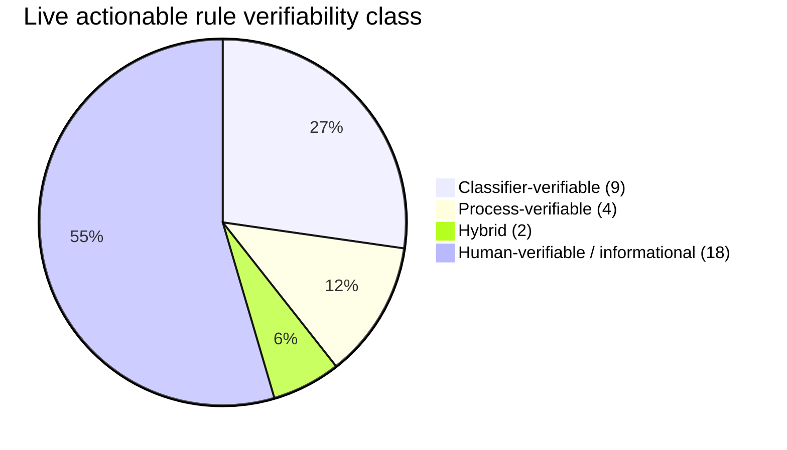

# JIMINY-METRIC-DENOMINATOR-DESIGN-001 — Verdict + Specs

**Task**: #157
**Designed**: 2026-09-07
**Recommendation**: **HYBRID — ship Path 3 first (1 sprint, cheap, immediate honest scoreboard), then Path 2 incrementally (1 observer per rule, each ships alone and contributes measurable lift on `follow_rate_process`).** Retrain (Phase 4b) gates on `follow_rate_classifier` post-Path-3.

## TL;DR

- **15 gradable rules** currently in `mdemg-dev` (13 constraints + 2 corrections); 18 additional marked informational
- Verifiability classification: **9 classifier / 4 process / 2 hybrid** — the classifier-verifiable class is the majority of what remains after Path 1
- **Path 3 (metric partitioning)**: 1 sprint, ships honest scoreboard immediately, unblocks Phase 4b retrain gate
- **Path 2 (process observers)**: 1-N sprints, each shipping one observer for one rule; incremental; expensive but honest for rules Path 3 alone can't grade
- **Hybrid sequencing**: Path 3 → Phase 4b (if classifier follow rate justifies) → Path 2 observers as separate opportunities

---

## Phase A — Rule Taxonomy Audit (all 33 live actionable nodes)

Classification method: for each rule, ask "what evidence would a grader need to verify follow?" and pick the minimal-cost source.

### Classifier-verifiable class (grade from action-text alone)

Evidence source: the diff, bash command, or file-write action-text that the classifier already sees. No new observation needed.

| # | Code | role | Evidence source | Notes |
|---|---|---|---|---|
| 1 | `auto-29156377a1de` (never use `mdemg db start`) | constraint | bash text | grep for `mdemg db start` in bash command |
| 2 | `auto-a4a36173bff8` (ingest with space_id=mdemg-dev) | constraint | code/bash args | grep for `--space-id` flag value |
| 3 | `must-use-cuid2` (CUIDv2 not UUID) | constraint | code diff | grep for `uuid` package imports + `NewUUID()` calls |
| 4 | `never-hardcode-config` | constraint | code diff | heuristic: literal strings/numbers where config lookup expected; borderline (requires context) |
| 5 | `never-direct-alter-schema` (migration file required) | constraint | file paths + SQL diff | ALTER/CREATE outside `internal/tsdb/migrations/` is a violation |
| 6 | `no-stash-for-release` | constraint | bash text | grep `git stash` in release commands |
| 7 | `no-direct-main-commits` | constraint | bash text | grep `git push origin main` or `git commit` on main branch |
| 8 | `openai-max-completion-tokens` | constraint | code diff | grep `max_tokens` (bad) vs `max_completion_tokens` (good) in gpt-5.x call sites |
| 9 | `project-planning-docs-in-repo-only` | correction | file paths | file writes to `~/Downloads/` or outside `docs/development/` are violations |

**Count: 9 rules.** After Path 1's exclusion of the 12 top process rules, these 9 are the honest denominator for classifier-side lift work (including any retrain).

### Process-verifiable class (grade from process-observation events, not action-text)

Evidence source: a NEW event stream capturing "did the process happen?" — not visible in the action-text the classifier sees.

| # | Code | role | Evidence needed | Observer needed |
|---|---|---|---|---|
| 10 | `lint-before-commit` | constraint | `golangci-lint run` command executed with exit=0 between last edit and commit | shell/PostToolUse hook capture |
| 11 | `never-haiku-for-planning` | constraint | which model responded to a "plan" prompt | LLM router / MCP tool-invocation event |
| 12 | `sequential-epics` | constraint | epics ran in order (not parallel goroutines / concurrent PRs) | sprint-plan parse + task/commit ordering audit |
| 13 | `query-mdemg-cms-file-paths` | correction | retrieval was called BEFORE glob/grep in the same session | shell hook: memory_recall event precedes glob/grep on same session_id |

**Count: 4 rules.** Each requires a distinct observer type.

### Hybrid class (classifier can partially verify; process signal adds precision)

| # | Code | role | Classifier signal | Process signal |
|---|---|---|---|---|
| 14 | `must-use-uxts-frameworks-consistently` | constraint | new JSON schema files outside `docs/tests/u*ts/` = classifier-verifiable | but "consistently" means CROSS-FILE audit — process-side |
| 15 | `unit-integration-e2e-docs` | constraint | sprint plan CONTENT lists 3 tiers = classifier-verifiable | did the tiers ACTUALLY run = process-side |

**Count: 2 rules.** Classifier grades the SHAPE, process grades the ACT.

### Human-verifiable class (currently marked informational — no automated evidence possible)

All 17 process/meta rules already moved to `is_informational=true` in Path 1 + prior:

`agent-handoff-requirement-guardrail`, `auto-build-restart-after-feature`, `end-with-docs-accessed`, `iterate-break-fix-verify`, `live-testing-tier-required`, `mandatory-feature-docs`, `markdown-mermaid-tables-and-charts`, `mdemg-cms-memory-only`, `memory-preservation-backup-integrity`, `must-comment-sprint-summary-on-pr`, `must-enforce-jiminy-constraints`, `must-follow-12-section-format`, `must-master-data-pipelines`, `must-validate-all-claims-before-commit`, `never-classify-policy-docs-as-constraint`, `never-skip-discovered-issues`, `plan-mode-before-change`, `trust-signal-must-be-persisted-never-ignore-honest`

These would benefit from HITL grading (JIMINY-HITL-VELOCITY-001 platform), not from Path 2 observers.

### Summary distribution



---

## Phase B — Path 2 Spec (Process-Observation Architecture)

### B1 — What process-observation events exist?

New TSDB hypertable `process_events`:

| field | type | notes |
|---|---|---|
| `time` | timestamptz | event time |
| `event_id` | text (CUIDv2) | unique id |
| `session_id` | text | correlate with action-text session |
| `space_id` | text | multi-space safe |
| `event_type` | text | enum: `lint_run`, `model_call`, `mcp_call`, `retrieval_call`, `bash_command`, `git_commit`, `git_push`, `test_run`, `plan_mode_entry` |
| `event_subtype` | text | e.g. `golangci-lint` vs `ruff`; `git push origin main` |
| `outcome` | text | enum: `success`, `failure`, `unknown` |
| `exit_code` | int | for shell events |
| `metadata` | jsonb | free-form for per-event details |
| `source_hook` | text | which emitter |

Retention: 30d chunks + 90d retention (mirrors existing `constraint_outcomes` shape).

### B2 — Emitter catalog (who writes to `process_events`)

| Emitter | Event types | Ships in |
|---|---|---|
| `.claude/hooks/post-tool-observe.py` | `bash_command`, `test_run`, `lint_run`, `plan_mode_entry` | already exists; extend to POST `/v1/process/event` on tool completion |
| `internal/llmclient/recorder.go` | `model_call` (which model? which task?) | extend the shipped LLM recorder |
| `internal/mcp/*` | `mcp_call` (which MCP tool?) | extend shipped MCP server |
| `internal/api/handlers_memory.go::handleRetrieve` | `retrieval_call` | extend the retrieval handler |
| `.claude/hooks/pre-bash-check.py` | `bash_command` (git push, git commit) | extend the pre-bash hook |

New HTTP endpoint: `POST /v1/process/event` — accepts event batches; writes to `process_events` via new buffered `ProcessEventWriter`.

### B3 — New verdict types

Extend `constraint_outcomes.outcome_type` enum with:
- `process_followed` — process observer saw the required event
- `process_missed` — process observer did NOT see the required event within timewindow
- `process_incomplete` — required event fired but with `outcome=failure` (e.g. lint ran but failed)

Or (cleaner alternative): new hypertable `process_outcomes` with same shape as `constraint_outcomes` but reads `process_events` instead of action-text. Keeps concerns separate.

**Recommendation: new hypertable `process_outcomes`.** Avoids polluting `constraint_outcomes` semantics + gives clean per-class metric aggregation.

### B4 — Grader design (per-rule matcher)

New Go package `internal/grader/process/`:

```go
// ProcessGrader routes rules to their matchers.
type ProcessGrader interface {
    Grade(ctx context.Context, ruleCode string, actionSessionID string, actionTime time.Time) ProcessVerdict
}

type ProcessVerdict struct {
    OutcomeType   string  // process_followed | process_missed | process_incomplete
    EvidenceEventID string // event_id from process_events that satisfied the grade
    Reason        string  // human-readable
}
```

Per-rule matchers as separate files under `internal/grader/process/matchers/`:
- `lint_before_commit.go` — query `process_events` for `event_type='lint_run', outcome='success'` between last `write_file` event and next `git_commit` on same session
- `never_haiku_for_planning.go` — query `process_events` for `event_type='model_call'` where subtype='haiku' AND task involved planning keywords
- `query_mdemg_cms_file_paths.go` — query for `event_type='retrieval_call'` PRECEDING `event_subtype='glob'` on same session
- `sequential_epics.go` — query for `event_type='git_commit'` ordering matching sprint-plan Epic numbering

One matcher file per rule; new rules mean new matcher files. Registered in a slice.

### B5 — Cost estimate (per observer sprint)

Typical process-observer sprint scope:
- 1 event type or 1 rule matcher
- +1 emitter site OR +1 grader matcher
- +1 pin test
- +CHANGELOG + CLAUDE.md pin

Estimated: 2-4h per observer. 4 process rules + 2 hybrid rules × 2-4h each = **12-24h total spread across 6 sprints.**

### B6 — Backward-compat: what happens to existing `constraint_outcomes` rows?

- Existing rows stay valid — they represent classifier verdicts on classifier-verifiable rules
- Historical rows for now-process-classified rules become "pre-process-grader-era classifier estimate" — flagged in the metric via a `grader_era` label if needed
- Retrain training signal reads BOTH tables via a UNION view

### B7 — Config

New env vars (per `never-hardcode-config` rule):
- `PROCESS_EVENTS_ENABLED` (default false) — master enable
- `PROCESS_EVENT_WRITER_FLUSH_INTERVAL_SEC` (default 30)
- `PROCESS_EVENT_WRITER_BUFFER_SIZE` (default 500)
- `PROCESS_GRADER_ENABLED` (default false)
- Per-matcher `PROCESS_MATCHER_<RULE>_ENABLED` — allow rules to opt in individually

### B8 — Human-class rules (17 informational) — deferred to HITL

Path 2 does NOT address human-verifiable rules (e.g. `agent-handoff-requirement-guardrail` — "operator user-side hand-inspection required"). Those need HITL grader integration via the shipped JIMINY-HITL-VELOCITY-001 platform. Separate design.

### B9 — Risk: process observers can miss events

Every observer has a fail-open contract: missing event ≠ violation. Only present-event-with-failure-outcome ≠ follow. This mirrors JIMINY-CLASSIFIER-CONTEXT-002's mechanism-scope gate philosophy.

### B10 — Risk: emitter overhead on hot paths

Emitters must be fire-and-forget async (POST /v1/process/event with 100ms timeout, drop on timeout). Mirrors the shipped `constraint_outcomes` writer pattern.

### B11 — Rollback per matcher

Each matcher ships behind `PROCESS_MATCHER_<RULE>_ENABLED=false`. Rollback = flag flip + kickstart. No substrate mutation to undo.

### B12 — Total surface

- 1 new TSDB migration (hypertable `process_events` + `process_outcomes`)
- 1 new Go package (`internal/grader/process/`)
- 1 new HTTP endpoint (`POST /v1/process/event`)
- N new matcher files (one per rule)
- ~5 emitter extensions (hooks + recorder + MCP + retrieval handler)

---

## Phase C — Path 3 Spec (Metric Partitioning)

### C1 — New Neo4j property

Extend `MemoryNode` (role_type in constraint,correction) with:
```
verifiability_class enum: 'classifier' | 'process' | 'hybrid' | 'human' | NULL(default → 'classifier' for backward-compat)
verifiability_class_marked_at datetime
```

Mirrors the shipped `is_informational` pattern (JIMINY-INFORMATIONAL-CATEGORY-001). Fully reversible.

### C2 — New CLI

Extend the shipped `mdemg jiminy constraint mark` with `--class`:
```
mdemg jiminy constraint set-class --code X --space-id mdemg-dev --class classifier|process|hybrid|human [--dry-run]
mdemg jiminy constraint list-classes --space-id mdemg-dev
```

Or a new subcommand `mdemg jiminy constraint set-class` for clarity.

### C3 — `RecordOutcome` routing

In `internal/jiminy/service.go::RecordOutcome`:

```go
switch node.VerifiabilityClass {
case "classifier", "":  // NULL/empty defaults to classifier for backward-compat
    // existing behavior — outcome lands in constraint_outcomes as today
case "process":
    // do NOT record in constraint_outcomes; router should have hit process grader instead
    // if we reach here, either grader is off (drop with WARN) or edge case
case "human":
    // do NOT record; HITL platform grades this
case "hybrid":
    // record BOTH: classifier verdict AND route to process grader
}
```

### C4 — New metric gauges

New TSDB gauges emitted by `internal/metrics/`:
- `mdemg_jiminy_follow_rate_classifier_verifiable{space_id}` — the current metric, but now only over `verifiability_class='classifier'`
- `mdemg_jiminy_follow_rate_process_verifiable{space_id}` — reads `process_outcomes` (Path 2) or is 0 if Path 2 not shipped
- `mdemg_jiminy_follow_rate_hybrid{space_id}` — reads BOTH classifier + process outcomes
- `mdemg_jiminy_follow_rate_human{space_id}` — reads HITL grades

The current `mdemg_jiminy_follow_rate` (aggregate) is DEPRECATED — replaced by explicit per-class gauges. Legacy panel titles preserve the number but with class prefix.

### C5 — New Grafana panels

Retire the single "Actionable Follow Rate" panel; replace with:
- **Classifier Follow Rate** — the honest metric a retrain CAN improve
- **Process Follow Rate** — reads Path 2 output (0 if Path 2 dormant)
- **Hybrid Follow Rate** — composite
- **Human Follow Rate** — HITL-graded
- **Rule Distribution by Class** — donut showing how many rules in each class

Add JIMINY-CEILING-BREAK-2 arc target: "**Target ≥80% ON CLASSIFIER CLASS**" (honest arc reframe from "on aggregate follow rate").

### C6 — Alert rules

Split `guidance_should_follow_rate_low` into per-class rules:
- `classifier_follow_rate_low` — fires at floor 0.5 (higher expectation — this IS what LLM can grade)
- `process_follow_rate_low` — fires at floor 0.6 (once Path 2 ships)
- `human_follow_rate_low` — fires at floor 0.7 (HITL is the highest-trust class)

Retire the aggregate rule as a source of chronic false-positives (per JIMINY-CEILING-INVESTIGATION-002 finding).

### C7 — Migration

- Ship Path 3 code + schema
- Startup goroutine: for each existing `constraint_outcomes` row, backfill `verifiability_class` based on a static seed list (the 9-item classifier list + 4-item process list + 2-item hybrid list from Phase A)
- After backfill, RecordOutcome writes new rows with the correct class
- Metric emitters use `verifiability_class` to route to gauges

**Cost: 1 sprint (~1 day).** Small surface, additive schema, fully reversible.

---

## Phase D — Cost + Risk Comparison

| Dimension | Path 2 | Path 3 |
|---|---|---|
| Sprints to ship | 6+ (1 per observer + platform sprint) | 1 |
| Wall-clock | 12-24h + coordination | ~8h |
| Substrate changes | 1 new hypertable + 1 new package | 1 property + backfill |
| Code surface | ~2,000 LoC (matchers + platform) | ~300 LoC (routing + gauges) |
| Grader accuracy | High (real evidence) | Same as today's classifier |
| Retrain unblock | No (retrain still gates on classifier class) | Yes (immediately gives honest classifier metric) |
| Human-class rules | Not addressed | Routed to HITL |
| Regression risk | Per-matcher (fail-open) | Per-property (default backward-compat) |
| Rollback | Per-matcher flag flip | Property write undo |

**Path 3 alone gives an honest metric TODAY. Path 2 alone doesn't unblock retrain — retrain still needs to know WHICH follow-rate class to gate on. Path 3 provides that framework.**

**Path 2 is only justified for rules where honest process-verification is worth the engineering cost.** Of 4 process-only rules + 2 hybrid, some are high-value (`lint-before-commit` — catches real quality regressions) and some are low-value (`never-haiku-for-planning` — user preference, low frequency).

---

## Phase E — Recommendation

### Ship Path 3 first (1 sprint)

Rationale:
1. **Immediate honest scoreboard** — Phase 4b retrain gate becomes meaningful next day
2. **Cheap** — ~1 day of work, small code surface, additive schema
3. **Fully reversible** — property writes, no code deletion required
4. **Enables Path 2 sequencing** — Path 2 observers land later without re-architecting the metric layer

### Ship Path 2 observers incrementally as separate sprints (deferred, not required)

Prioritization order (highest-value first):
1. **`lint-before-commit`** — real quality signal; observer is trivial (shell hook already captures bash; add a lint-outcome event); every commit becomes a graded event
2. **`sequential-epics`** — via commit-message parse; sprint-plan-based grader (parses `Epic N` markers); no new hook needed
3. **`query-mdemg-cms-file-paths`** — via memory_recall event correlation with subsequent glob/grep on same session
4. **`unit-integration-e2e-docs`** (hybrid) — sprint plan CONTENT parseable; test-tier events from CI
5. **`must-use-uxts-frameworks-consistently`** (hybrid) — file-path checker for new JSON schemas
6. **`never-haiku-for-planning`** — LOWEST priority; single-event lookup; low frequency

**Estimated 6 mini-sprints of 2-4h each = 12-24h total, spread over weeks.** Each contributes measurable lift to `follow_rate_process`. Operator can pause or reorder anytime.

### DO NOT ship Path 5 (retrain) until Path 3 gives an honest classifier follow-rate

Post-Path-1 measurement (2026-09-13 window) tells us classifier-only follow rate. Retrain compute is only justified if that number is <70% AND retrain is expected to move it substantively. If classifier follow rate turns out to already be ~50-80% (small-n post-Path-1), retrain has diminishing returns.

### Fallback if Path 3 rejected

If operator rejects Path 3 (e.g. doesn't want to add a property to nodes), the fallback is to compute per-class follow rates DERIVED from a hardcoded rule-to-class mapping in `internal/metrics/`. Less clean (mapping lives in code, not on the node), but same honest scoreboard. Cost: same 1 sprint.

---

## New architectural rule pinned (proposed for CLAUDE.md next PR)

**Rules of different verifiability classes MUST be graded by class-specific signals + metric-partitioned into per-class gauges.** Aggregate follow rate over mixed classes is dishonest (per JIMINY-CEILING-INVESTIGATION-002 root cause: the ceiling is bounded by class mix, not classifier quality). The taxonomy: (a) **classifier-verifiable** — evidence is in the action-text (code diff, bash command, file path); grade via existing LLM classifier; (b) **process-verifiable** — evidence is process-observation events (`golangci-lint` invoked, `retrieval_call` preceded `glob`); grade via new `internal/grader/process/matchers/`; (c) **hybrid** — classifier grades shape, process grades act; both signals recorded; (d) **human-verifiable** — no automated grade possible; route to HITL via JIMINY-HITL-VELOCITY-001 platform. When adding a new rule to the substrate, the rule's `verifiability_class` MUST be set at creation time. New follow-rate arcs MUST specify WHICH class they target. Retrain compute MUST gate on the class where LLM improvement CAN help (classifier). This closes the loophole that JIMINY-CEILING-BREAK-2 hit: predicting +15-25pp classifier-side lift on a metric dominated by classifier-unverifiable rules.

## Follow-up sprints filed

1. **JIMINY-METRIC-PARTITION-001** — implement Path 3 (~1 day)
   - V0N migration: add `verifiability_class` property + backfill from static seed
   - Extend `RecordOutcome` routing
   - New metric gauges + 5 new Grafana panels
   - CLI `mdemg jiminy constraint set-class`
   - Retire aggregate follow-rate alert; add 3 per-class alert rules
2. **Phase 4b GATE decision sprint** — post-Path 3 + 168h passive re-measure, decide whether retrain is justified based on `follow_rate_classifier`
3. **JIMINY-PROCESS-OBSERVER-{01..06}** — incremental Path 2 observers, one per rule, prioritized above
4. **JIMINY-HITL-HUMAN-CLASS-INTEGRATION-001** — route human-class rules to HITL grader (extends JIMINY-HITL-VELOCITY-001)

## Documents Accessed

- Live Neo4j — 33 actionable rule taxonomy enumeration
- `docs/development/jiminy-ceiling-investigation-002/verdict.md` — Path 2/3 framing origin
- `docs/development/jiminy-ceiling-investigation-002-execution/sprint_post.md` — Path 1 execution + informational rule list
- `docs/development/jiminy-correction-sink-investigate-001/verdict.md` — confirmed correction sink not a bug
- `docs/development/jiminy-informational-category-001/` — shipped is_informational precedent for Path 3 property pattern
- `docs/development/jiminy-hitl-velocity-001/` — shipped HITL platform Path 2's human-class subset would route to
- `internal/jiminy/service.go` — RecordOutcome location for Path 3 routing changes
- `internal/metrics/` — gauge emitter location for per-class panels
- CLAUDE.md pins: JIMINY-CEILING-INVESTIGATION-002 taxonomy pin, JIMINY-INFORMATIONAL-CATEGORY-001 pattern pin
- Operator directive: "run the path 2/3 design sprint" (2026-09-07)
