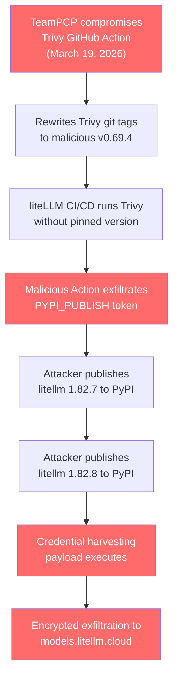
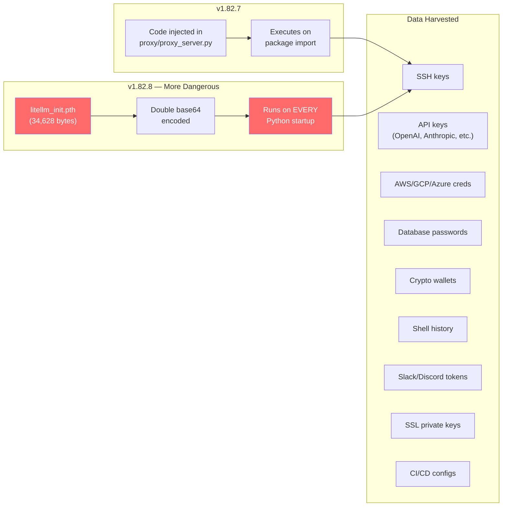
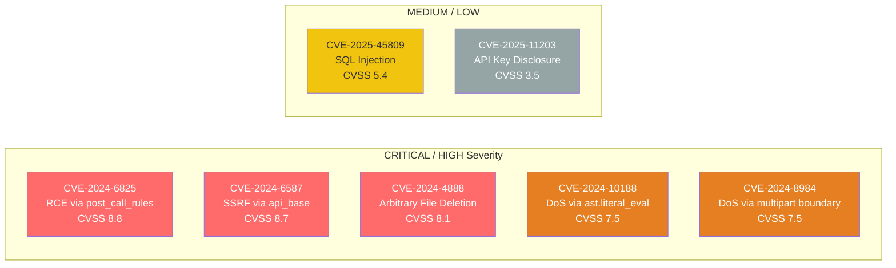
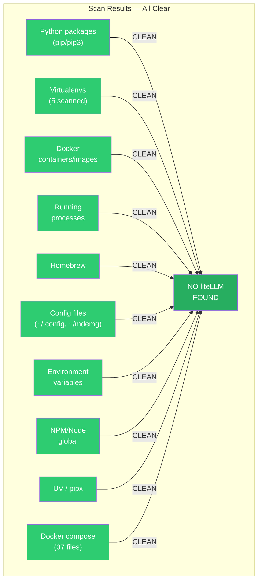
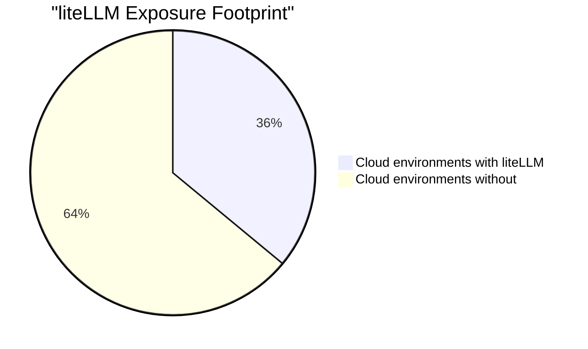

# liteLLM Security Audit Report

**Date:** 2026-03-26
**Scope:** Full local machine scan — `/Users/reh3376`
**Verdict:** CLEAN — No exposure detected

---

## Executive Summary

On March 24, 2026, threat group **TeamPCP** executed a supply chain attack against liteLLM via compromised PyPI publishing credentials. Malicious versions 1.82.7 and 1.82.8 were published containing credential-stealing malware. This audit confirms zero liteLLM presence on the local development machine.

---

## Attack Chain

---

## Malicious Payload Behavior

---

## Known CVEs

| CVE | Type | CVSS | Affected Versions | Description |
|-----|------|------|-------------------|-------------|
| CVE-2024-6825 | RCE | 8.8 | <= 1.40.12 | `post_call_rules` allows `os.system` as callback; fix bypassable via `pty.spawn` |
| CVE-2024-6587 | SSRF | 8.7 | < 1.44.8 | User-controlled `api_base` forwards requests + API keys to attacker domain |
| CVE-2024-4888 | File Deletion | 8.1 | < 1.35.19 | `/audio/transcriptions` endpoint allows `os.remove()` on arbitrary paths |
| CVE-2024-10188 | DoS | 7.5 | 26c03c9+ | `ast.literal_eval` crash via unauthenticated input |
| CVE-2024-8984 | DoS | 7.5 | <= 1.44.5 | Multipart boundary manipulation causes resource exhaustion |
| CVE-2025-45809 | SQLi | 5.4 | < 1.81.0 | SQL injection via `/key/block` and `/key/unblock` endpoints |
| CVE-2025-11203 | Info Leak | 3.5 | unspecified | Health API leaks API_KEY to authenticated attackers |

**Total: 13 CVEs catalogued (2024-2026)**

---

## Local Machine Scan Results

| # | Check | Scope | Result |
|---|-------|-------|--------|
| 1 | Python packages | pip, pip3 system installs | CLEAN |
| 2 | Virtualenvs | erd-creator, mlx, pyml_venvs, .venv, chroma-venv | CLEAN |
| 3 | Docker | All containers and images | CLEAN |
| 4 | Processes | All running processes | CLEAN |
| 5 | Homebrew | All installed formulae | CLEAN |
| 6 | Config files | ~/.config/, ~/mdemg/, dotfiles (yaml/json/toml/env) | CLEAN |
| 7 | Environment variables | Full env dump | CLEAN |
| 8 | NPM/Node | Global node modules | CLEAN |
| 9 | UV/pipx | uv pip list, uv tool list, pipx list | CLEAN |
| 10 | Docker compose | 37 compose files across home directory | CLEAN |

---

## Impact Context

- liteLLM averages **~3.4 million downloads/day** on PyPI
- Present in **36% of all cloud environments**
- Malicious versions were live for **~3 hours** before PyPI quarantine
- Attackers deployed **88 bot comments from 73 compromised accounts** in 102 seconds to disrupt GitHub issue reporting
- liteLLM package is currently **suspended on PyPI** — all versions return "No matching distribution found"

---

## Recommendations

1. **No action required** — this machine has zero liteLLM exposure
2. **Monitor** any shared infrastructure or CI/CD pipelines for liteLLM dependencies
3. If liteLLM is ever introduced as a dependency, pin to a verified version and audit the package hash
4. Consider blocking liteLLM at the dependency policy level until PyPI suspension is lifted and a post-incident review is published

---

## Indicators of Compromise (IOC)

If liteLLM were found, check for network connections to:

| IOC | Type |
|-----|------|
| `models.litellm.cloud` | Exfiltration endpoint |
| `litellm.cloud` | Attacker-controlled domain |
| `scan.aquasecurity.org` / `45.148.10.212` | Trivy attack infrastructure |
| `checkmarx.zone` / `83.142.209.11` | Trivy attack infrastructure |

Check for suspicious subprocess execution from Python: `curl`, `kubectl`, `find & xargs`, `openssl`

---

## Sources

- Snyk: *How a Poisoned Security Scanner Became the Key to Backdooring LiteLLM*
- The Hacker News: *TeamPCP Backdoors LiteLLM Versions 1.82.7-1.82.8 via Trivy CI/CD Compromise*
- Datadog Security Labs: *LiteLLM compromised on PyPI — Tracing the March 2026 TeamPCP supply chain campaign*
- Wiz Blog: *TeamPCP Supply Chain Attack on LiteLLM*
- Trend Micro: *Inside the LiteLLM Supply Chain Compromise*
- ARMO: *The Library That Holds All Your AI Keys Was Just Backdoored*
- Sonatype: *Compromised litellm PyPI Package Delivers Multi-Stage Credential Stealer*
- GitGuardian: *LiteLLM Supply Chain Attack Response*
- Kaspersky: *Trojanization of Trivy, Checkmarx, and LiteLLM*
- NVD: CVE-2024-6825, CVE-2024-6587, CVE-2024-4888, CVE-2025-45809
